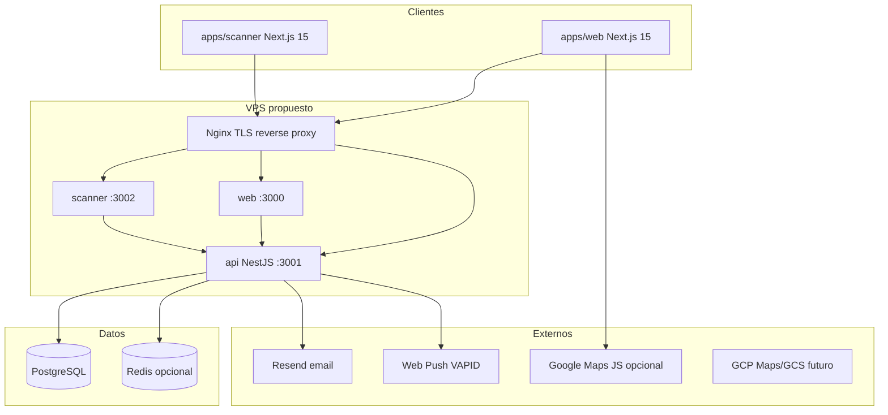

# Auditoría de preproducción y Producción técnica — Yo Te Invito

**Fecha:** 2026-05-28 (auditoría) · **Actualización estado prod:** Mayo 2026  
**Slice:** Infra 1 — auditoría pre-deploy. **Infra 2B** — provisioning ejecutado en VPS DonWeb.  
**Fuentes:** código y docs del monorepo (`docs/context/*`, `docs/dev/*`, `docs/guides/*`, `apps/*`).

> **Estado producción (Mayo 2026):** VPS DonWeb levantado en **`yoteinvito.club`** (`179.43.124.145`). systemd + Nginx + HTTPS + PostgreSQL/Redis locales. Migraciones (`migrate deploy`), seeds, admin maestro operativo. **Pendiente:** backups, hardening, rotación secretos, legales reales, smoke completo. Ver [`docs/deploy/DONWEB_PRODUCTION_RUNBOOK.md`](../deploy/DONWEB_PRODUCTION_RUNBOOK.md) §24.

---

## 1. Resumen ejecutivo

Yo Te Invito es un monorepo **Nx + pnpm** con tres aplicaciones desplegables (**web**, **api**, **scanner**) y **`packages/shared`**. En desarrollo avanzado opera contra **PostgreSQL** vía **NestJS + Prisma**; la web usa **NextAuth** y **ApiRepository** (sin LocalDB). Los pagos en checkout siguen siendo **demo** (`POST /public/payments/:id/demo-confirm`, provider `DEMO`); Getnet está cableado pero no es el foco de este slice.

**Para producción técnica se necesita como mínimo:**

| Capa | Requisito |
|------|-----------|
| Compute | VPS (o equivalente) con Node 20+, proceso manager, Nginx |
| Datos | PostgreSQL 16+ dedicado |
| Cola email | Redis 7+ **recomendado** (opcional al inicio: envío síncrono sin `REDIS_URL`) |
| DNS/TLS | Dominio + subdominios + Let's Encrypt |
| Secretos | `JWT_SECRET`, `NEXTAUTH_SECRET`, `DATABASE_URL`, CORS, Resend, VAPID (si push) |
| Datos iniciales | `prisma migrate deploy`, `seed:subcategories`, usuario real + `user:restore-master`, legales según plan de contenido |

**Riesgos principales antes de desplegar:** imágenes en **data-URL** en BD (tamaño, backups, rendimiento); **sin rate limiting** en API; **`DEV_AUTH_ENABLED` o `JWT_SECRET` por defecto** en producción; **puertos/documentación inconsistentes** (`.env.example` API `PORT=4000` vs runtime default `3001`); **cron Nest** activo en cada réplica API sin coordinación; ausencia de **backups probados**.

**Recomendación de dominios:** subdominios separados — ver §7. **Aplicado en prod:** `yoteinvito.club`, `api.yoteinvito.club`, `scanner.yoteinvito.club`.

**Siguiente bloque:** **Infra 2C — Cierre operativo** (secretos, backups, hardening, legales reales, smoke) — ver runbook §24.8.

---

## 2. Estado actual detectado

### Monorepo y comandos

| Elemento | Estado |
|----------|--------|
| Gestor | pnpm 9.14.2, Nx 20 |
| Dev conjunto | `pnpm dev` → web `:3000`, api `:3001`, scanner `:3002` |
| Build | `pnpm build` → `shared`, `api`, `web`, `scanner` |
| BD local | `docker compose` solo **Postgres** (`5433→5432`); **Redis comentado** en `docker-compose.yml` |
| Migraciones dev | `pnpm db:migrate` → `prisma migrate dev` (no usar en producción) |
| Demo datos | Eliminados `demo:seed`, LocalDB, `@demo.local` por defecto |
| Pago demo | **Activo** — no eliminar |
| Rate limiting | **No implementado** (mencionado en roadmap/guardrails como V2 con Redis) |
| Storage imágenes | **data-URL / https** en schemas; sin bucket en producción |
| Google Maps | Código listo con `NEXT_PUBLIC_GOOGLE_MAPS_API_KEY`; fallback OSM |
| Getnet | Variables en `.env.example`; provider opcional; default checkout **DEMO** |

### Inconsistencias detectadas (documentar al configurar prod)

1. **`apps/api/.env.example`:** `PORT=4000`; **`main.ts`** usa default `3001`; guías y `pnpm dev` asumen **3001**.
2. **`apps/scanner/.env.example`:** `NEXT_PUBLIC_API_BASE_URL=http://localhost:4000` — desalineado con API real en dev (**3001**).
3. **`pnpm db:migrate`** ejecuta `migrate dev` — en producción usar **`prisma migrate deploy`** desde `apps/api`.
4. **`ARCHITECTURE_GUARDRAILS.md`** está en `docs/architecture/`, no en `docs/rules/` (la regla del slice apunta a ruta histórica).

### Usuario maestro

- Email fijo: `felipe.e.salom@gmail.com` (`packages/shared` → `MASTER_USER_EMAIL`).
- `user:restore-master` restaura rol **ADMIN** y perfiles de portales; **no crea** usuario si no existe.
- `db:cleanup-content` **preserva** ese email; `db:reset-dangerous` **no** preserva nada.

---

## 3. Arquitectura actual relevante



**Flujo de datos (regla del proyecto):** Usuario → Next.js → `ApiRepository` → NestJS → Prisma → PostgreSQL.

**Auth:** NextAuth (JWT de sesión en web) + API JWT en `Authorization`; en dev opcional `X-Dev-User-Id` si `NODE_ENV !== 'production'` o `DEV_AUTH_ENABLED=true`.

**Jobs:** `@nestjs/schedule` (crons notificaciones, transferencias); **BullMQ** solo para cola de emails si `REDIS_URL` está definido.

---

## 4. Apps a desplegar

### 4.1 Web (`apps/web`)

| Aspecto | Detalle |
|---------|---------|
| Framework | Next.js 15 App Router |
| Build | `pnpm exec next build` (cwd `apps/web`) o `nx run web:build` |
| Start prod | `next start -p 3000` |
| Puerto interno | **3000** |
| Runtime | Node.js; depende de API HTTP |
| Variables críticas | `NEXT_PUBLIC_API_BASE_URL`, `NEXTAUTH_URL`, `NEXTAUTH_SECRET`, opcionales push/maps/pagos |
| Cookies | NextAuth; en prod: `NEXTAUTH_URL` HTTPS, `secure` cookies vía entorno producción |
| Metadata | `metadataBase` ← `NEXT_PUBLIC_APP_URL` (`app/layout.tsx`) |
| Service worker | `public/push-sw.js` — push requiere HTTPS |
| Sin | `app/api/auth/*` locales eliminados; auth vía API |

**Reverse proxy:** enviar `X-Forwarded-Proto`, `Host`; WebSocket no crítico salvo futuras features.

### 4.2 API (`apps/api`)

| Aspecto | Detalle |
|---------|---------|
| Framework | NestJS 10 |
| Build | `nest build` → `apps/api/dist` |
| Start prod | `node dist/main.js` o `nest start` (sin watch) |
| Puerto interno | **`PORT` env o 3001** (no 4000 salvo que se configure explícitamente) |
| Body limit | JSON/urlencoded **10mb** (`main.ts`) — relevante con data-URL |
| Health | `GET /health` → `{ status: 'ok' }` (no verifica DB/Redis) |
| CORS | `CORS_ORIGIN` lista separada por comas; `credentials: true` |
| Prisma | `DATABASE_URL`; post-deploy `prisma generate` |

### 4.3 Scanner PWA (`apps/scanner`)

| Aspecto | Detalle |
|---------|---------|
| Framework | Next.js 15 (app mínima) |
| Build / start | Igual que web; puerto **3002** |
| API | `NEXT_PUBLIC_API_URL` o `NEXT_PUBLIC_API_BASE_URL` |
| Rutas | Modo puerta (`/door`, etc.) — validación `POST /scanner/*` |
| HTTPS | **Obligatorio** para cámara/QR en dispositivos móviles |
| PWA | Metadata básica; sin manifest dedicado detectado en repo — evaluar `manifest.json` + icons en slice de scanner prod |
| Enlace desde web | `NEXT_PUBLIC_SCANNER_APP_URL` (gastro dashboard; default `http://localhost:3002/door`) |

**Dependencia:** mismos JWT/login que usuarios con rol SCANNER (o ADMIN/GASTRO según endpoint).

### 4.4 Shared (`packages/shared`)

- Zod schemas, constantes (`MASTER_USER_EMAIL`, legales, QR payloads).
- **Build:** incluido en `pnpm build` del monorepo; las apps usan `transpilePackages: ['@yo-te-invito/shared']`.
- No se despliega como servicio aparte.

---

## 5. Servicios requeridos

### 5.1 PostgreSQL

| Ítem | Recomendación |
|------|----------------|
| Versión | 16+ (alineado con `postgres:16-alpine` en compose) |
| Ubicación | VPS mismo host (inicio) o **managed** (Cloud SQL, RDS, Supabase) si presupuesto lo permite |
| DB/usuario | DB dedicada `yo_te_invito`; usuario de aplicación con permisos mínimos (no superuser) |
| Conexión | `DATABASE_URL` con SSL en prod (`?sslmode=require` según proveedor) |
| Migraciones | `cd apps/api && npx prisma migrate deploy` |
| Generate | `npx prisma generate` en build/deploy de API |
| **No en prod** | `prisma migrate dev`, `db:reset-dangerous`, `db:cleanup-content` (salvo emergencia con flags) |

### 5.2 Redis

| Pregunta | Respuesta |
|----------|-----------|
| ¿Obligatorio día 1? | **No** — API arranca sin Redis |
| ¿Para qué? | Cola BullMQ de emails (`EmailQueueService`) |
| Sin Redis | Emails se envían en fire-and-forget síncrono (`email.send().catch`) |
| Con Redis | Worker BullMQ + cola `emails` |
| Módulos que lo usan | Solo `apps/api/src/email/email-queue.service.ts` (no cache ni rate limit aún) |
| Recomendación prod | **Sí desde el inicio** si se esperan picos de notificaciones (registro, eventos, transferencias) |
| Instalación | Contenedor en VPS, o **Upstash/Redis Cloud** (menos ops) |

### 5.3 Email (Resend)

| Variable | Uso |
|----------|-----|
| `RESEND_API_KEY` | Cliente Resend |
| `EMAIL_FROM` | Remitente (dominio verificado en prod) |
| `ADMIN_EMAIL` | Notificaciones admin (payouts, etc.) |
| `APP_URL` / `NEXT_PUBLIC_APP_URL` | Links en plantillas |

Sin `RESEND_API_KEY`: envíos fallan de forma controlada; bandeja in-app y push pueden seguir.

### 5.4 Web Push

| Variable (API) | Variable (web, opcional) |
|----------------|--------------------------|
| `WEB_PUSH_VAPID_PUBLIC_KEY` | `NEXT_PUBLIC_WEB_PUSH_VAPID_PUBLIC_KEY` |
| `WEB_PUSH_VAPID_PRIVATE_KEY` | (solo API) |
| `WEB_PUSH_CONTACT_EMAIL` | `mailto:...` para `web-push` |

Sin VAPID: API inicia; registro de subscription OK; envío push falla con mensaje controlado.

### 5.5 Storage

**Estado actual:** imágenes y fondos se persisten como **URLs https** o **data:image/** en campos Prisma (`coverImageUrl`, `galleryUrls` JSON, perfiles, ticket templates, gastro content, inbox).

**Riesgo en producción:** payloads grandes, backups pesados, límites Zod (~2M chars en galerías), body 10mb en API.

**Recomendación (sin implementar en este slice):**

| Opción | Pros | Contras |
|--------|------|---------|
| **Google Cloud Storage** | Ya contemplado en checklist V2; IAM por service account; CDN natural | Coste, CORS, migración de URLs |
| **Cloudflare R2** | S3-compatible, sin egress a CF | Setup aparte de GCP Maps |
| **AWS S3** | Estándar | Segunda cuenta/facturación si ya usan GCP para Maps |

**Módulos afectados al migrar:** eventos, productoras, gastro (`GastroContent`), rentals, hoteles, ticket studio, descuentos gastro (admin), inbox.

### 5.6 Google Cloud

**Conviene usar ahora (infra ligera):**

- Proyecto GCP + billing alerts.
- **Maps JavaScript API** + key restringida por referrer (`NEXT_PUBLIC_GOOGLE_MAPS_API_KEY`).
- OAuth si se habilita login Google (`GOOGLE_CLIENT_ID` / `SECRET`).

**Dejar para slice posterior:**

- **Cloud Storage** (upload real, reemplazo data-URL).
- Cloud CDN / dominio `cdn.`.
- Separación estricta buckets staging/prod hasta tener staging.

**APIs a habilitar según checklist V2:** Maps JS, Places (autocomplete futuro), Geocoding si se geocodifica server-side.

**Riesgo de costos:** Places Autocomplete por sesión; presupuesto + cuotas; keys separadas staging/prod.

---

## 6. Variables de entorno detectadas

Variables **reales** encontradas en código o `.env.example`. Clasificación: **dev** | **staging** | **prod** (staging = mismas claves con URLs/credenciales de prueba).

### API (`apps/api`)

| Variable | App | Entorno | Obligatoria | Uso | Riesgo si falta |
|----------|-----|---------|-------------|-----|-----------------|
| `NODE_ENV` | API | todos | Sí (prod=`production`) | Comportamiento guards, crons | Dev auth activo si mal configurado |
| `PORT` | API | todos | No (default 3001) | Puerto HTTP | Bind incorrecto |
| `DATABASE_URL` | API | todos | **Sí** | Prisma | API no arranca |
| `JWT_SECRET` | API | prod | **Sí** | Firma JWT | Default inseguro `dev-secret-change-in-production` |
| `CORS_ORIGIN` | API | prod | **Sí** | Orígenes web+scanner | Login/CORS falla en browser |
| `DEV_AUTH_ENABLED` | API | dev/staging | No | Header `X-Dev-User-Id` | **Crítico si `true` en prod** |
| `LOG_LEVEL` | API | todos | No | Documentado en example | Logs verbosos |
| `REDIS_URL` | API | prod | Recomendada | Cola email BullMQ | Emails síncronos |
| `RESEND_API_KEY` | API | prod | Recomendada | Email transaccional | Sin email |
| `EMAIL_FROM` | API | prod | Recomendada | Remitente | Rechazo Resend |
| `ADMIN_EMAIL` | API | prod | Recomendada | Alertas admin | Sin destino admin |
| `APP_URL` | API | prod | Recomendada | Links notificaciones/email | Links a localhost |
| `NEXT_PUBLIC_APP_URL` | API | prod | Fallback | Plantillas email | Idem |
| `WEB_BASE_URL` | API | prod | No | Links descuentos gastro QR | Links incorrectos |
| `WEB_APP_URL` | API | prod | No | URLs referidos checkout | Idem |
| `WEB_PUSH_VAPID_PUBLIC_KEY` | API | prod | Si push | Web Push | Push deshabilitado |
| `WEB_PUSH_VAPID_PRIVATE_KEY` | API | prod | Si push | Web Push | Idem |
| `WEB_PUSH_CONTACT_EMAIL` | API | prod | Si push | VAPID details | Default genérico |
| `NOTIFICATIONS_CRON_ENABLED` | API | prod | No (`false` para desactivar) | Cron recordatorios | Crons activos |
| `NOTIFICATION_REMINDER_HOURS` | API | todos | No | Ventana recordatorio | Default 24h |
| `NOTIFICATION_REMINDER_TOLERANCE_HOURS` | API | todos | No | Tolerancia cron | Default 1h |
| `TICKET_TRANSFER_CRON_ENABLED` | API | prod | No | Expiración transferencias | Default activo |
| `SMART_ALERTS_MAX_PER_USER_HOUR` | API | prod | No | Throttle alertas | Default 5 |
| `PUBLIC_EVENTS_TIMEZONE` | API | prod | No | Visibilidad eventos vencidos | TZ Argentina default |
| `FRAUD_SCAN_RATE_THRESHOLD` | API | prod | No | Detección fraude scanner | Defaults en código |
| `FRAUD_REPEATED_VALID_THRESHOLD` | API | prod | No | Idem | Idem |
| `FRAUD_INVALID_BURST_COUNT` | API | prod | No | Idem | Idem |
| `FRAUD_INVALID_BURST_RATIO` | API | prod | No | Idem | Idem |
| `GETNET_ENV` | API | staging/prod | Si Getnet | URLs OAuth/checkout | Staging URLs |
| `GETNET_CLIENT_ID` | API | si Getnet | **Sí** | Pagos reales | Getnet disabled |
| `GETNET_CLIENT_SECRET` | API | si Getnet | **Sí** | Pagos reales | Idem |
| `GETNET_AUTH_BASE_URL` | API | no | Override URLs | Misconfig |
| `GETNET_CHECKOUT_BASE_URL` | API | no | Override URLs | Misconfig |
| `GETNET_SCOPE` | API | no | OAuth scope | Default `*` |
| `SEED_DEFAULT_TENANT` | API | dev | No | `prisma db seed` opt-in | — |
| `SEED_ADMIN_EMAIL` | API | dev | No | Seed opt-in | — |
| `SEED_ADMIN_PASSWORD` | API | dev | No | Seed opt-in | — |
| `ALLOW_PRODUCTION_CLEANUP` | API | prod | Solo emergencia | `db:cleanup-content` | Bloqueado |
| `ALLOW_PRODUCTION_RESET` | API | prod | Solo emergencia | `db:reset-dangerous` | Bloqueado |
| `ALLOW_PRODUCTION_SMOKE_CLEANUP` | API | prod | No | `smoke:cleanup` | Bloqueado |

### Web (`apps/web`)

| Variable | App | Entorno | Obligatoria | Uso | Riesgo si falta |
|----------|-----|---------|-------------|-----|-----------------|
| `NODE_ENV` | web | todos | Sí | Build/runtime Next | — |
| `NEXT_PUBLIC_API_BASE_URL` | web | todos | **Sí** | Todas las llamadas API | App rota |
| `NEXTAUTH_URL` | web | prod | **Sí** | Callbacks OAuth/cookies | Login falla |
| `NEXTAUTH_SECRET` | web | prod | **Sí** | Sesión NextAuth | Sesiones inseguras |
| `NEXT_PUBLIC_APP_URL` | web | prod | Recomendada | metadataBase, SEO | URLs wrong |
| `GOOGLE_CLIENT_ID` | web | opcional | Si Google login | OAuth | Botón oculto |
| `GOOGLE_CLIENT_SECRET` | web | opcional | Si Google login | OAuth | Idem |
| `NEXT_PUBLIC_GOOGLE_ENABLED` | web | opcional | UI login Google | — |
| `NEXT_PUBLIC_GOOGLE_MAPS_API_KEY` | web | opcional | Mapas/autocomplete | Fallback OSM |
| `NEXT_PUBLIC_WEB_PUSH_VAPID_PUBLIC_KEY` | web | opcional | Push cliente | Usa API `/me/push-subscriptions/config` |
| `NEXT_PUBLIC_PAYMENT_PROVIDER_DEFAULT` | web | prod | No | UI checkout DEMO/GETNET | Default DEMO |
| `NEXT_PUBLIC_DEFAULT_TENANT_ID` | web | prod | No | Legales públicos | `tenant-demo` |
| `NEXT_PUBLIC_SCANNER_APP_URL` | web | prod | Recomendada | Enlaces a scanner | localhost |
| `NEXT_PUBLIC_API_URL` | web | legacy | No | Algunos `lib/api/*` | Fallback 3001 |
| `NEXT_PUBLIC_MAP_PREVIEW` | web | no | `0` oculta previews | — |

### Scanner (`apps/scanner`)

| Variable | App | Entorno | Obligatoria | Uso | Riesgo si falta |
|----------|-----|---------|-------------|-----|-----------------|
| `NODE_ENV` | scanner | todos | Sí | Build | — |
| `NEXT_PUBLIC_API_BASE_URL` | scanner | **Sí** | API | Escaneo roto |
| `NEXT_PUBLIC_API_URL` | scanner | alt | Alias | Idem |
| `NEXT_PUBLIC_SCANNER_MODE_DEFAULT` | scanner | No | Default UI | `door` |

### Scripts / CI (no en servidor app salvo ejecución manual)

| Variable | Uso |
|----------|-----|
| `SMOKE_USER_EMAIL`, `SMOKE_USER_PASSWORD` | Smokes obligatorios |
| `SMOKE_TENANT_ID` | Default `tenant-demo` |
| `API_BASE_URL`, `API_URL` | Scripts HTTP |
| `SMOKE_*` (múltiples) | Ver `docs/guides/SMOKE_TESTS_GUIDE.md` |
| `E2E_USER_EMAIL`, `E2E_USER_PASSWORD` | Playwright |
| `TEST_USER_EMAIL`, `TENANT_ID` | `user:restore-master` |
| `LEGAL_SEED_TENANT_ID` | Seeds legales |

---

## 7. Dominio, DNS y reverse proxy

### Opciones evaluadas

| Modelo | Pros | Contras |
|--------|------|---------|
| **A) Subdominios** `www` + `api` + `scanner` | CORS simple; cookies NextAuth claras; 3 procesos Next/Nest independientes; PWA scanner aislada; certificados SAN | 3 upstreams en Nginx |
| **B) Path** `yoteinvito.com/api` | Un solo certificado aparente | Dos apps Next + API: routing complejo; cookies/path; scanner en path raro |
| **C) Solo apex** | Mínimo DNS | No recomendado: API y scanner necesitan orígenes distintos para CORS y PWA |

### Recomendación: **Opción A (subdominios)**

| Host público | Servicio interno | Notas |
|--------------|------------------|-------|
| `https://yoteinvito.com` (y `www` → apex) | `127.0.0.1:3000` web | `NEXTAUTH_URL`, `NEXT_PUBLIC_APP_URL` |
| `https://api.yoteinvito.com` | `127.0.0.1:3001` api | `NEXT_PUBLIC_API_BASE_URL`; sin exponer Prisma Studio |
| `https://scanner.yoteinvito.com` | `127.0.0.1:3002` scanner | `NEXT_PUBLIC_SCANNER_APP_URL` en web |

**`CORS_ORIGIN` ejemplo prod:**

```text
https://yoteinvito.com,https://www.yoteinvito.com,https://scanner.yoteinvito.com
```

### Nginx (plantilla conceptual — no aplicar en este slice)

- TLS: Let's Encrypt (certbot) + renovación automática.
- `proxy_pass` HTTP a puertos internos; headers: `Host`, `X-Real-IP`, `X-Forwarded-For`, `X-Forwarded-Proto`.
- `client_max_body_size 12m` (≥ 10mb API + margen).
- `gzip` on para assets Next.
- Timeouts razonables (60–120s) en rutas de checkout.
- Logs: access + error por vhost; logrotate.
- Rate limit en Nginx (opcional capa 1) hasta implementar en Nest.

---

## 8. Base de datos producción

### Plan de creación

1. Crear rol/login y base `yo_te_invito`.
2. Configurar `DATABASE_URL` en entorno API (solo en servidor, permisos 600).
3. En deploy: `npx prisma generate && npx prisma migrate deploy` (cwd `apps/api`).
4. Verificar: `GET https://api.../health` + login web.

### Seeds y datos iniciales

| Acción | Comando | Prod | Notas |
|--------|---------|------|-------|
| Subcategorías catálogo | `pnpm --filter api run seed:subcategories` | **Sí** (idempotente) | Solo estructura; tenant `tenant-demo` |
| Catálogo legal (keys) | `pnpm --filter api run seed:legal-documents` | **Sí** | No publica contenido |
| Contenido legal Markdown | `pnpm --filter api run seed:legal-content` | Opcional | Borradores; `--publish` solo con revisión legal |
| Usuario admin real | Registro manual o existente + `user:restore-master` | **Sí** | Requiere usuario en BD; luego **logout/login** |
| Prisma seed genérico | `pnpm db:seed` | **No** por defecto | Solo con `SEED_DEFAULT_TENANT=true` explícito |

### Comandos producción vs prohibidos

| Comando | Producción |
|---------|------------|
| `npx prisma migrate deploy` | **Sí** |
| `npx prisma generate` | **Sí** (build) |
| `pnpm db:migrate` (`migrate dev`) | **No** |
| `pnpm db:reset-dangerous` | **Prohibido** (salvo DR con `ALLOW_PRODUCTION_RESET`) |
| `pnpm db:cleanup-content` | **Prohibido** salvo emergencia (`ALLOW_PRODUCTION_CLEANUP`) |
| `pnpm --filter api run smoke:*` | Solo ventana de prueba; no dejar credenciales smoke |
| `pnpm db:studio` | No exponer públicamente |

### Usuario admin real

1. Asegurar cuenta `felipe.e.salom@gmail.com` (o `TEST_USER_EMAIL`) registrada en prod.
2. `pnpm --filter api run user:restore-master` con `DATABASE_URL` de prod (desde servidor seguro, no laptop contra prod salvo VPN).
3. Cerrar sesión en web y volver a entrar (JWT con `role: ADMIN`).

---

## 9. Redis producción

1. Instalar Redis 7 (VPS o managed).
2. `REDIS_URL=redis://:password@127.0.0.1:6379/0` (o TLS URL del proveedor).
3. Reiniciar API; verificar logs sin error BullMQ.
4. Probar email (registro / notificación) bajo carga ligera.
5. Firewall: Redis **no** expuesto a internet.

**Si se pospone Redis:** documentar que emails van en proceso API (riesgo de latencia en requests que encolan).

---

## 10. Backups

### PostgreSQL

| Ítem | Recomendación |
|------|----------------|
| Frecuencia | Diario completo + WAL/archivo si managed |
| Retención | 7–30 días online; mensual frío según compliance |
| Herramienta | `pg_dump -Fc` automatizado (cron/systemd timer) o backup nativo del proveedor |
| Secreto | Cifrar dumps en reposo; acceso restringido |
| Prueba restore | **Obligatoria** en staging antes de go-live (§16) |

### Storage (futuro)

Cuando exista GCS/S3: versionado de bucket, lifecycle rules, backup de metadatos (no sustituye BD).

### Qué incluye el dump

- Todo el schema Prisma actual (incl. data-URL en texto — dumps grandes).

---

## 11. Logs y monitoreo

| Fuente | Qué capturar |
|--------|----------------|
| API Nest | stdout/stderr (PM2/systemd journal); nivel según `LOG_LEVEL` |
| Nginx | access.log, error.log por vhost |
| PostgreSQL | slow query log (opcional) |
| Redis | slowlog si aplica |
| Web/Scanner Next | logs de proceso |

**Monitoreo mínimo:**

- Uptime HTTP: `GET /health` (api), `GET /` (web).
- Alertas: disco, CPU, memoria, certificado TLS < 14 días.
- Errores 5xx en Nginx.

**Pendiente en código:** health check profundo (DB ping); APM (Sentry/Datadog) no detectado.

**Frontend errores:** sin integración global detectada — considerar en slice posterior.

---

## 12. Seguridad y hardening

| Control | Estado | Acción prod |
|---------|--------|-------------|
| `JWT_SECRET` fuerte | Pendiente verificar | `openssl rand -base64 32` |
| `NEXTAUTH_SECRET` fuerte | Pendiente | Idem |
| `DEV_AUTH_ENABLED=false` | Crítico | Verificar en prod |
| CORS restrictivo | Configurable | Solo dominios reales |
| Rate limiting API | **No** | Nginx `limit_req` y/o `@nestjs/throttler` + Redis (slice futuro) |
| Headers seguridad | Parcial | Nginx: `X-Frame-Options`, `X-Content-Type-Options`, HSTS |
| HTTPS everywhere | Nginx | Redirect 80→443 |
| Firewall | Ops | Solo 22 (SSH restringido), 80, 443 |
| SSH | Ops | Keys, sin password root |
| Prisma Studio / 5432 | — | Solo localhost/VPN |
| Endpoints admin | App | Rol `ADMIN`; JWT válido |
| Scripts destructivos | Protegidos | No ejecutar en prod |
| Pago demo | **Mantener** | Aceptado para pre-lanzamiento; no exponer en marketing |
| Body 10mb | Activo | Aumenta superficie; acortar al migrar storage |
| Cron duplicado | Riesgo multi-réplica | Una sola instancia API con crons o leader election (futuro) |

---

## 13. Scripts relevantes

| Acción | Script | Entorno | Seguro | Observaciones |
|--------|--------|---------|--------|---------------|
| Dev full stack | `pnpm dev` | dev | Sí | No en prod |
| Build monorepo | `pnpm build` | CI/prod | Sí | Antes de start |
| Postgres local | `pnpm db:up` / `db:down` | dev | Sí | Prod: servicio gestionado |
| Prisma generate | `pnpm db:generate` | todos | Sí | En pipeline API |
| Migrar dev | `pnpm db:migrate` | dev | Sí | **No prod** |
| Migrar prod | `npx prisma migrate deploy` | prod | Sí | En `apps/api` |
| Seed subcategorías | `pnpm --filter api run seed:subcategories` | prod | Sí | Idempotente |
| Seed legal catálogo | `pnpm --filter api run seed:legal-documents` | prod | Sí | Sin publish |
| Import legal MD | `pnpm --filter api run seed:legal-content` | prod | Con revisión | `--publish` solo legal aprobado |
| Restaurar maestro | `pnpm --filter api run user:restore-master` | prod | Sí | Usuario debe existir |
| Inspeccionar usuario | `pnpm --filter api run user:inspect` | dev/staging | Sí | — |
| Reset password | `pnpm --filter api run user:reset-password` | ops | Medio | Solo ops autorizado |
| Verify email | `pnpm --filter api run user:verify-email` | ops | Medio | — |
| Test login | `pnpm --filter api run user:test-login` | dev | Sí | — |
| Cleanup contenido | `pnpm db:cleanup-content` | dev | **Confirmación** | Bloqueado prod |
| Reset BD total | `pnpm db:reset-dangerous -- --confirm` | dev | **Peligroso** | **Prohibido prod** |
| Smoke API | `pnpm --filter api run smoke:api` | dev/staging | Sí* | *Credenciales |
| Smoke portal | `smoke:user-portal` | dev/staging | Medio | Crea `@smoke.yo-te-invito.test` |
| Smoke cleanup | `smoke:cleanup -- --confirm` | dev | Confirmación | Bloqueado prod |
| E2E | `pnpm e2e:*` | CI | Sí | No contra prod sin control |
| Getnet test | `pnpm --filter api run test:getnet-auth` | staging | Sí | No prod real sin acuerdo |
| Prisma seed opt-in | `pnpm db:seed` | dev | Medio | Requiere env explícitos |

### Prohibidos en producción (salvo DR documentado)

- `db:reset-dangerous`
- `db:cleanup-content` (sin override)
- `smoke:*` masivos contra BD prod
- `prisma migrate dev`
- `DEV_AUTH_ENABLED=true`
- Seeds demo eliminados (`demo:seed`, etc.) — **no reintroducir**

---

## 14. Riesgos detectados

### Alto

| Riesgo | Mitigación |
|--------|------------|
| `JWT_SECRET` / defaults dev en prod | Secretos fuertes; checklist pre-deploy |
| `DEV_AUTH_ENABLED=true` en prod | Auditar env; bloquear en plantilla |
| Imágenes data-URL en PostgreSQL | Plan GCS; límites; migración gradual |
| Sin backups/restores probados | Automatizar `pg_dump` + prueba restore |
| Sin rate limiting | Nginx + throttler en slice seguridad |
| Ejecutar `migrate dev` o reset en prod | Runbook solo `migrate deploy` |

### Medio

| Riesgo | Mitigación |
|--------|------------|
| Redis ausente bajo carga email | Instalar Redis o monitorear latencia |
| CORS mal configurado | Probar login desde web y scanner |
| Health check no valida DB | Monitoreo externo + query ligera futura |
| Crons en N replicas API | Una réplica “worker” o desactivar crons en réplicas |
| Certificado/scanner HTTP | Solo HTTPS en `scanner.` |
| Tenant hardcoded `tenant-demo` | Aceptado V2; documentar si multi-tenant real |
| Body 10mb + data-URL | Storage externo |

### Bajo

| Riesgo | Mitigación |
|--------|------------|
| Inconsistencia puertos en `.env.example` | Corregir en slice docs (no bloqueante) |
| `GET /health` minimalista | Suficiente para uptime básico |
| Google Maps sin key | Fallback OSM ya implementado |

---

## 15. Orden recomendado para Producción técnica

Mapeo directo al checklist `docs/dev/Yo_Te_Invito_Checklist_V2_Produccion.md` § Producción técnica.

### Fase 0 — Pre-requisitos (sin servidor)

- [ ] Revisar este documento y acordar dominios (`yoteinvito.com`, `api.`, `scanner.`).
- [ ] Generar secretos (`JWT_SECRET`, `NEXTAUTH_SECRET`) offline.
- [ ] Cuenta Resend + dominio verificado.
- [ ] Generar par VAPID si push en go-live.
- [ ] Runbook: comandos permitidos/prohibidos (§8, §13).

### 1. Contratar VPS

- [ ] VPS Linux (Ubuntu 22.04+ recomendado), ≥ 2 vCPU / 4 GB RAM para 3 apps + Postgres (o DB externa).
- [ ] Usuario deploy, SSH keys, firewall ufw.

### 2. Configurar dominio

- [ ] DNS A/AAAA: apex, `api`, `scanner`.
- [ ] Nginx vhosts + certbot.
- [ ] Verificar HTTPS en los tres hosts.

### 3. Configurar PostgreSQL producción

- [ ] Instalar o contratar Postgres 16+.
- [ ] Crear DB y usuario app.
- [ ] `DATABASE_URL` en API.

### 4. Configurar Redis producción

- [ ] Instalar Redis o servicio managed.
- [ ] `REDIS_URL` en API.
- [ ] Reiniciar API y smoke email.

### 5. Configurar variables de entorno producción

- [ ] `apps/api/.env` (servidor): §6 API.
- [ ] `apps/web/.env`: `NEXT_PUBLIC_*`, NextAuth.
- [ ] `apps/scanner/.env`: API URL pública.
- [ ] `CORS_ORIGIN` alineado con dominios reales.
- [ ] `DEV_AUTH_ENABLED=false`, `NODE_ENV=production`.

### 6. Ejecutar migraciones Prisma en producción

- [ ] Clone/build artefacto en servidor o CI/CD.
- [ ] `cd apps/api && npx prisma generate && npx prisma migrate deploy`.
- [ ] No usar `pnpm db:migrate`.

### 7. Crear/restaurar usuario admin real

- [ ] Registrar `felipe.e.salom@gmail.com` (o cuenta operativa acordada).
- [ ] `pnpm --filter api run user:restore-master`.
- [ ] Login + verificar `/admin`.

### 8. Ejecutar seed de subcategorías

- [ ] `pnpm --filter api run seed:subcategories`.

### 9. Configurar backups automáticos

- [ ] Cron `pg_dump` + retención + cifrado.
- [ ] Calendario prueba de restore.

### 10. Configurar logs/monitoreo

- [ ] journald/PM2 logs, Nginx logs, rotación.
- [ ] Uptime en `/health` y home.

### 11. Configurar rate limiting y hardening

- [ ] `limit_req` Nginx en `/auth/login` y APIs públicas sensibles.
- [ ] Headers HSTS; desactivar listado directorios.
- [ ] Slice aplicación: `@nestjs/throttler` (pendiente código).

### Post-bloque (no checklist Producción técnica pero recomendado)

- [ ] `seed:legal-documents` + publicación manual en `/admin/legales`.
- [ ] Smoke read-only: `smoke:api` contra staging/prod con usuario real (sin destructivos).
- [ ] Validar scanner físico HTTPS en `scanner.`.

---

## 16. Checklist previo antes de tocar servidor

- [ ] Secretos generados y guardados (gestor de secretos, no git).
- [ ] Dominios y DNS listos o TTL bajo para corte.
- [ ] Decisión Postgres en VPS vs managed.
- [ ] Decisión Redis sí/no día 1.
- [ ] Plantilla `.env` por app revisada (§6).
- [ ] Build local exitoso: `pnpm build`.
- [ ] Migraciones aplicadas en **staging** con `migrate deploy`.
- [ ] Runbook impreso: **no** `reset-dangerous`, **no** `cleanup-content` en prod.
- [ ] Resend dominio / `EMAIL_FROM` validado.
- [ ] Contenido legal: plan de publicación (no solo seeds).
- [ ] Aceptación: pago **DEMO** sigue activo hasta slice pagos reales.
- [ ] Storage: plan GCS/R2 documentado en checklist V2 (no bloqueante go-live técnico acotado).

---

## 17. Recomendación final

Desplegar en **un VPS** con **Nginx** y **tres procesos Node** (web, api, scanner) es coherente con el monorepo actual. **PostgreSQL** es obligatorio; **Redis** es altamente recomendable pero no bloquea el arranque. **Google Cloud** conviene activar pronto para **Maps** (key restringida); **GCS** debe ser un slice dedicado por el impacto en data-URL y `next/image`.

No avanzar a tráfico público masivo sin: secretos rotados, CORS correcto, backups probados, y al menos un smoke (`smoke:api` + login manual admin). Mantener **demo-confirm** hasta slice de pagos reales.

**Siguiente slice exacto:** **Infra 2 — Provisioning servidor** (VPS + Postgres + Redis + Nginx + TLS + env files + `migrate deploy` + `seed:subcategories` + `user:restore-master`), ejecutado contra **staging** primero, producción después, sin modificar lógica de negocio.

---

## Referencias

| Documento | Ruta |
|-----------|------|
| Entrypoint IA | `docs/context/AI_ENTRYPOINT.md` |
| Checklist V2 producción | `docs/dev/Yo_Te_Invito_Checklist_V2_Produccion.md` |
| Scripts | `docs/guides/DEVELOPER_SCRIPTS_GUIDE.md`, `docs/dev/SCRIPTS.md` |
| Smokes | `docs/guides/SMOKE_TESTS_GUIDE.md` |
| Google/Resend | `docs/guides/CONFIG_GOOGLE_RESEND.md` |
| Getnet | `docs/modules/getnet-payment-integration.md` |
| Guardrails | `docs/architecture/ARCHITECTURE_GUARDRAILS.md` |
| Pendientes | `docs/context/CONTEXT_PENDIENTES.md` |
