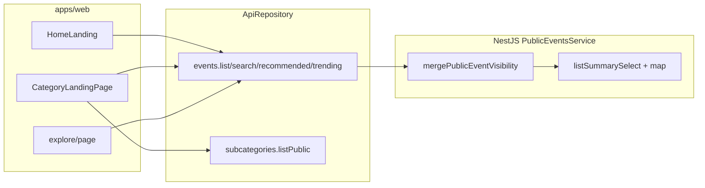

# Public Discovery Audit

**Proyecto:** Yo Te Invito  
**Estado:** **Cerrado** (Slices 1–8, QA 2026-05-22)  
**Fuentes:** `docs/context/*`, `docs/rules/*`, código en `apps/web`, `apps/api`, `packages/shared`

---

## Descubrimiento público — Estado cerrado

| Componente | Rutas / API | Notas |
|------------|-------------|--------|
| **Gateway editorial** | `/`, `/categorias` | 2×2 sin hotel; copy Bariloche; footer → `/home`, `/explore` |
| **Home** | `/home` | 4 categorías; rails + Ver más; `fromPrice`/`producerName`; hoteles “Próximamente” |
| **Explore** | `/explore` | Query `q`, `category`, `subcategoryId`, `city`, fechas, `page` |
| **Categorías** | `/categoria/{event\|gastro\|rental\|excursion}` | Hero, subcategorías, carruseles propios, cruzados |
| **Carruseles cruzados** | Bottom category landings | 3 rails; Ver más → otra categoría; sin hotel |
| **Metadata cards** | Home, explore, categorías | `ContentCard`; sin placeholders falsos |
| **Visibilidad eventos** | `GET /public/events*` | Eventos con horario: visibles hasta **01:00 del día siguiente** (TZ `America/Argentina/Buenos_Aires`) |
| **Trending** | `GET /public/events/trending` | `viewCount` ↓, `rankingScore` ↓, `startAt` ↑, `createdAt` ↓ |

**Tests automatizados:** `pnpm --filter api run test:event-visibility`, `test:event-trending`, `test:public-event-summary`.

**QA manual recomendado:** `/`, `/categorias`, `/home`, `/explore`, las 4 categorías, detalle por vertical (`/events`, `/restaurants`, `/rentals`, `/excursiones`).

**Pendiente fuera del bloque:** E2E Playwright discovery; drift build web (`registerPush.ts`); ítems checklist Rentals/Admin.

---

## 1. Resumen ejecutivo (histórico Slice 1)

Auditoría inicial detectó gaps; **todos los ítems del checklist § Descubrimiento público quedaron cerrados** en slices 2–8. Tabla histórica:

| Área | Estado final |
|------|----------------|
| Gateway editorial | Cerrado (Slice 5) |
| Páginas por categoría + cruzados | Cerrado (Slice 6) |
| `fromPrice` / `producerName` | Cerrado (Slice 2) |
| `/explore` | Cerrado (Slice 3) |
| Home discovery | Cerrado (Slice 4) |
| Trending `viewCount` | Cerrado (Slice 7) |
| Eventos vencidos 1AM | Cerrado (backend + tests Slice 8) |

**Slice 8 (2026-05-22):** QA documental; tests `test:event-visibility`; checklist V2 § Descubrimiento público marcado [x]; sin features nuevas.

---

## 2. Estado actual frontend

### 2.1 Rutas públicas relevantes

| Ruta | Componente / comportamiento |
|------|-----------------------------|
| `/` | Splash (`SplashIntro`) → grilla editorial (`CategoryGatewayScreen`). Si intro ya vista (&lt;24h), `replace` a `/home`. |
| `/categorias` | Misma grilla sin splash (`variant="page"`). Logo navbar apunta aquí. |
| `/home` | `HomeLanding` — carruseles globales + hero. `?category=` enfoca tab y scroll a rail. |
| `/categoria/[category]` | `CategoryLandingPage` — `event` \| `gastro` \| `rental` \| `excursion`. `?subcategory=` filtra. |
| `/explore` | Grid + formulario; `useExploreEvents` → `GET /public/events/search`. |
| Detalle | `/events/[id]`, `/restaurants/[id]`, `/rentals/[id]`, `/excursiones/[id]`, `/hoteles/[id]` |

**Estándar de categoría:** usar **`/categoria/{category}`** (`category` = `event` \| `gastro` \| `rental` \| `excursion`). No romper `/categorias` (alias editorial) ni rutas de detalle existentes.

### 2.2 Flujo post-splash (editorial)

- Config: `apps/web/lib/home/categoryGatewayConfig.ts` — headline *¿QUÉ QUERÉS HACER HOY?*, ubicación Bariloche, 4 tiles (sin hotel).
- Splash: `apps/web/components/splash/SplashIntro.tsx` + `apps/web/lib/introStorage.ts` (localStorage `yti_intro_last_seen`, 24h).
- Selección categoría → `getCategoryGatewayHref` → `/categoria/{category}` (no `/home` directo).
- **Nota:** reglas del proyecto desaconsejan `localStorage` en UI salvo excepciones; aquí solo guarda timestamp de intro (no datos de negocio).

**Ruta recomendada para pantalla editorial:** mantener **`/`** (primera visita) + **`/categorias`** (reentrada desde navbar). No hace falta `/descubrir` nueva.

### 2.3 Home pública (`HomeLanding`)

**Archivos clave:**

- `apps/web/components/home/HomeLanding.tsx`
- `apps/web/components/home/HomeHero.tsx`, `ContentRail.tsx`, `ContentCard.tsx`, `ContentPreviewModal.tsx`
- `apps/web/lib/query/home.ts` (`useHomeCarousels`)
- `apps/web/lib/home/homeViewModel.ts`, `homeStrategy.ts`
- `apps/web/lib/home/contentRoutes.ts`

**Carruseles hoy (`useHomeCarousels`):**

| Rail ID (view model) | Hook / endpoint | Datos |
|----------------------|-----------------|-------|
| `highlights` | `useEventsList` p1, limit 8 | `GET /public/events` |
| `recommended` | `recommended` → fallback `trending` | `GET /public/events/recommended`, `GET /public/events/trending` |
| `trending` | `trending` | `GET /public/events/trending` |
| `nearYou` | `list` + `city` (prefs o "Buenos Aires") | `GET /public/events` |
| `newEvents` | `list` + `dateFrom=hoy` | `GET /public/events` |
| `gastro` / `excursion` / `rental` / `hotel` | `recommended` por categoría → fallback `list` | `GET /public/events/recommended`, `GET /public/events` |

**Query keys:** `homeKeys` en `apps/web/lib/query/keys.ts`.

**Rutas de cards:** `getContentDetailHref` — `gastro`→`/restaurants`, `excursion`→`/excursiones`, `rental`→`/rentals`, `hotel`→`/hoteles`, default→`/events`.

**Cards — capacidades vs datos:**

| Campo UI | Soporte componente | ¿Viene del listado API? |
|----------|-------------------|-------------------------|
| Imagen, título, fecha, ciudad/lugar | Sí (collapsed) | Sí |
| Categoría | Badge con `item.category` raw (`event`, `gastro`…) | Sí |
| Subcategoría | No en card collapsed | `subcategoryName` solo en `list` no-gastro |
| `fromPrice` | `PriceBadge` en overlay expandido | **No** |
| `producerName` | `ProducerMeta` en overlay | **No** |
| Rating | Sí | Sí (`ratingAvg`) |
| Gastro promo | Sí (`gastroPromoLabel`) | Solo list gastro |

**Duplicación:** misma `ContentCard` en home (preview modal), categoría (preview) y explore (navegación directa). Mapping de hero: `lib/home/heroModel.ts` (acepta `fromPrice`/`producerName` pero no los recibe de API).

**Path discovery vs producto:** alineado Slice 4 — hero y carruseles sin hotel; bloque **Próximamente** (`HomeHotelsComingSoon`); 4 categorías + rails editoriales con Ver más a `/categoria/*`.

### 2.4 Páginas por categoría

**Base:** `CategoryLandingPage.tsx` + `useCategoryCarousels.ts` + `category-carousel.logic.ts`.

| Categoría | Comportamiento |
|-----------|----------------|
| `event` | `EventDiscoveryContent` — carruseles + vista por fecha + calendario modal |
| `gastro` / `rental` / `excursion` | Hero banner, `SubcategoryRail`, carruseles propios, `CrossCategoryRails` |

**Carruseles de categoría (sin filtro subcategoría):**

1. Destacados / Más recomendados (eventos: `featured_event` + ticketing)
2. Mejor puntuados (no eventos)
3. Recientes
4. Un rail por cada subcategoría activa (`upcoming` + slug)

**Carruseles cruzados:** `CrossCategoryRails` + `useCrossCategoryRails` — las otras 3 categorías, con **Ver más** → `/categoria/{cat}`. Sin hotel. Vacío eventos: mensaje dedicado.

**Subcategorías:** `useCategorySubcategories` → `SubcategoriesRepo.listPublic` → `GET /public/subcategories?category=&tenantId=`. Gastro: subcategoría virtual "Descuentos" si hay cupones publicados.

### 2.5 Explore (`/explore`)

**Archivos:** `apps/web/app/(public)/explore/page.tsx`, `apps/web/lib/query/explore.ts`.

**Filtros UI:** texto (`q`), ciudad, `dateFrom`/`dateTo`, categoría (select; incluye hotel si `PlatformConfig` lo trae). **Sin subcategoría.**

**Endpoint:** `repos.events.search` → `GET /public/events/search` (ApiRepository).

**Card:** `ContentCard` sin `onClick` → link directo a detalle. Respuesta search más pobre (sin `subcategoryName`, `hasTicketing`, `createdAt`, promos gastro).

**UX:** formulario “Buscar” manual; carga inicial con `page: 1` aunque filtros vacíos; categoría en badge raw.

---

## 3. Estado actual backend

### 3.1 Endpoints públicos de descubrimiento

| Método | Ruta | Servicio | Visibilidad 1AM |
|--------|------|----------|-----------------|
| GET | `/public/events` | `PublicEventsService.list` | Sí (`mergePublicEventVisibility`) |
| GET | `/public/events/search` | `search` | Sí |
| GET | `/public/events/recommended` | `recommended` → `list` | Sí |
| GET | `/public/events/trending` | `trending` | Sí |
| GET | `/public/events/calendar` | `listCalendarMonth` → `list` | Sí |
| GET | `/public/events/:id` | `detail` | Sí |
| GET | `/public/events/:id/discounts` | gastro discounts | Parcial (evento debe existir APPROVED) |
| GET | `/public/subcategories` | `SubcategoriesService.listPublic` | N/A |
| GET | `/public/events/:eventId/ticket-types` | `PublicTicketTypesService` | Sí (evento visible) |

**Controller:** `apps/api/src/public/public-events.controller.ts`.

### 3.2 DTO / campos en listados (`EventSummary`)

**Incluye hoy:** `id`, `title`, `startAt`, `city`, `venueName`, `coverImageUrl`, `category`, `subcategoryId`, `subcategoryName` (list no-gastro), `description`, ratings, `createdAt`, `isTicketingEnabled`, `hasTicketing`, `isGeneralPublication`, promos gastro.

**No incluye:** `fromPrice`, `producerName`, `endAt` (en summary), slug productora.

**Detalle (`EventDetail`):** `producer` completo (`ProducerProfile`), `endAt`, media, `rentalLocation`, `excursionOperator`. Precio mínimo **no** en detalle API — el frontend de `/events/[id]` lo calcula con **segunda request** a ticket-types.

### 3.3 Ordenamiento y ranking

- `sort`: `recent`, `featured_rating`, `featured_event`, `recommended`, `top_rated`, `upcoming`, `dateAsc`.
- `recommended` / `top_rated`: usa `rankingScore` / `ratingAvg` + `RECOMMENDED_LIST_MIN_VALID_REVIEWS`.
- `trending`: **`viewCount` ↓, `rankingScore` ↓, `startAt` ↑, `createdAt` ↓** (`event-trending.util.ts`, Slice 7). Recommended/top_rated sin cambios.

### 3.4 Subcategorías

- Modelo: `ContentSubcategory` (Prisma).
- Público: `GET /public/subcategories?tenantId&category` — solo `event|gastro|rental|excursion`.
- Admin hotel: `comingSoon: true` + mensaje “Próximamente”.
- Seed: `apps/api/scripts/seed-subcategories.ts` (`pnpm --filter api run seed:subcategories`) — Fiestas, Recitales, Autos, Kayaks, etc.

### 3.5 Filtros list/search

- Categoría: `event` incluye `category null`.
- Subcategoría: `subcategoryId` o `subcategorySlug` + `category`.
- Fechas: `dateFrom` / `dateTo` sobre `startAt`.
- `hasTicketing`, `excludeGeneralPublications`, `minValidReviews`.

---

## 4. Contrato actual de datos públicos



**Contrato objetivo (próximos slices)** — extender `eventSummarySchema` y mappers:

```ts
// packages/shared — campos propuestos
fromPrice: number | null;      // centavos o unidad documentada; null sin tickets activos
producerName: string | null; // ProducerProfile.displayName; null si no aplica
```

**Reglas de negocio acordadas:**

| Campo | Regla |
|-------|--------|
| `fromPrice` | Mínimo precio venta público (tanda activa / ticket type ACTIVE). Eventos sin ticketera → `null`. Gastro/rental/excursion/hotel → `null` salvo que exista precio explícito en modelo. |
| `producerName` | `Event.producerProfile.displayName` cuando `producerProfileId` y perfil ACTIVE. Rentals/gastro pueden usar nombre de local/operador en slice futuro si se define. |

---

## 5. Gaps detectados

| # | Gap | Severidad |
|---|-----|-----------|
| G1 | ~~API list/search/trending/recommended sin `fromPrice` ni `producerName`~~ | **Cerrado Slice 2** |
| G2 | ~~Explore sin filtro subcategoría; search con menos campos~~ | **Cerrado Slice 3** (paridad search/list Slice 2 + UI explore) |
| G3 | Cards muestran `category` técnico, no `subcategoryName` ni labels (`getCategoryLabel`) | Media |
| G4 | ~~Home discovery incluye Hoteles en tabs/carrusel~~ | **Cerrado Slice 4** |
| G5 | ~~Trending no usa `viewCount`~~ | **Cerrado Slice 7** |
| G6 | ~~`fromPrice` solo en detalle evento vía N+1 ticket-types~~ | **Cerrado Slice 2** (listados batch); detalle `/events/[id]` web puede seguir usando ticket-types local hasta slice UI |
| G7 | ~~Sin tests unitarios de `event-public-visibility.util.ts`~~ | **Cerrado Slice 8** (`test:event-visibility`) |
| G8 | Lint/build monorepo fallan por drift TS ajeno (portal productor, push, reviews) | Infra |
| G9 | Editorial: usuarios recurrentes saltan grilla y van a `/home` | Producto (¿intencional?) |
| G10 | Cross-category usa `trending` global filtrado — no ranking por categoría | Baja |

**No es gap (ya implementado):** regla 1:00 AM eventos timed; carruseles cruzados; página categoría; subcategorías públicas; pantalla editorial 2×2.

---

## 6. Cambios necesarios por área

### Backend

1. **`PublicEventsService`** — en `listSummarySelect` / mappers y `search`/`trending`:
   - Join `producerProfile` (ACTIVE) → `producerName`.
   - Subquery o helper `computeFromPriceCents(eventId)` desde `TicketType` + tanda activa (`TicketBatchService` / `pickActiveBatch`).
2. Reutilizar un único mapper `toEventSummaryPublic(row)` para list, search, trending, recommended.
3. **Smoke:** extender `smoke:api` o script dedicado: evento ayer visible antes 1:00, oculto después (TZ `America/Argentina/Buenos_Aires`).
4. ~~Trending por `viewCount`~~ — hecho Slice 7 (`recentScore` no existe en schema).

### Shared schemas

- `packages/shared/src/schemas/events.ts` — `eventSummarySchema`: `fromPrice`, `producerName` (nullable).
- Documentar unidad de `fromPrice` (recomendado: **entero en centavos** + moneda en campo futuro o asumir ARS).

### Frontend

1. Eliminar cálculo local de precio en listados; consumir campos API en `ContentCard`, `HomeHero`, explore.
2. **Explore:** subcategoría (`usePublicSubcategories` + `subcategorySlug` en search); labels humanos; usar `list` si se necesitan mismos campos que home.
3. **Home:** quitar hotel de `DISCOVERY_TABS` / rail o marcar “Próximamente”; Path A tabs hero anónimo (CONTEXT § H).
4. **Cards:** mostrar `subcategoryName`, `producerName`, `fromPrice` en collapsed (no solo hover desktop).
5. Editorial: decidir si visitas recurrentes deben ver grilla (`/categorias`) vs solo `/home`.

### QA / tests

| Tipo | Qué |
|------|-----|
| Unit API | `getMinVisibleTimedEventStartAt`, `isEventPubliclyVisible`, DST edge |
| Smoke HTTP | list/search no devuelven evento timed vencido; campos `fromPrice`/`producerName` |
| E2E opcional | `/` → elegir categoría → `/categoria/event`; `/explore` filtros |
| Manual | `/home`, `/explore`, fichas rental/gastro/excursion/event |

---

## 7. Riesgos

| Riesgo | Mitigación |
|--------|------------|
| TZ incorrecta para regla 1AM | Usar `PUBLIC_EVENTS_TIMEZONE`; tests con fechas fijas |
| `fromPrice` N+1 en listados | Agregación SQL o batch precio por IDs en servicio |
| Precio string vs number en ticket types | Normalizar a number en mapper |
| Romper rentals al tocar mappers | Tests smoke por categoría `rental` |
| Hotel visible en home confunde producto | Quitar de discovery path, mantener `/hoteles` |
| `localStorage` intro | Aceptable para UX; no mezclar con datos de negocio |
| Build roto preexistente | Arreglar drift shared/API antes de CI estricto en slices grandes |

---

## 8. Orden recomendado de implementación

| Slice | Entregable |
|-------|------------|
| **2** | Backend: `fromPrice` + `producerName` en todos los listados públicos + schema shared + smoke |
| **3** | Frontend cards/home/categoría: consumir contrato; mostrar subcategoría y labels |
| **4** | Eventos vencidos: tests + documentación (lógica ya en prod); verificar admin/productor no filtrados |
| **5** | Editorial/home: hotel fuera de discovery; política re-visita splash; hero tabs anónimos |
| **6** | Explore: subcategoría, paridad de campos, UX búsqueda |
| **7** | Trending real (`viewCount`); pulido rentals cards (checklist rentals) |

---

## 9. Archivos candidatos a modificar en próximos slices

### Backend

- `apps/api/src/public/public-events.service.ts`
- `apps/api/src/common/utils/event-public-visibility.util.ts` (solo tests)
- `apps/api/src/ticketing/ticket-batch.service.ts` (helper precio mínimo)
- `apps/api/scripts/smoke-api.ts` (o nuevo `smoke:public-discovery`)

### Shared

- `packages/shared/src/schemas/events.ts`

### Frontend

- `apps/web/components/home/ContentCard.tsx`
- `apps/web/components/home/ExpandedContentCardOverlay.tsx`
- `apps/web/lib/home/homeViewModel.ts`
- `apps/web/components/home/HomeHero.tsx`
- `apps/web/app/(public)/explore/page.tsx`
- `apps/web/lib/query/explore.ts`
- `apps/web/lib/query/categoryLanding.ts` (cross-category fetch)
- `apps/web/components/categories/CategoryLandingPage.tsx` (si mapping centralizado)

### Sin tocar salvo bug

- `CategoryGatewayScreen`, `categoryGatewayConfig` (ya cumplen spec editorial)
- `CrossCategoryRails` (estructura OK; datos mejoran con API)
- Detalle rental/gastro/excursion (`RentalProductDetailContent`, etc.)

---

## 10. Criterios de aceptación para próximos slices

### Slice 2 — Contrato listados

- [ ] `GET /public/events`, `/search`, `/recommended`, `/trending` devuelven `fromPrice` y `producerName` coherentes.
- [ ] Zod `eventSummarySchema` actualizado; web sin `fetch` directo.
- [ ] Smoke: evento con tickets tiene `fromPrice` &gt; 0; sin tickets `null`.
- [ ] Smoke: evento timed pasado no aparece en list/search después de ventana 1AM (TZ Argentina).

### Slice 3 — Cards y home

- [ ] `ContentCard` muestra precio, productora, subcategoría donde aplique.
- [ ] Home/categoría sin requests extra por card para precio.

### Slice 4 — Explore

- [ ] Filtro subcategoría operativo.
- [ ] Misma riqueza de metadata que home en resultados.

### Slice 5 — Editorial / home polish

- [ ] Grilla sin hoteles (ya); home discovery sin carril hotel o “Próximamente”.
- [ ] Tabs hero anónimos Path A (si aplica).

---

## 11. Checklist del slice 1 (auditoría)

- [x] Rutas públicas principales revisadas
- [x] Hooks/repositorios home y category carousels revisados
- [x] `/explore` revisado
- [x] Endpoints públicos eventos/discovery revisados
- [x] Subcategorías públicas revisadas
- [x] `fromPrice` analizado
- [x] `producerName` analizado
- [x] Regla eventos vencidos analizada (**ya implementada en API**)
- [x] Archivos candidatos identificados
- [x] `docs/audits/PUBLIC_DISCOVERY_AUDIT.md` creado
- [ ] `CONTEXT_PENDIENTES.md` — no actualizado (ítems checklist V2 siguen válidos como pendientes de pulido, no cerrados)
- [x] Sin cambios funcionales grandes

---

## 12. Smoke / verificación (Slice 8 — 2026-05-22)

| Comando | Resultado | Relación discovery |
|---------|-----------|-------------------|
| `pnpm --filter shared run build` | OK | Contratos `EventSummary` |
| `pnpm --filter api run build` | OK | `PublicEventsService`, visibility, trending |
| `pnpm --filter api run test:event-visibility` | OK | Regla 1AM |
| `pnpm --filter api run test:event-trending` | OK | Orden trending |
| `pnpm --filter api run test:public-event-summary` | OK | `fromPrice` helpers |
| `pnpm --filter api run smoke:api` | Requiere credenciales | Valida contrato trending/list |
| `pnpm --filter web run build` | **Falla** | `apps/web/lib/push/registerPush.ts` — **no relacionado** con discovery |
| `pnpm lint` | **Falla** | Drift TS en api (portal prefs, disputes) y web (push, producer) — **no relacionado** |

**Cobertura visibilidad pública (`mergePublicEventVisibility`):** `list`, `search`, `trending`, `recommended` (vía `list`), `detail`, `listCalendarMonth` en `PublicEventsService`; carruseles web consumen esos endpoints. **No aplica** en admin/producer/scanner/métricas privadas.

**Verificación manual:** ver tabla § Descubrimiento público — Estado cerrado.

---

## Referencias rápidas

- Visibilidad pública: `apps/api/src/common/utils/event-public-visibility.util.ts`
- Gateway editorial: `apps/web/lib/home/categoryGatewayConfig.ts`
- Carruseles categoría: `apps/web/lib/query/useCategoryCarousels.ts`
- Checklist producto: `docs/dev/Yo_Te_Invito_Checklist_V2_Produccion.md` § Descubrimiento público
