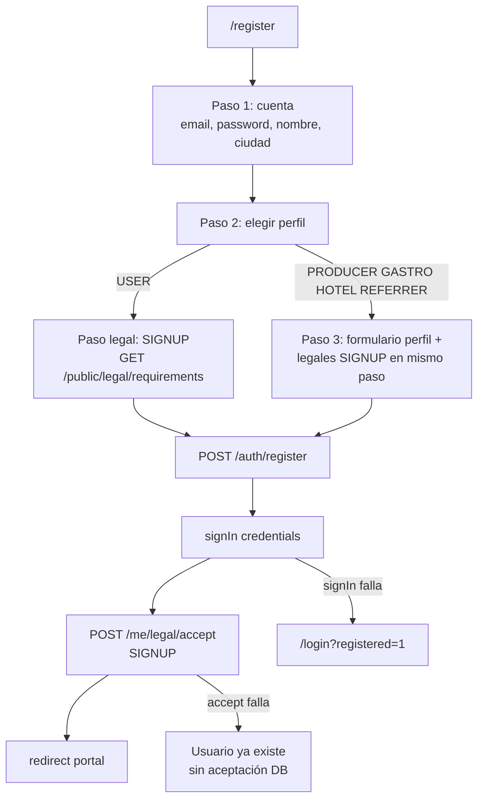

# Register & Onboarding Audit — Yo Te Invito

Fecha: 2026-05-24  
Slice: Registro y onboarding por tipo de usuario — Slice 1  
Estado: Auditoría

## 1. Resumen ejecutivo

El registro público unificado vive en **`/register`** (`RegisterWizard`): tres pasos lógicos (cuenta → elección de perfil → datos de perfil y/o legales), luego `POST /auth/register`, `signIn` y `POST /me/legal/accept` con contexto `SIGNUP`.

**Qué funciona hoy**

- Elección de perfil en un solo wizard (USER, PRODUCER, GASTRO, HOTEL, REFERRER).
- Creación de usuario `ACTIVE` con rol **`USER`** siempre; perfiles comerciales **`ACTIVE`** + membership `OWNER`/`ACTIVE` en la misma transacción (sin cola admin de perfiles).
- Aceptación legal `SIGNUP` con checkboxes, links a `/legal/[slug]` y persistencia en `UserLegalAcceptance` (`documentVersionId`, `acceptedAt`, contexto).
- Redirección post-registro al portal correspondiente (`/me`, `/producer`, `/gastro`, `/hotel`, `/referrer`).
- Acceso a portales vía `ProfileProtectedLayout` + `GET /me` → `availableProfiles` (no exige `PRODUCER_OWNER` en JWT).
- Rutas legacy `/register/producer|gastro|hotel` redirigen a `/register`.

**Qué está incompleto o ausente**

- **No existe registro para rental / proveedor de equipos** en UI ni en `registrationProfileTypeSchema` (solo catálogo legal `rental_terms` + perfil `RENTAL` en admin; operación rental es vía **admin** `RentalLocation`, no onboarding self-service).
- **Dos caminos paralelos** para crear perfiles comerciales: registro público vs `/cuenta/solicitar-*` (usuario ya logueado) con **schemas y campos distintos**; el segundo no integra legales.
- Términos **específicos por vertical** (`producer_terms`, `gastro_terms`, etc.) **no** son obligatorios en `SIGNUP`; quedan para `PORTAL_ACCESS` (banner no bloqueante).
- Checklist V2 ítem «Registrar versión aceptada…» está **parcialmente implementado** solo para documentos con `isRequiredForSignup` (hoy: generales + privacidad).
- Páginas `/register/*/success` con copy de **«solicitud pendiente de aprobación»** (legacy); el flujo actual activa al instante.
- Sin estado visual de completitud de onboarding; validación Zod de perfiles comerciales solo en backend al submit.

**Principales riesgos**

| Riesgo | Severidad |
|--------|-----------|
| Usuario creado si falla `POST /me/legal/accept` tras `register` + login | Alta |
| Registro permitido sin checkboxes si no hay documentos **publicados** (`items.length === 0`) | Alta |
| Gastro: registro crea perfil sin `publicEventId` hasta sync en portal; apply logueado crea perfil mínimo sin geo | Media |
| Hotel: copy «alojamiento» en wizard vs vertical hotel Próximamente / sin booking | Media |
| Confusión rental vs hotel; sin onboarding rental | Media |
| `POST /auth/apply-role` + `RoleApplication` legacy conviven con registro nuevo | Baja |

**Recomendación de próximos slices (orden sugerido)**

1. Matriz definitiva de campos por perfil + decisión rental (admin-only vs nuevo `RENTAL` en register).
2. Unificar o documentar registro vs `/cuenta/solicitar-*`; alinear schemas shared/backend.
3. Pulir formulario comprador (paso legal dedicado, errores, mobile).
4. Pulir formularios productora, gastro, hotel, referido (validación client, copy, responsabilidad).
5. Cerrar gap legal: `SIGNUP` vs `PORTAL_ACCESS`; transacción o rollback si falla accept.
6. Completitud/onboarding + mensajes de error + QA mobile.

---

## 2. Alcance revisado

### Frontend (web)

| Área | Archivos / rutas |
|------|------------------|
| Registro principal | `apps/web/app/(auth)/register/page.tsx`, `components/auth/RegisterWizard.tsx` |
| Redirects legacy | `register/producer`, `register/gastro`, `register/hotel` → `/register` |
| Success legacy | `register/producer|gastro|success` (copy desactualizado; no usado por wizard) |
| Legales UI | `components/legal/LegalFlowAcceptanceBlock.tsx`, `LegalAcceptanceCheckboxList.tsx`, `lib/legal/legal-acceptance-validation.ts` |
| Hooks | `lib/query/public-legal-requirements.ts`, `lib/query/me-legal.ts` |
| Onboarding logueado | `app/(portal)/cuenta/solicitar-productor|gastro|hotel|referrer/page.tsx` |
| Cuenta / perfiles | `components/me/MeAccountProfiles.tsx`, `app/(portal)/me/account/page.tsx`, `/profiles` |
| Portales guard | `components/auth/ProfileProtectedLayout.tsx`, layouts `(portal)/*/layout.tsx` |
| Portal legales post-login | `PortalLegalPendingBanner`, `lib/navigation/portalLegalProfile.ts` |
| Repos | `repositories/ApiRepository.ts` (`auth.register`, `legalDocuments.*`, `profiles.apply*`) |

### Backend (API)

| Área | Archivos |
|------|----------|
| Auth | `auth/auth.controller.ts`, `auth.service.ts`, `auth/profile-registration.service.ts` |
| Perfiles apply | `modules/profiles/profiles.controller.ts`, `profiles.service.ts` |
| Legales | `modules/legal/legal-documents.service.ts`, `me-legal.service.ts`, controllers public/me |
| Me | `modules/me/me.service.ts` (`availableProfiles`) |
| Legacy | `auth.service.applyRole` → `RoleApplication` |
| Prisma | `User`, `ProducerProfile`, `GastroProfile`, `HotelProfile`, `ReferrerProfile`, `User*Membership`, `LegalDocument*`, `UserLegalAcceptance`, `RentalLocation` (sin membership rental) |

### Shared

| Archivo | Uso |
|---------|-----|
| `packages/shared/src/schemas/user.schema.ts` | `authRegisterRequestSchema`, `registrationProfileTypeSchema`, `profile*ApplySchema` |
| `packages/shared/src/schemas/gastro-locations.ts` | `gastroLocalCreateSchema` (registro gastro) |
| `packages/shared/src/schemas/legal-documents.ts`, `me-legal.ts` | Requirements / accept |
| `packages/shared/src/constants/legal-documents.ts` | Seed flags `isRequiredForSignup`, `appliesToProfiles` |

### Documentación leída

`docs/context/AI_ENTRYPOINT.md`, `PROJECT_CONTEXT.md`, `BACKEND_CONTEXT.md`, `FRONTEND_CONTEXT.md`, `CONTEXT_PENDIENTES.md`, `docs/dev/Yo_Te_Invito_Checklist_V2_Produccion.md`, `docs/legal/LEGAL_ADMIN_MODULE.md`, `docs/dev/LEGAL_ADMIN_QA_SMOKE.md`.

---

## 3. Flujo actual de registro



### Paso a paso (comportamiento real)

1. **Entrada:** `GET /register` renderiza `RegisterWizard` (`max-w-lg`, mobile-friendly stack).
2. **Paso 1 — Cuenta:** validación **solo frontend** (`accountSchema` Zod): email, password ≥6, confirmación, nombre, apellido, ciudad (`PreferredCitySelect`, default Bariloche).
3. **Paso 2 — Perfil:** cinco botones (`PROFILE_CHOICES`). No hay tipo **RENTAL**. Al elegir:
   - **USER** → `step = 'legal'` (no hay paso 3 de negocio).
   - **Otros** → `step = 3` (formulario + legales).
4. **Legales (SIGNUP):** `usePublicLegalRequirements('SIGNUP', profileType)` → `GET /public/legal/requirements?tenantId=&context=SIGNUP&profileType=`. Checkboxes obligatorios si hay ítems; si **lista vacía**, `allLegalItemsSelected` devuelve `true` y se puede registrar sin UI legal.
5. **Submit:** `POST /auth/register` con `tenantId: 'tenant-demo'` hardcodeado, `profileType`, `profileData` (omitido para USER).
6. **Backend:** crea `User` (`role: USER`, `status: ACTIVE`, `preferences.city` si hay ciudad); si `profileType !== USER`, `ProfileRegistrationService.createProfileForRegistration` en la misma transacción; emails verificación + bienvenida; devuelve JWT.
7. **Frontend:** `signIn('credentials')`. Si OK y hay versiones seleccionadas → `POST /me/legal/accept` con `{ documentVersionIds, context: 'SIGNUP' }`.
8. **Redirect:** USER → `/me`; PRODUCER → `/producer`; GASTRO → `/gastro`; HOTEL → `/hotel`; REFERRER → `/referrer`; `router.refresh()`.

### Flujo alternativo (no es `/register`)

Usuario **ya autenticado** puede crear otro perfil comercial desde:

- `/cuenta/solicitar-productor` → `POST /profiles/producer/apply` (`profileProducerApplySchema`)
- `/cuenta/solicitar-gastro` → `POST /profiles/gastro/apply` (`profileGastroApplySchema` — **no** `gastroLocalCreateSchema`)
- `/cuenta/solicitar-hotel` → `POST /profiles/hotel/apply` (formulario más completo que registro hotel)
- `/cuenta/solicitar-referrer` → `POST /profiles/referrer/apply`

Sin bloque legal en estos formularios. Redirige a `/profiles`.

### Legacy (no usar para onboarding nuevo)

- `POST /auth/apply-role` → cola `RoleApplication` (PENDING hasta admin).
- Admin `GET /admin/applications` (repo web aún existe).
- Páginas success hablan de «aprobación pendiente».

---

## 4. Matriz actual por tipo de perfil

| Perfil | Campos UI actuales (`/register`) | `profileType` | `profileData` enviado | Perfil creado | Rol JWT / Membership | Redirección | Términos SIGNUP (publicados) | Observaciones |
|--------|-----------------------------------|---------------|------------------------|---------------|----------------------|-------------|------------------------------|---------------|
| **Comprador / USER** | Paso 1 solo; paso legal sin campos negocio | `USER` | *(omitido)* | Solo `User` | `role: USER`; tickets vía `/me` | `/me` | `terms_general`, `privacy_policy` (por flags seed) | Ciudad en `User.preferences` |
| **Productora** | `displayName*`, `city`, `description` | `PRODUCER` | `{ displayName, description?, city? }` | `ProducerProfile` ACTIVE + `UserProducerMembership` OWNER ACTIVE | JWT `USER`; acceso portal por membership | `/producer` | Generales + privacidad (mismo SIGNUP) | **Sin slug** al registrar; slug en `/producer/profile` después. `producer_terms` en **PORTAL_ACCESS** |
| **Gastronómico** | `displayName*`, `summary`, `contactEmail*`, `province*`, `city*`, `address*`, `lat`, `lng` (defaults CABA) | `GASTRO` | Objeto `gastroLocalCreateSchema` | `GastroProfile` ACTIVE + membership | Igual | `/gastro` | Generales + privacidad | Backend exige `contactEmail` email válido. **Sin** `publicEventId` hasta sync en portal. Apply logueado usa schema **distinto** y menos campos |
| **Hotel** | `displayName*`, `websiteUrl*`, `city`, `description` | `HOTEL` | `{ displayName, websiteUrl, description?, city? }` | `HotelProfile` ACTIVE + membership | Igual | `/hotel` | Generales + privacidad | UI dice «Hotel / alojamiento»; producto V2 = Próximamente, sin booking. `hotel_terms` en PORTAL_ACCESS. `bookingUrl` no se pide en registro |
| **Referido** | `displayName*`, `city`, `bio` | `REFERRER` | `{ displayName, bio?, city? }` | `ReferrerProfile` ACTIVE + slug/handle auto + membership | Igual | `/referrer` | Generales + privacidad | `publicVisibility: false` por defecto. Copy menciona Mis Tickets + pagos externos en docs referidos, no en wizard |
| **Rental / equipos** | **No disponible** en wizard | — | — | Solo admin: `RentalLocation` + productos `Event` category rental | Sin modelo membership rental | — | `rental_terms` aplica a perfil `RENTAL` en catálogo legal; **sin** onboarding | Checklist pide pulir formulario rental: **gap total** en registro |

---

## 5. Frontend audit

### 5.1 Rutas y componentes

- **Único entry de registro:** `/register` → `RegisterWizard`.
- **Selección de perfil:** clara visualmente (cards con título + descripción); no hay confirmación explícita «¿Confirmás que sos X?».
- **Formulario por perfil:** cambia el bloque en paso 3; USER usa paso `'legal'` separado.
- **Hardcode:** `tenantId: 'tenant-demo'` en payload.
- **Duplicación:** flujos `/cuenta/solicitar-*` repiten intención con menos campos y sin legales.
- **RENTAL:** ausente en `PROFILE_CHOICES` y en `registrationProfileTypeSchema`.

### 5.2 Repositorios / hooks

| Operación | Ruta API | Hook / uso |
|-----------|----------|------------|
| Registro | `POST /auth/register` | `repos.auth.register` |
| Requisitos legales signup | `GET /public/legal/requirements` | `usePublicLegalRequirements` |
| Aceptación | `POST /me/legal/accept` | `repos.legalDocuments.acceptMyLegalDocuments` |
| Apply perfil (logueado) | `POST /profiles/*/apply` | mutations en páginas solicitar |

Arquitectura respetada: sin `fetch` directo en componentes.

### 5.3 Validaciones visibles

| Paso | Frontend | Backend (al submit) |
|------|----------|---------------------|
| Cuenta | Zod `accountSchema` | `authRegisterRequestSchema` |
| Perfil comercial | HTML `required` en algunos campos; **sin** Zod por tipo | `profileProducerApplySchema`, `gastroLocalCreateSchema`, `profileHotelApplySchema`, `profileReferrerApplySchema` |
| Legales | `allLegalItemsSelected` | No validado en `/auth/register`; sí en `/me/legal/accept` |

Errores API: `getErrorMessage` → texto rojo bajo formulario. Conflict email: mensaje genérico del API.

### 5.4 Estados loading / error / success

- `submitting` deshabilita botones; label «Creando cuenta…».
- Legal: `signupLegalLoading` → `PageLoader`.
- Si `signIn` falla tras registro exitoso: mensaje + redirect `/login?registered=1` (**cuenta creada**, sin accept legal en ese camino).
- No hay pantalla de éxito intermedia; redirect directo al portal.

### 5.5 Mobile UX

- Card `max-w-lg`, grids 2 columnas en nombre/apellido y lat/lng.
- Botones full-width; paso legal con dos botones en fila (`flex gap-2`).
- Sin sticky CTA ni indicador de progreso (1/2/3).
- Textareas sin contador de caracteres; lat/lng técnicos poco amigables en mobile.

### 5.6 Riesgos frontend

- Usuario puede elegir perfil comercial y enviar sin validación client de `websiteUrl` (hotel) hasta error API.
- Mensaje verde «No tenés documentos legales pendientes» si nada publicado → registro sin fricción legal.
- Copy hotel «alojamiento» puede contradecir messaging rental anti-alojamiento.
- Success pages legacy confunden si alguien enlaza URLs viejas.

---

## 6. Backend audit

### 6.1 Endpoint `POST /auth/register`

- Controller: `AuthController.register` + `ZodValidationPipe(authRegisterRequestSchema)`.
- Service: `AuthService.register`:
  - Email único por tenant.
  - Password hash (scrypt).
  - **`role` siempre `USER`** (no promueve a `PRODUCER_OWNER`, etc.).
  - `profileType` default `USER`; exige `profileData` si `profileType !== USER`.
  - Transacción: user + perfil.
  - Post-transacción: token verificación email, welcome email, JWT response.

### 6.2 Schemas compartidos

```132:152:packages/shared/src/schemas/user.schema.ts
export const registrationProfileTypeSchema = z.enum([
  'USER',
  'PRODUCER',
  'GASTRO',
  'HOTEL',
  'REFERRER',
]);
// ...
export const authRegisterRequestSchema = z.object({
  email: z.string().email(),
  password: z.string().min(6, 'La contraseña debe tener al menos 6 caracteres'),
  firstName: z.string().min(1, 'Nombre requerido'),
  lastName: z.string().min(1, 'Apellido requerido'),
  city: z.string().max(120).optional(),
  tenantId: z.string().optional(),
  profileType: registrationProfileTypeSchema.optional().default('USER'),
  profileData: z.unknown().optional(),
});
```

`profileData` es `unknown` en register; validación fuerte ocurre en `ProfileRegistrationService` por switch.

### 6.3 Persistencia real por perfil

| Tipo | Servicio | Estado perfil | Notas |
|------|----------|---------------|-------|
| PRODUCER | `createProducerActive` | `ProducerProfile.status = ACTIVE` | `shortDescription` ← `description`; sin slug |
| GASTRO | `createGastroActive` | `GastroProfile.status = ACTIVE` | Geo + contactEmail; sin evento público automático |
| HOTEL | `createHotelActive` | `HotelProfile.status = ACTIVE` | `websiteUrl` obligatorio en schema |
| REFERRER | `createReferrerActive` | `ReferrerProfile.status = ACTIVE` | slug + publicHandle + association token |

**Apply logueado** (`ProfilesService`): también ACTIVE, pero gastro apply usa campos planos (`description`, `address`) **sin** `gastroLocalCreateSchema` — perfiles gastro incompletos para ficha/QR hasta completar en portal.

### 6.4 Roles, memberships y estados

- **JWT `role`:** permanece `USER` para registrantes comerciales.
- **Acceso portal:** `MeService` calcula `hasAccess` por memberships ACTIVE o roles legacy (`PRODUCER_OWNER`, etc.).
- **Cuenta maestro:** `felipe.e.salom@gmail.com` no tiene excepción en register; protegida en admin users / cleanup scripts.
- **Todos los perfiles comerciales en registro quedan ACTIVE** (no PENDING). Alineado con checklist «perfiles activos al crear».

### 6.5 Riesgos backend

- Register **no** registra aceptación legal (correcto por diseño) → depende del cliente.
- `apply-role` / `RoleApplication` pueden confundir integraciones antiguas.
- Sin validación de que `profileType` en legal accept coincida con memberships creadas.
- Rental: solo operadores con rol `ADMIN` gestionan locales; no hay `UserRentalMembership`.

---

## 7. Legal acceptance audit

### 7.1 Documentos requeridos por contexto

Según seed (`LEGAL_DOCUMENT_SEED_DEFINITIONS`):

| Contexto | Documentos con flag true |
|----------|---------------------------|
| **SIGNUP** | `terms_general`, `privacy_policy` |
| **CHECKOUT** | `terms_general`, `purchase_refund_policy` (perfil USER) |
| **PORTAL_ACCESS** | `terms_general` + términos por vertical (`producer_terms`, `gastro_terms`, `rental_terms`, `hotel_terms`, `referrer_terms`, `ticket_transfer_terms` según `appliesToProfiles`) |

Filtro adicional: documento debe tener versión **PUBLISHED** y `visibility: PUBLIC`.

### 7.2 Signup legal flow

1. `GET /public/legal/requirements?context=SIGNUP&profileType=PRODUCER` filtra por `isRequiredForSignup` **y** `appliesToProfiles` incluye el tipo (o array vacío).
2. Usuario marca checkboxes → tras login `POST /me/legal/accept`.
3. **Orden:** register → signIn → accept (**no** accept antes de userId).

### 7.3 Registro de versión y fecha

Modelo `UserLegalAcceptance`:

- `documentVersionId`, `documentId`, `context`, `acceptedAt` (default now), `ipAddress`, `userAgent` opcionales.
- Unique `(userId, documentVersionId, context)`.

**Checklist «Registrar versión aceptada…»:** implementado para flujos que llaman `/me/legal/accept` (registro, checkout autenticado, banner portal). **No** implementado en registro para términos solo `PORTAL_ACCESS`. Checkout invitado: checkbox sin persistencia hasta cuenta.

### 7.4 Fallos posibles

| Escenario | Comportamiento |
|-----------|----------------|
| Accept falla después de register+login | Usuario existe; puede quedar sin filas `UserLegalAcceptance` |
| signIn falla | Redirect login; cuenta existe; sin accept |
| Sin docs publicados | UI: mensaje verde; registro sin checkboxes |
| Versión INTERNAL / DRAFT | No aparece en requirements |
| Nueva versión publicada | Usuario debe re-aceptar (requirements pendientes) |

### 7.5 Riesgos legales / UX

- Términos verticales no aceptados en signup → riesgo si se asume «todo aceptado al registrarse como productora».
- Banner portal es **no bloqueante** (`PortalLegalPendingBanner`).
- Links en checkboxes: `item.publicPath` → `/legal/{slug}` (correcto si publicado).

---

## 8. Inconsistencias detectadas

| Área | Problema | Impacto | Severidad | Recomendación |
|------|----------|---------|-----------|---------------|
| Legal / registro | Accept legal después de crear usuario; sin compensación si falla | Usuario sin trazabilidad legal | Alta | Transacción post-login, retry UI, o bloquear uso hasta accept |
| Legal / seed | Sin versiones PUBLISHED → signup sin checkboxes | Registro sin aceptación registrada | Alta | Bloquear submit o exigir publish mínimo en staging/prod |
| Producto | No hay registro rental; checklist asume formulario rental | Proveedores no pueden self-onboard | Alta | Definir slice: admin-only vs `RENTAL` en wizard |
| Duplicidad | `/register` gastro vs `/cuenta/solicitar-gastro` schemas distintos | Perfiles incompletos / datos inconsistentes | Alta | Unificar schema o deprecar un camino |
| Checklist | Ítem «términos específicos según perfil» marcado hecho pero SIGNUP solo lleva generales | Expectativa vs implementación | Media | Aclarar checklist o mover obligatoriedad a SIGNUP |
| Checklist | Ítem «Registrar versión…» sin marcar pero código persiste en accept | Desalineación backlog | Baja | Marcar sub-ítem: SIGNUP sí; verticales en PORTAL_ACCESS |
| Hotel UX | Wizard «alojamiento» vs V2 Próximamente sin reservas | Expectativas incorrectas | Media | Copy: ficha informativa, sin booking |
| Gastro | Lat/lng default Buenos Aires | Geo incorrecta si no editan | Media | Default según ciudad elegida o mapa |
| Producer | Sin slug en registro | Ficha pública incompleta hasta editar perfil | Baja | Opcional: slug auto en register |
| Legacy | `/register/*/success` copy «pendiente aprobación» | Confusión | Baja | Redirect a `/register` o actualizar copy |
| Legacy | `RoleApplication` + `/auth/apply-role` | Deuda técnica | Baja | Deprecar documentado |
| JWT | Rol siempre USER | Correcto si memberships bastan; confuso en debugging | Baja | Documentar en onboarding |
| Tenant | `tenant-demo` hardcodeado en wizard | Multi-tenant futuro | Baja | Usar `useTenant()` |

---

## 9. Recomendación de slices siguientes

1. **Matriz definitiva de campos** por perfil (incl. rental: alcance admin vs self-service) y decisión de un solo camino onboarding.
2. **Shared schemas + validación backend** alineados entre `auth/register` y `profiles/*/apply`; tests de contrato.
3. **Pulido registro comprador** (paso legal, errores, vacío legal, mobile).
4. **Pulido productora** (slug opcional, legal copy, validación client).
5. **Pulido gastro** (geo, publicEvent sync, unificar con solicitar).
6. **Pulido hotel + referido** (copy Próximamente / pagos externos).
7. **Rental onboarding** (si aplica) o documentar explícitamente flujo solo admin.
8. **Completitud visual + mensajes error + QA mobile** del wizard completo.
9. **Hardening legal:** obligatoriedad SIGNUP vs PORTAL; rollback/retry accept.

---

## 10. Criterios de aceptación para cerrar este Slice 1

- [x] Auditoría creada en `docs/audits/REGISTER_ONBOARDING_AUDIT.md`.
- [x] Se listaron rutas/componentes/backend/schemas revisados.
- [x] Se documentó el flujo actual completo.
- [x] Se creó matriz actual por tipo de perfil.
- [x] Se documentaron inconsistencias y riesgos.
- [x] Se recomendó el orden de próximos slices.
- [x] No se hicieron cambios funcionales destructivos.

---

## Smoke manual sugerido

1. Abrir `/register`.
2. Probar registro **comprador** (USER): paso legal → crear → verificar redirect `/me`.
3. Probar registro **productora**: campos mínimos → `/producer` y membership en `/profiles` o `GET /me`.
4. Probar registro **gastronómico**: con dirección y email contacto → `/gastro`; verificar perfil en DB (`GastroProfile`, geo).
5. Probar registro **rental**: confirmar que **no** hay opción en UI (documentar resultado esperado: N/A).
6. Probar registro **hotel**: `websiteUrl` https → `/hotel`.
7. Probar registro **referido** → `/referrer`; verificar slug/handle en DB.
8. Confirmar que aparecen **links legales** en checkboxes (con al menos `terms_general` y `privacy_policy` publicados).
9. Confirmar que **no** se puede avanzar sin aceptar cuando hay ítems en lista legal.
10. Confirmar **redirección** post-registro según tabla §4.
11. Tras registro, `GET /me/legal/acceptances` o DB `UserLegalAcceptance`: `documentVersionId`, `context: SIGNUP`, `acceptedAt`.
12. **Sin documentos publicados:** repetir registro y anotar si permite crear cuenta sin checkboxes (comportamiento actual esperado: sí).

### Verificación API rápida (opcional)

```bash
# Con API en :3001 y docs publicados
pnpm --filter api run smoke:legal
# Tras registro manual, inspeccionar aceptaciones con usuario de prueba
```

---

## Referencias cruzadas

- Legal: `docs/legal/LEGAL_ADMIN_MODULE.md`, `docs/dev/LEGAL_ADMIN_QA_SMOKE.md`
- Perfiles activos: `docs/context/CONTEXT_PENDIENTES.md` § Perfiles y registro
- Gastro/hotel V2: `docs/audits/GASTRO_HOTELES_V2_AUDIT.md`
- Rentals operación: checklist § Rentals (admin locales, sin onboarding usuario)
