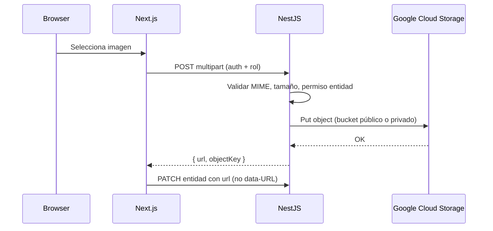

# Estrategia Google Cloud Storage — Yo Te Invito

**Estado:** arquitectura documentada + **API upload V1** (Junio 2026). Formularios frontend pendientes.  
**Relacionado:** [`GOOGLE_CLOUD_RUNBOOK.md`](./GOOGLE_CLOUD_RUNBOOK.md) · [`GCS_BACKUPS_RUNBOOK.md`](./GCS_BACKUPS_RUNBOOK.md)

> **Regla:** no commitear JSON de service account, API keys ni `.env` productivos. Solo nombres, IDs y variables esperadas.

---

## 1. Resumen ejecutivo

| Decisión | Detalle |
|----------|---------|
| Bucket privado actual | **`yti-prod-storage`** — se mantiene **privado** (Public Access Prevention). Backups, archivos privados futuros, exports internos. **No** exponer públicamente. |
| Bucket público | **`yti-prod-public-assets`** — **creado** en GCP (`southamerica-east1`); lectura pública; CORS aplicado |
| Alternativa descartada como nombre principal | `yti-prod-media` — menos explícito sobre alcance; reservar solo si el equipo prefiere nombre corto. |
| Upload V2 inicial | **Browser → backend NestJS → GCS**. No upload directo desde navegador a GCS en la primera iteración. |
| Persistencia en BD | Guardar **URL HTTPS** (`https://…`), nunca `data:` / base64 en PostgreSQL. |
| Backups | **Cerrados** — ver [`GCS_BACKUPS_RUNBOOK.md`](./GCS_BACKUPS_RUNBOOK.md). Lifecycle `backups/postgres/` → delete a 30 días. |

---

## 2. Problema actual

- Formularios (eventos, rentals, gastro, hoteles, productoras) envían imágenes como **data-URL** comprimidas.
- PostgreSQL almacena strings largos (~2M chars límite Zod); dumps de backup crecen; riesgo operativo en VPS prod.
- No hay URLs estables ni CDN para `next/image` remoto.

**Objetivo V2 storage:** reemplazar gradualmente data-URL por URLs GCS definitivas, sin mezclar assets públicos con datos sensibles ni backups.

---

## 3. Modelo de buckets

### 3.1 `yti-prod-storage` (privado — existente)

| Atributo | Valor |
|----------|--------|
| URI | `gs://yti-prod-storage` |
| Región | `southamerica-east1` |
| Acceso | **No público** — Uniform bucket-level access + Public Access Prevention |
| Soft delete | 7 días |
| Lifecycle | `Delete` · `age: 30` · `matchesPrefix: backups/postgres/` |

**Contenido permitido:**

| Prefijo | Uso |
|---------|-----|
| `backups/postgres/YYYY/MM/` | Dumps PostgreSQL (script `backup-postgres-to-gcs.sh`) |
| `private/tickets/` | Tickets PDF/imagen con datos personales (futuro) |
| `private/invoices/` | Facturas, comprobantes (futuro) |
| `private/system/` | Artefactos internos, migraciones de archivos |
| `private/exports/` | CSV/reportes admin descargables (futuro) |

**Prohibido en este bucket:**

- Covers/galerías públicas de discovery
- Hacer el bucket público o allUsers read
- Credenciales, keys, `.env`

**Acceso:** Service Account `yti-backend-storage`; URLs firmadas (V4) para descarga temporal de objetos privados cuando el usuario tenga permiso.

### 3.2 `yti-prod-public-assets` (público — operativo)

| Atributo | Valor |
|----------|--------|
| URI | `gs://yti-prod-public-assets` |
| Región | `southamerica-east1` |
| Storage class | Standard |
| Acceso | `allUsers` → Storage Object Viewer |
| Public Access Prevention | No bloquea acceso público |
| CORS | `yoteinvito.club`, `www` — GET/HEAD/OPTIONS |
| URL base | `https://storage.googleapis.com/yti-prod-public-assets` |

**Contenido permitido:**

- Covers, banners, galerías, logos de fichas públicas
- Assets de plataforma (footer, placeholders controlados)

**Prohibido:**

- Backups PostgreSQL
- Facturas, tickets privados, exports admin
- Credenciales
- Upload de SVG/PDF por usuarios en V2 inicial

**URLs públicas (fase 1 — sin CDN):**

```txt
https://storage.googleapis.com/yti-prod-public-assets/public/events/{eventId}/cover/{filename}
```

**URLs públicas (fase 2 — opcional CDN):**

```txt
https://cdn.yoteinvito.club/public/events/{eventId}/cover/{filename}
```

Requiere Load Balancer + Cloud CDN + certificado; slice posterior.

---

## 4. Estructura de prefijos

### 4.1 Bucket privado `yti-prod-storage`

```txt
backups/postgres/YYYY/MM/yo_te_invito_YYYYmmdd_HHMMSS.sql.gz
backups/postgres/YYYY/MM/yo_te_invito_YYYYmmdd_HHMMSS.sql.gz.sha256
private/tickets/{ticketId}/
private/invoices/{invoiceId}/
private/system/
private/exports/{exportJobId}/
```

Convención de nombres de archivo: `{uuid}.{ext}` o `{entityId}-{role}-{timestamp}.{ext}` — definir en implementación; evitar PII en el path.

### 4.2 Bucket público `yti-prod-public-assets`

```txt
public/events/{eventId}/cover/
public/events/{eventId}/gallery/
public/producers/{producerProfileId}/profile/
public/producers/{producerProfileId}/cover/
public/gastro/{gastroProfileId}/cover/
public/gastro/{gastroProfileId}/gallery/
public/rentals/{rentalLocationId}/products/{productId}/cover/
public/rentals/{rentalLocationId}/products/{productId}/gallery/
public/hotels/{hotelProfileId}/cover/
public/hotels/{hotelProfileId}/gallery/
public/excursions/{eventId}/cover/
public/excursions/{eventId}/gallery/
public/platform/
```

**Notas:**

- `{eventId}` / IDs de perfil son IDs Prisma (CUID/UUID) — no slugs en path (slugs pueden cambiar).
- Galería: un objeto por imagen; orden en BD (`EventMedia.sortOrder`, etc.).
- Reemplazo: subir nuevo objeto + actualizar URL en BD + borrar objeto anterior (slice cleanup).

---

## 5. Variables de entorno futuras

### 5.1 Backend (`apps/api/.env` — referencia, sin valores en repo)

```env
GCS_PROJECT_ID=yoteinvito-1721413433327
GCS_PRIVATE_BUCKET=yti-prod-storage
GCS_PUBLIC_BUCKET=yti-prod-public-assets
GCS_SERVICE_ACCOUNT_KEY_FILE=/opt/yoteinvito/secrets/gcp-yti-backend-storage.json
GCS_PUBLIC_BASE_URL=
GCS_SIGNED_URL_TTL_SECONDS=900
UPLOAD_MAX_IMAGE_MB=5
UPLOAD_ALLOWED_IMAGE_MIME_TYPES=image/jpeg,image/png,image/webp
```

| Variable | Uso |
|----------|-----|
| `GCS_PROJECT_ID` | Proyecto GCP |
| `GCS_PRIVATE_BUCKET` | Bucket privado (backups + private/*) |
| `GCS_PUBLIC_BUCKET` | Bucket assets públicos |
| `GCS_SERVICE_ACCOUNT_KEY_FILE` | Ruta JSON SA en VPS (misma SA inicial; IAM por bucket en hardening) |
| `GCS_PUBLIC_BASE_URL` | Base URL pública sin trailing slash. Vacío → derivar `https://storage.googleapis.com/{GCS_PUBLIC_BUCKET}` |
| `GCS_SIGNED_URL_TTL_SECONDS` | TTL URLs firmadas para objetos en bucket privado (default 900 s) |
| `UPLOAD_MAX_IMAGE_MB` | Tamaño máximo post-validación backend |
| `UPLOAD_ALLOWED_IMAGE_MIME_TYPES` | Lista separada por comas |

**Compatibilidad backups:** el script ops puede seguir usando `BACKUP_GCS_BUCKET=yti-prod-storage` en `/opt/yoteinvito/.ops/backup-gcs.env` o alinearse a `GCS_PRIVATE_BUCKET` en slice de unificación.

**Alias legacy (evitar en código nuevo):** `GCS_BUCKET` → usar `GCS_PRIVATE_BUCKET`.

### 5.2 Frontend (`apps/web/.env.production`)

```env
NEXT_PUBLIC_GCS_PUBLIC_BASE_URL=
```

Si vacío, la web construye URLs desde respuestas API (campo `url` completo). Si CDN: `https://cdn.yoteinvito.club`.

---

## 6. Política de uploads (V2 inicial)



| Regla | Detalle |
|-------|---------|
| Upload desde browser | **No directo a GCS** en V2 inicial |
| Auth | JWT + RBAC (`RolesGuard`) — productor solo sus eventos, admin rentals, etc. |
| Validación backend | MIME real (magic bytes), tamaño ≤ `UPLOAD_MAX_IMAGE_MB`, dimensiones opcionales |
| Respuesta | URL HTTPS final + `objectKey` opcional para delete/replace |
| BD | Columnas `*ImageUrl`, `galleryUrls[]` guardan URL, no base64 |
| Privados | Objetos en `private/*` — acceso vía URL firmada generada en API |

---

## 7. Límites y formatos (V2 inicial)

| Parámetro | Valor |
|-----------|--------|
| Tamaño máximo imagen | **5 MB** |
| Formatos permitidos | JPEG, PNG, WEBP |
| Preferencia | WEBP o JPEG optimizado (backend puede re-encode opcional en slice posterior) |
| SVG subido por usuarios | **No** (riesgo XSS) |
| PDF público | **No** en V2 inicial |
| PDF/facturas privadas | Bucket privado + signed URL (slice posterior) |

---

## 8. Clasificación por tipo de archivo

| Tipo | Bucket | Prefijo | Acceso |
|------|--------|---------|--------|
| Cover evento / excursión | público | `public/events/` · `public/excursions/` | URL pública |
| Galería evento | público | `public/events/…/gallery/` | URL pública |
| Perfil/cover productora | público | `public/producers/` | URL pública |
| Gastro cover/galería | público | `public/gastro/` | URL pública |
| Rental producto cover/galería | público | `public/rentals/…/products/` | URL pública |
| Hotel cover/galería | público | `public/hotels/` | URL pública |
| Assets plataforma | público | `public/platform/` | URL pública |
| Backup PostgreSQL | privado | `backups/postgres/` | Solo SA / ops |
| Ticket con PII | privado | `private/tickets/` | Signed URL |
| Factura / comprobante | privado | `private/invoices/` | Signed URL |
| Export admin CSV | privado | `private/exports/` | Signed URL + auth admin |
| Logs/archivos sistema | privado | `private/system/` | Solo SA |

---

## 9. CORS — bucket público `yti-prod-public-assets`

Upload vía backend → CORS mínimo para **lectura** desde web (imágenes en `` / `next/image` no requieren CORS; sí fetch desde browser si aplica).

Configuración recomendada (consola o `gsutil cors set`):

```json
[
  {
    "origin": [
      "https://yoteinvito.club",
      "https://www.yoteinvito.club"
    ],
    "method": ["GET", "HEAD", "OPTIONS"],
    "responseHeader": ["Content-Type", "Cache-Control"],
    "maxAgeSeconds": 3600
  }
]
```

**No incluir** `PUT` / `POST` / `DELETE` hasta evaluar upload directo firmado (fuera de V2 inicial).

Bucket privado `yti-prod-storage`: **sin CORS público** (acceso solo SA + signed URLs server-side).

---

## 10. IAM recomendado (evolución)

| Fase | SA `yti-backend-storage` |
|------|---------------------------|
| Actual | Storage Object Admin en `yti-prod-storage` |
| Post-crear bucket público | Object Admin en **ambos** buckets (o roles custom por prefijo) |
| Hardening futuro | Rol lectura pública solo en bucket público vía bucket IAM; SA con `storage.objectCreator` + `storage.objectViewer` acotado |

No documentar keys ni JSON en repo.

---

## 11. Impacto en `next/image` (documentación — no implementar aún)

Cuando exista bucket público o CDN, actualizar `apps/web/next.config.js`:

```js
images: {
  remotePatterns: [
    {
      protocol: 'https',
      hostname: 'storage.googleapis.com',
      pathname: '/yti-prod-public-assets/**',
    },
    // Fase CDN (opcional):
    // { protocol: 'https', hostname: 'cdn.yoteinvito.club', pathname: '/**' },
  ],
},
```

Fallback UI: placeholder / imagen rota si URL 404 — ya parcialmente cubierto en componentes de cards.

---

## 12. API upload V1 (implementado — Junio 2026)

Módulo NestJS: `apps/api/src/modules/uploads/`

| Campo | Valor |
|-------|--------|
| Endpoint | `POST /uploads/public-image` |
| Content-Type | `multipart/form-data` |
| Auth | JWT / dev auth — **solo `Role.ADMIN`** en V1 |
| Campos form | `file`, `scope`, `purpose`, `entityId` (opcional según scope) |

**Respuesta:**

```json
{
  "url": "https://storage.googleapis.com/yti-prod-public-assets/public/...",
  "objectKey": "public/...",
  "bucket": "yti-prod-public-assets",
  "contentType": "image/webp",
  "size": 123456
}
```

**Reglas V1:**

- `platform` + `banner` \| `logo` → sin `entityId`
- Scopes de entidad → `entityId` obligatorio (alfanumérico, `-`, `_`)
- MIME por magic bytes (JPEG/PNG/WEBP); no SVG/PDF/data-URL
- `Cache-Control: public, max-age=31536000, immutable` en GCS
- Sin persistencia en BD en este slice
- Si `GCS_PUBLIC_BUCKET` falta → **503** al usar el endpoint (API arranca igual)

**Auth futuro:** productor/gastro/hotel por ownership — slice posterior.

---

## 13. Smoke — Storage Upload

```bash
SMOKE_USER_EMAIL=felipe.e.salom@gmail.com SMOKE_USER_PASSWORD=<pass> \
  pnpm --filter api run smoke:storage-upload
```

Opcional: `SMOKE_UPLOAD_FILE=/path/to/image.png` · `SMOKE_SKIP_GCS_UPLOAD=1` si GCS no configurado en API.

Valida: login ADMIN → upload → `url` + `objectKey` → HEAD público 200. **No borra** el objeto en GCS.

---

## 14. Próximos slices

| # | Slice | Estado |
|---|--------|--------|
| S1 | Crear bucket público + CORS | [x] |
| S2 | Backend upload module (`POST /uploads/public-image`) | [x] V1 ADMIN |
| S3 | Roles portal + ownership por entidad | [ ] |
| S4 | Migración formularios (rentals primero) | [ ] |
| S5 | Persistir URL en BD (sin data-URL) | [ ] |
| S6 | `next/image` + `NEXT_PUBLIC_GCS_PUBLIC_BASE_URL` | [ ] |
| S7 | Signed URLs bucket privado (`private/*`) | [ ] |
| S8 | Cleanup huérfanos | [ ] |
| S9 | CDN opcional | [ ] |

**No mover backups** de `yti-prod-storage`. **No publicar** `yti-prod-storage`.

---

## Referencias

| Documento | Uso |
|-----------|-----|
| [`GOOGLE_CLOUD_RUNBOOK.md`](./GOOGLE_CLOUD_RUNBOOK.md) | Proyecto GCP, buckets, Maps |
| [`GCS_BACKUPS_RUNBOOK.md`](./GCS_BACKUPS_RUNBOOK.md) | Backups PostgreSQL (cerrado) |
| [`DONWEB_PRODUCTION_RUNBOOK.md`](./DONWEB_PRODUCTION_RUNBOOK.md) | VPS, secretos |
| [`PREPRODUCTION_DEPLOY_AUDIT.md`](../audits/PREPRODUCTION_DEPLOY_AUDIT.md) | Riesgo data-URL |
