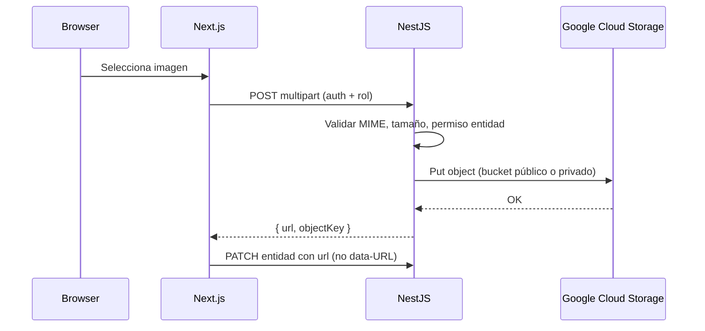

# Estrategia Google Cloud Storage — Yo Te Invito

**Estado:** arquitectura documentada + **API upload V1** (Junio 2026). Formularios frontend pendientes.  
**Relacionado:** [`GOOGLE_CLOUD_RUNBOOK.md`](./GOOGLE_CLOUD_RUNBOOK.md) · [`GCS_BACKUPS_RUNBOOK.md`](./GCS_BACKUPS_RUNBOOK.md)

> **Regla:** no commitear JSON de service account, API keys ni `.env` productivos. Solo nombres, IDs y variables esperadas.

---

## 1. Resumen ejecutivo

| Decisión | Detalle |
|----------|---------|
| Bucket privado actual | **`yti-prod-storage`** — se mantiene **privado** (Public Access Prevention). Backups, archivos privados futuros, exports internos. **No** exponer públicamente. |
| Bucket público | **`yti-prod-public-assets`** — **creado** en GCP (`southamerica-east1`); lectura pública; CORS aplicado |
| Alternativa descartada como nombre principal | `yti-prod-media` — menos explícito sobre alcance; reservar solo si el equipo prefiere nombre corto. |
| Upload V2 inicial | **Browser → backend NestJS → GCS**. No upload directo desde navegador a GCS en la primera iteración. |
| Persistencia en BD | Guardar **URL HTTPS** (`https://…`), nunca `data:` / base64 en PostgreSQL. |
| Backups | **Cerrados** — ver [`GCS_BACKUPS_RUNBOOK.md`](./GCS_BACKUPS_RUNBOOK.md). Lifecycle `backups/postgres/` → delete a 30 días. |

---

## 2. Problema actual

- Formularios (eventos, rentals, gastro, hoteles, productoras) envían imágenes como **data-URL** comprimidas.
- PostgreSQL almacena strings largos (~2M chars límite Zod); dumps de backup crecen; riesgo operativo en VPS prod.
- No hay URLs estables ni CDN para `next/image` remoto.

**Objetivo V2 storage:** reemplazar gradualmente data-URL por URLs GCS definitivas, sin mezclar assets públicos con datos sensibles ni backups.

---

## 3. Modelo de buckets

### 3.1 `yti-prod-storage` (privado — existente)

| Atributo | Valor |
|----------|--------|
| URI | `gs://yti-prod-storage` |
| Región | `southamerica-east1` |
| Acceso | **No público** — Uniform bucket-level access + Public Access Prevention |
| Soft delete | 7 días |
| Lifecycle | `Delete` · `age: 30` · `matchesPrefix: backups/postgres/` |

**Contenido permitido:**

| Prefijo | Uso |
|---------|-----|
| `backups/postgres/YYYY/MM/` | Dumps PostgreSQL (script `backup-postgres-to-gcs.sh`) |
| `private/tickets/` | Tickets PDF/imagen con datos personales (futuro) |
| `private/invoices/` | Facturas, comprobantes (futuro) |
| `private/system/` | Artefactos internos, migraciones de archivos |
| `private/exports/` | CSV/reportes admin descargables (futuro) |

**Prohibido en este bucket:**

- Covers/galerías públicas de discovery
- Hacer el bucket público o allUsers read
- Credenciales, keys, `.env`

**Acceso:** Service Account `yti-backend-storage`; URLs firmadas (V4) para descarga temporal de objetos privados cuando el usuario tenga permiso.

### 3.2 `yti-prod-public-assets` (público — operativo)

| Atributo | Valor |
|----------|--------|
| URI | `gs://yti-prod-public-assets` |
| Región | `southamerica-east1` |
| Storage class | Standard |
| Acceso | `allUsers` → Storage Object Viewer |
| Public Access Prevention | No bloquea acceso público |
| CORS | `yoteinvito.club`, `www` — GET/HEAD/OPTIONS |
| URL base | `https://storage.googleapis.com/yti-prod-public-assets` |

**Contenido permitido:**

- Covers, banners, galerías, logos de fichas públicas
- Assets de plataforma (footer, placeholders controlados)

**Prohibido:**

- Backups PostgreSQL
- Facturas, tickets privados, exports admin
- Credenciales
- Upload de SVG/PDF por usuarios en V2 inicial

**URLs públicas (fase 1 — sin CDN):**

```txt
https://storage.googleapis.com/yti-prod-public-assets/public/events/{eventId}/cover/{filename}
```

**URLs públicas (fase 2 — opcional CDN):**

```txt
https://cdn.yoteinvito.club/public/events/{eventId}/cover/{filename}
```

Requiere Load Balancer + Cloud CDN + certificado; slice posterior.

---

## 4. Estructura de prefijos

### 4.1 Bucket privado `yti-prod-storage`

```txt
backups/postgres/YYYY/MM/yo_te_invito_YYYYmmdd_HHMMSS.sql.gz
backups/postgres/YYYY/MM/yo_te_invito_YYYYmmdd_HHMMSS.sql.gz.sha256
private/tickets/{ticketId}/
private/invoices/{invoiceId}/
private/system/
private/exports/{exportJobId}/
```

Convención de nombres de archivo: `{uuid}.{ext}` o `{entityId}-{role}-{timestamp}.{ext}` — definir en implementación; evitar PII en el path.

### 4.2 Bucket público `yti-prod-public-assets`

```txt
public/events/{eventId}/cover/
public/events/{eventId}/gallery/
public/producers/{producerProfileId}/profile/
public/producers/{producerProfileId}/cover/
public/gastro/{gastroProfileId}/cover/
public/gastro/{gastroProfileId}/gallery/
public/rentals/{rentalLocationId}/products/{productId}/cover/
public/rentals/{rentalLocationId}/products/{productId}/gallery/
public/hotels/{hotelProfileId}/cover/
public/hotels/{hotelProfileId}/gallery/
public/excursions/{eventId}/cover/
public/excursions/{eventId}/gallery/
public/platform/
```

**Notas:**

- `{eventId}` / IDs de perfil son IDs Prisma (CUID/UUID) — no slugs en path (slugs pueden cambiar).
- Galería: un objeto por imagen; orden en BD (`EventMedia.sortOrder`, etc.).
- Reemplazo: subir nuevo objeto + actualizar URL en BD + borrar objeto anterior (slice cleanup).

---

## 5. Variables de entorno futuras

### 5.1 Backend (`apps/api/.env` — referencia, sin valores en repo)

```env
GCS_PROJECT_ID=yoteinvito-1721413433327
GCS_PRIVATE_BUCKET=yti-prod-storage
GCS_PUBLIC_BUCKET=yti-prod-public-assets
GCS_SERVICE_ACCOUNT_KEY_FILE=/opt/yoteinvito/secrets/gcp-yti-backend-storage.json
GCS_PUBLIC_BASE_URL=
GCS_SIGNED_URL_TTL_SECONDS=900
UPLOAD_MAX_IMAGE_MB=5
UPLOAD_ALLOWED_IMAGE_MIME_TYPES=image/jpeg,image/png,image/webp
```

| Variable | Uso |
|----------|-----|
| `GCS_PROJECT_ID` | Proyecto GCP |
| `GCS_PRIVATE_BUCKET` | Bucket privado (backups + private/*) |
| `GCS_PUBLIC_BUCKET` | Bucket assets públicos |
| `GCS_SERVICE_ACCOUNT_KEY_FILE` | Ruta JSON SA en VPS (misma SA inicial; IAM por bucket en hardening) |
| `GCS_PUBLIC_BASE_URL` | Base URL pública sin trailing slash. Vacío → derivar `https://storage.googleapis.com/{GCS_PUBLIC_BUCKET}` |
| `GCS_SIGNED_URL_TTL_SECONDS` | TTL URLs firmadas para objetos en bucket privado (default 900 s) |
| `UPLOAD_MAX_IMAGE_MB` | Tamaño máximo post-validación backend |
| `UPLOAD_ALLOWED_IMAGE_MIME_TYPES` | Lista separada por comas |

**Compatibilidad backups:** el script ops puede seguir usando `BACKUP_GCS_BUCKET=yti-prod-storage` en `/opt/yoteinvito/.ops/backup-gcs.env` o alinearse a `GCS_PRIVATE_BUCKET` en slice de unificación.

**Alias legacy (evitar en código nuevo):** `GCS_BUCKET` → usar `GCS_PRIVATE_BUCKET`.

### 5.2 Frontend (`apps/web/.env.production`)

```env
NEXT_PUBLIC_GCS_PUBLIC_BASE_URL=
```

Si vacío, la web construye URLs desde respuestas API (campo `url` completo). Si CDN: `https://cdn.yoteinvito.club`.

---

## 6. Política de uploads (V2 inicial)



| Regla | Detalle |
|-------|---------|
| Upload desde browser | **No directo a GCS** en V2 inicial |
| Auth | JWT + RBAC (`RolesGuard`) — productor solo sus eventos, admin rentals, etc. |
| Validación backend | MIME real (magic bytes), tamaño ≤ `UPLOAD_MAX_IMAGE_MB`, dimensiones opcionales |
| Respuesta | URL HTTPS final + `objectKey` opcional para delete/replace |
| BD | Columnas `*ImageUrl`, `galleryUrls[]` guardan URL, no base64 |
| Privados | Objetos en `private/*` — acceso vía URL firmada generada en API |

---

## 7. Límites y formatos (V2 inicial)

| Parámetro | Valor |
|-----------|--------|
| Tamaño máximo imagen | **5 MB** |
| Formatos permitidos | JPEG, PNG, WEBP |
| Preferencia | WEBP o JPEG optimizado (backend puede re-encode opcional en slice posterior) |
| SVG subido por usuarios | **No** (riesgo XSS) |
| PDF público | **No** en V2 inicial |
| PDF/facturas privadas | Bucket privado + signed URL (slice posterior) |

---

## 8. Clasificación por tipo de archivo

| Tipo | Bucket | Prefijo | Acceso |
|------|--------|---------|--------|
| Cover evento / excursión | público | `public/events/` · `public/excursions/` | URL pública |
| Galería evento | público | `public/events/…/gallery/` | URL pública |
| Perfil/cover productora | público | `public/producers/` | URL pública |
| Gastro cover/galería | público | `public/gastro/` | URL pública |
| Rental producto cover/galería | público | `public/rentals/…/products/` | URL pública |
| Hotel cover/galería | público | `public/hotels/` | URL pública |
| Assets plataforma | público | `public/platform/` | URL pública |
| Backup PostgreSQL | privado | `backups/postgres/` | Solo SA / ops |
| Ticket con PII | privado | `private/tickets/` | Signed URL |
| Factura / comprobante | privado | `private/invoices/` | Signed URL |
| Export admin CSV | privado | `private/exports/` | Signed URL + auth admin |
| Logs/archivos sistema | privado | `private/system/` | Solo SA |

---

## 9. CORS — bucket público `yti-prod-public-assets`

Upload vía backend → CORS mínimo para **lectura** desde web (imágenes en `` / `next/image` no requieren CORS; sí fetch desde browser si aplica).

Configuración recomendada (consola o `gsutil cors set`):

```json
[
  {
    "origin": [
      "https://yoteinvito.club",
      "https://www.yoteinvito.club"
    ],
    "method": ["GET", "HEAD", "OPTIONS"],
    "responseHeader": ["Content-Type", "Cache-Control"],
    "maxAgeSeconds": 3600
  }
]
```

**No incluir** `PUT` / `POST` / `DELETE` hasta evaluar upload directo firmado (fuera de V2 inicial).

Bucket privado `yti-prod-storage`: **sin CORS público** (acceso solo SA + signed URLs server-side).

---

## 10. IAM recomendado (evolución)

| Fase | SA `yti-backend-storage` |
|------|---------------------------|
| Actual | Storage Object Admin en `yti-prod-storage` |
| Post-crear bucket público | Object Admin en **ambos** buckets (o roles custom por prefijo) |
| Hardening futuro | Rol lectura pública solo en bucket público vía bucket IAM; SA con `storage.objectCreator` + `storage.objectViewer` acotado |

No documentar keys ni JSON en repo.

---

## 11. `next/image` — remotePatterns GCS (Storage 5, Jun 2026)

Configurado en `apps/web/next.config.js`:

```js
images: {
  remotePatterns: [
    {
      protocol: 'https',
      hostname: 'storage.googleapis.com',
      pathname: '/yti-prod-public-assets/**',
    },
  ],
},
```

**Restricciones:**

- Solo bucket público `yti-prod-public-assets` — **no** `yti-prod-storage` ni wildcard `storage.googleapis.com/**`.
- Ficha rental pública (`RentalProductHero`) y admin preview (`ImageUrlPreview`) usan `` nativo hoy; la config habilita `next/image` cuando un componente lo adopte.
- CDN futuro: agregar patrón `{ hostname: 'cdn.yoteinvito.club', pathname: '/**' }` en slice aparte.

**Validación manual:**

1. Producto rental con cover GCS (`https://storage.googleapis.com/yti-prod-public-assets/...`).
2. Abrir `/rentals/{id}` — hero carga sin error.
3. Si un componente usa `next/image` con esa URL, no aparece error *"hostname is not configured"* en consola/dev.

Fallback UI: placeholder / imagen rota si URL 404 — ya parcialmente cubierto en componentes de cards.

---

## 12. API upload V1 (implementado — Junio 2026)

Módulo NestJS: `apps/api/src/modules/uploads/`

| Campo | Valor |
|-------|--------|
| Endpoint | `POST /uploads/public-image` |
| Content-Type | `multipart/form-data` |
| Auth | JWT / dev auth — **ADMIN** bypass; portal roles con ownership (Storage 7) |
| Campos form | `file`, `scope`, `purpose`, `entityId` (opcional según scope) |

**Respuesta:**

```json
{
  "url": "https://storage.googleapis.com/yti-prod-public-assets/public/...",
  "objectKey": "public/...",
  "bucket": "yti-prod-public-assets",
  "contentType": "image/webp",
  "size": 123456
}
```

**Reglas V1:**

- `platform` + `banner` \| `logo` → sin `entityId`
- Scopes de entidad → `entityId` obligatorio (alfanumérico, `-`, `_`)
- MIME por magic bytes (JPEG/PNG/WEBP); no SVG/PDF/data-URL
- `Cache-Control: public, max-age=31536000, immutable` en GCS
- Sin persistencia en BD en este slice
- Si `GCS_PUBLIC_BUCKET` falta → **503** al usar el endpoint (API arranca igual)

**Autorización (Storage 7):** `UploadsAuthorizationService` — ver §18.

---

## 13. Smoke — Storage Upload

```bash
SMOKE_USER_EMAIL=felipe.e.salom@gmail.com SMOKE_USER_PASSWORD=<pass> \
  pnpm --filter api run smoke:storage-upload
```

Opcional: `SMOKE_UPLOAD_FILE=/path/to/image.png` · `SMOKE_SKIP_GCS_UPLOAD=1` si GCS no configurado en API.

Valida: login ADMIN → upload → `url` + `objectKey` → HEAD público 200. **No borra** el objeto en GCS.

---

## 14. Próximos slices

| # | Slice | Estado |
|---|--------|--------|
| S1 | Crear bucket público + CORS | [x] |
| S2 | Backend upload module (`POST /uploads/public-image`) | [x] V1 ADMIN |
| S3 | Roles portal + ownership por entidad | [x] Jun 2026 |
| S4 | Admin Rentals — formularios → GCS (cover + galería) | [x] Jun 2026 |
| S5 | `next/image` remotePatterns GCS | [x] Jun 2026 |
| S6 | Admin Eventos + Excursiones → GCS | [x] Jun 2026 |
| S7 | Otros verticales (gastro, hotel, productoras) | [ ] |
| S8 | Signed URLs bucket privado (`private/*`) | [ ] |
| S9 | Cleanup huérfanos + migración data-URL legacy | [ ] |
| S10 | CDN opcional | [ ] |

**No mover backups** de `yti-prod-storage`. **No publicar** `yti-prod-storage`.

---

## 15. Admin Rentals — upload GCS (Storage 4, Jun 2026)

**Alcance:** solo Admin Rentals (`/admin/rentals/locales/.../productos/nuevo|editar`). Otros formularios que reutilizan `RentalProductImagesForm` siguen con data-URL comprimida hasta slice posterior.

### Decisión `entityId`

Se usa **`rentalLocationId`** (disponible en crear y editar producto). No se usa `productId` aunque exista — simplifica paths y evita re-upload al crear:

```
public/rental/{rentalLocationId}/cover/YYYY/MM/{uuid}.ext
public/rental/{rentalLocationId}/gallery/YYYY/MM/{uuid}.ext
```

### Frontend

| Pieza | Ubicación |
|-------|-----------|
| Repo | `repos.uploads.uploadPublicImage` → `POST /uploads/public-image` |
| Hook | `useUploadPublicImage()` — `lib/query/uploads.ts` |
| Validación cliente | `lib/upload/validate-public-image-file.ts` (JPEG/PNG/WEBP, 5 MB) |
| Form | `RentalProductImagesForm` con `uploadConfig={{ mode: 'gcs-rental', rentalLocationId }}` |

**Reglas UX:**

- Sin fallback silencioso a data-URL en modo GCS.
- Progreso: «Subiendo imagen…» / «Subiendo 1/3…».
- Guardar deshabilitado mientras sube.
- URLs pegadas: solo `https://`; rechaza `data:image/`.
- Imágenes legacy en BD (data-URL) siguen mostrándose en preview; no se migran en este slice.

### Smoke manual (Admin)

1. Login ADMIN → `/admin/rentals/locales/{locationId}/productos/nuevo`.
2. Subir cover PNG/JPG/WEBP &lt; 5 MB → preview con URL `https://storage.googleapis.com/yti-prod-public-assets/...`.
3. Guardar producto → verificar en API/BD que `coverImageUrl` y galería **no** empiezan con `data:image/`.
4. `curl -I` a la URL pública → HTTP 200.
5. Probar archivo &gt; 5 MB o SVG → error visible.
6. Galería multi-upload → varias URLs GCS.

---

## 17. Admin Eventos + Excursiones — upload GCS (Storage 6, Jun 2026)

**Alcance:** formularios admin de eventos (publicaciones generales) y excursiones. Sin producer portal, gastro ni hotel.

### Decisión `entityId`

| Flujo | scope | entityId | purpose |
|-------|--------|----------|---------|
| Admin evento **create** (`/admin/publicaciones-generales/nuevo`, categoría event) | `event` | `tenant-demo` (tenant; evento aún no existe) | `cover` |
| Admin excursión **create** (operador → nueva excursión) | `excursion` | `operatorId` (entidad padre, como rental + locationId) | `cover`, `gallery` |
| Admin excursión **create** (publicaciones-generales, categoría excursion) | `excursion` | `tenant-demo` | `cover`, `gallery` |
| Admin excursión **edit** (operador → editar) | `excursion` | `excursionId` | `cover`, `gallery` |
| Admin excursión **edit** legacy (`/admin/excursiones/[id]/editar`) | `excursion` | `id` (event id) | `cover` |

Paths GCS (backend): `public/events/{entityId}/…`, `public/excursions/{entityId}/…`.

**Nota:** uploads bajo `tenant-demo` en create agrupan imágenes pre-save del tenant; al no existir `eventId` aún, no se inventan IDs. Edit con id real cuando está disponible.

### Frontend

| Pieza | Uso |
|-------|-----|
| `useGcsImageUpload` | Hook compartido — `lib/upload/use-gcs-image-upload.ts` |
| `GcsImageUploadConfig` | `{ scope, entityId }` — `lib/upload/gcs-image-upload-config.ts` |
| `EventCategoryPublicationFields` | Cover GCS en create evento admin |
| `RentalProductImagesForm` + `uploadConfig` | Cover + galería excursiones (operador + publicaciones-generales) |
| `/admin/excursiones/[id]/editar` | Cover GCS directo con hook |

**Reglas:** sin fallback data-URL; legacy visible; `https://` pegado OK; `data:image/` rechazado en nuevas cargas.

### Smoke manual

**Eventos:** `/admin/publicaciones-generales/nuevo` → categoría Evento → subir cover → crear → verificar URL GCS en BD.

**Excursiones:** operador → nueva/editar excursión → cover + galería; legacy edit `/admin/excursiones/{id}/editar` → cover GCS.

---

## 18. Upload auth — roles y ownership (Storage 7, Jun 2026)

Servicio: `apps/api/src/modules/uploads/uploads-authorization.service.ts`  
Helpers: `ProfilesAuthorizationService` (`canManageProducerProfile`, `canManageEvent`, `canManageGastroProfile`, `canManageHotelProfile`).

### Matriz de permisos

| Rol / acceso | Scopes permitidos | Ownership |
|--------------|-------------------|-----------|
| **ADMIN** | Todos | Bypass |
| **Producer** (`PRODUCER_OWNER`, `PRODUCER_STAFF`, o membership activa) | `producer`, `event`, `excursion` | `producer` → `entityId` = producerProfileId propio; `event` → evento gestionable; `excursion` → event id `category=excursion` gestionable |
| **GASTRO_OWNER** (o membership gastro) | `gastro` | `entityId` = gastroProfileId propio |
| **HOTEL_OWNER** (o membership hotel) | `hotel` | `entityId` = hotelProfileId propio |
| **USER** / otros | — | **403** |

### Admin-only (sin ownership portal)

| Scope | Motivo |
|-------|--------|
| `platform` | Assets globales de plataforma |
| `rental` | Sin modelo de owner de rental en portal V1 |
| `excursion` + `entityId` = ExcursionOperator id | Operadores admin; productor debe usar event id de excursión propia |

### Errores HTTP

| Código | Caso |
|--------|------|
| 401 | Sin JWT / sesión inválida |
| 403 | Rol/ownership no autorizado |
| 400 | scope/purpose/entityId/MIME/tamaño inválido |
| 503 | GCS no configurado |

### Smoke

```bash
pnpm --filter api run smoke:storage-upload        # ADMIN + GCS
pnpm --filter api run smoke:storage-upload-auth    # USER → 403 platform; opcional producer cross-owner
```

**Producción (`smoke:storage-upload-auth`):** el registro efímero suele fallar si el signup exige aceptación legal. Usar un USER existente:

```bash
SMOKE_NON_ADMIN_EMAIL=user@example.com SMOKE_NON_ADMIN_PASSWORD='…' \
  pnpm --filter api run smoke:storage-upload-auth
```

Si no hay `SMOKE_NON_ADMIN_*`, el smoke intenta `POST /auth/register` y, al fallar, imprime status HTTP, body resumido, endpoint y causa probable.

Opcional auth smoke: `SMOKE_PRODUCER_EMAIL`, `SMOKE_PRODUCER_OTHER_PROFILE_ID`, `SMOKE_PRODUCER_EVENT_ID`.

---

## 19. Portal Productora — upload GCS (Storage 8, Jun 2026)

**Alcance:** perfil productora (logo, cover, galería) y eventos creados/editados desde `/producer/events`. Sin admin, gastro, hotel ni ticket studio. Backend sin cambios (ownership Storage 7).

### Decisión `entityId`

| Flujo | scope | entityId | purpose |
|-------|--------|----------|---------|
| Perfil — logo (`/producer/profile/identity`) | `producer` | `producerProfileId` (`ProducerDetail.id`) | `logo` |
| Perfil — cover + galería (`/producer/profile/images`) | `producer` | `producerProfileId` | `cover`, `gallery` |
| Evento productor **create** (sin `eventId` aún) | `producer` | `producerProfileId` | `cover` (staging pre-save; URL guardada en `coverImageUrl` del evento al crear) |
| Evento productor **edit** | `event` | `eventId` | `cover` |

**Excursiones:** no hay flujo dedicado en portal productor V1; si el productor gestiona excursión como evento `category=excursion`, usar `scope=event` + `eventId` en edit (misma regla Storage 7).

Paths GCS: `public/producers/{producerProfileId}/…`, `public/events/{eventId}/…`.

### Frontend

| Componente | GCS |
|------------|-----|
| `ProducerIdentityForm` | Logo — `useGcsImageUpload`, `purpose=logo` |
| `ProducerImagesForm` | Cover + galería — `RentalProductImagesForm` + `uploadConfig` |
| `ProducerEventCreateForm` | Cover — `ProducerEventFormFields` + `scope=producer` |
| `ProducerEventEditForm` | Cover — `ProducerEventFormFields` + `scope=event` |

**Infra:** `repos.uploads.uploadPublicImage`, `useUploadPublicImage`, `useGcsImageUpload`, validación MIME/tamaño. Error **403** → toast explícito de permisos (`GCS_UPLOAD_FORBIDDEN`).

**Reglas:** sin nuevas data-URL; legacy visible en preview; guardar deshabilitado mientras sube; progreso «Subiendo imagen…» / «Subiendo 1/N…».

### Smoke manual (PRODUCER)

1. Login productor → `/producer/profile/identity` → subir logo → URL `storage.googleapis.com/yti-prod-public-assets/public/producers/…`.
2. `/producer/profile/images` → cover + galería multi-upload → guardar → verificar BD sin `data:image/`.
3. `/producer/events/new` → crear evento con cover subido → URL GCS bajo `producers/{id}` (create) o pegar https.
4. Editar evento existente → subir cover → path bajo `events/{eventId}/`.
5. (Opcional) Intentar upload con `entityId` ajeno vía API → **403** y mensaje claro en UI.

**Próximo:** Storage 9 — gastro / hotel portal.

---

## 20. Portales Gastro + Hotel — upload GCS (Storage 9, Jun 2026)

**Alcance:** formularios de imagen en `/gastro/*` y `/hotel/editar`. Sin admin, productora, rentals ni migración legacy. Backend sin cambios (ownership Storage 7: `scope=gastro|hotel` + perfil propio).

### Decisión `entityId`

| Flujo | scope | entityId | purpose |
|-------|--------|----------|---------|
| Local gastro — cover + galería (`GastroLocalForm`) | `gastro` | `GastroLocal.id` (= gastroProfileId) | `cover`, `gallery` |
| Ticket descuento gastro (`GastroDiscountForm`) | `gastro` | gastroProfileId | `gallery` |
| Contenido editorial (`/gastro/contenido`) | `gastro` | gastroProfileId (`local.id`) | `content` |
| Solicitud promoción (`GastroPromoRequestModal`) | `gastro` | gastroProfileId | `content` |
| Ficha hotel — logo | `hotel` | `HotelProfile.id` | `logo` |
| Ficha hotel — cover + galería (`HotelProfileForm`) | `hotel` | hotelProfileId | `cover`, `gallery` |

Paths GCS: `public/gastro/{gastroProfileId}/…`, `public/hotel/{hotelProfileId}/…`.

**Resolución `gastroProfileId` en create local:** `getMyLocal()?.id` o fallback `users.getMe().availableProfiles.gastro.profiles[0].id`.

### Frontend

| Componente | GCS |
|------------|-----|
| `GastroLocalForm` | `RentalProductImagesForm` + `uploadConfig` |
| `GastroDiscountForm` | Galería ticket — `galleryOnly` + GCS |
| `gastro/contenido/page.tsx` | Imagen editorial — `useGcsImageUpload`, `purpose=content` |
| `GastroPromoRequestModal` | Multi-upload promoción — `purpose=content` |
| `HotelProfileForm` | Logo (`logo`) + cover/galería (`RentalProductImagesForm`) |

**Reglas:** sin nuevas data-URL; legacy visible; MIME JPEG/PNG/WEBP ≤ 5 MB; **403** → `GCS_UPLOAD_FORBIDDEN`; guardar deshabilitado mientras sube.

### Smoke manual

**GASTRO_OWNER:** `/gastro/local/editar` → cover + galería → guardar → URLs GCS. `/gastro/descuentos/nuevo` → imágenes ticket. `/gastro/contenido` → crear bloque con imagen.

**HOTEL_OWNER:** `/hotel/editar` → logo + portada + galería → guardar → URLs GCS en `PATCH /hotel/me`.

---

## 21. Data-URL audit + controlled migration (Storage 10, Jun 2026)

**Objetivo:** detectar `data:image/` en BD y migrar opcionalmente a GCS **sin cambios destructivos por defecto**.

### Campos auditados

| Tabla | Campos |
|-------|--------|
| `Event` | `coverImageUrl` (eventos, rentals, excursiones, gastro/hotel public events) |
| `EventMedia` | `url` (type `IMAGE`) |
| `ProducerProfile` | `logoUrl`, `coverImageUrl`, `galleryUrls[]` |
| `GastroProfile` | `logoUrl`, `bannerUrl`, `galleryUrls[]` |
| `GastroContent` | `imageUrl` |
| `GastroDiscount` | `displayImageUrls[]`, `submittedImageUrls[]` |
| `HotelProfile` | `logoUrl`, `bannerUrl`, `galleryUrls[]` |
| `ContentSubcategory` | `imageUrl` (taxonomía plataforma) |

**Fuera de alcance V1:** `TicketTemplate` JSON, `PlatformConfig.categories` (sin URLs), `RentalLocation` (sin imágenes).

### Comandos (ops)

```bash
pnpm --filter api run storage:audit-data-urls
pnpm --filter api run storage:audit-data-urls -- --tenant=tenant-demo --limit=20

pnpm --filter api run storage:migrate-data-urls              # dry-run (default)
pnpm --filter api run storage:migrate-data-urls -- --confirm # aplica (backup DB manual primero)
```

**Implementación:** `apps/api/scripts/lib/storage-data-url.util.ts`, `storage-audit-data-urls.ts`, `storage-migrate-data-urls.ts`.

### Reglas

| Regla | Detalle |
|-------|---------|
| Dry-run default | Sin `--confirm` → no escribe BD ni GCS |
| `--confirm` | Sube buffer validado a `GCS_PUBLIC_BUCKET`, actualiza campo en PostgreSQL |
| Seguridad logs | Solo hash SHA-256 (16 chars), MIME, tamaño — **nunca** base64 |
| Validación | Magic bytes JPEG/PNG/WEBP, ≤ 5 MB, rechaza SVG |
| Ownership paths | Misma convención scope/entityId que uploads portal (§18–20) |
| Sin borrado | No elimina objetos GCS ni filas |
| Skip seguro | Sin entityId (ej. `GastroDiscount` sin `gastroProfileId`), parse inválido, MIME no permitido |

### Migración — mapping log (stdout)

```
MIGRATED table=Event id=… field=coverImageUrl hash=abc… oldLen=12345 url=https://… objectKey=public/events/…
```

### Smoke manual

1. `storage:audit-data-urls` en dev/staging → reporte por tabla.campo.
2. `storage:migrate-data-urls` (sin flags) → líneas `DRY_RUN`, cero cambios en BD.
3. Con filas de prueba + GCS configurado: `--confirm --limit=1` → URL GCS en BD, campo ya no empieza con `data:image/`.

**Pendiente post-V1:** migración masiva prod, `TicketTemplate` assets.

---

## 22. Orphan cleanup + global smoke + Storage V2 closure (Storage 11, Jun 2026)

**Objetivo:** detectar objetos en `gs://yti-prod-public-assets/public/` no referenciados en PostgreSQL; cleanup seguro (dry-run default); smoke global de uploads; cierre operativo Storage V2.

### Alcance del scan

| Incluye | Excluye |
|---------|---------|
| Prefijo `public/` en `GCS_PUBLIC_BUCKET` | `yti-prod-storage` |
| Keys bajo `public/{events,producers,gastro,rentals,hotels,excursions,platform}/…` | `backups/postgres/` |
| Comparación vs URLs en campos imagen (mismos que §21) | `private/*` en cualquier bucket |

**Referencias BD:** `Event.coverImageUrl`, `EventMedia.url`, perfiles producer/gastro/hotel, `GastroContent`, `GastroDiscount`, `ContentSubcategory`.

**Advertencia:** `TicketTemplate` JSON no se escanea — objetos bajo `public/` usados solo por ticket-studio pueden aparecer como huérfanos; **revisar manualmente** antes de `--confirm`.

### Comandos (ops)

```bash
pnpm --filter api run storage:audit-orphans
pnpm --filter api run storage:audit-orphans -- --min-age-hours=24 --limit=50

pnpm --filter api run storage:cleanup-orphans              # dry-run (default)
pnpm --filter api run storage:cleanup-orphans -- --dry-run
pnpm --filter api run storage:cleanup-orphans -- --confirm # borra (solo tras revisar audit)
```

**Implementación:** `apps/api/scripts/lib/storage-orphans.util.ts`, `storage-audit-orphans.ts`, `storage-cleanup-orphans.ts`.

### Reglas de cleanup

| Regla | Detalle |
|-------|---------|
| Dry-run default | Sin `--confirm` → solo log `DRY_DELETE`, cero borrados |
| Grace period | Default **48 h** (`--min-age-hours=`); objetos recientes se omiten |
| Path seguro | Solo keys que matchean layout conocido `public/{scope}/{entityId}/…` |
| Incertidumbre | Key fuera de layout → audit only, no borrar |
| Logs | `objectKey`, edad (h), motivo; en delete real hash corto del key |
| Producción | **No** ejecutar `--confirm` desde CI/Cursor; ops manual post-audit |

### Smoke global (`smoke:storage-global`)

Matriz automatizada (API levantada + GCS configurado; skips si `503` o env opcional ausente):

| Caso | Esperado |
|------|----------|
| ADMIN platform banner | 200 + URL pública HEAD 200 |
| ADMIN rental cover | 200 (`SMOKE_RENTAL_LOCATION_ID`) |
| ADMIN event cover | 200 (staging `tenant-demo`) |
| ADMIN excursion cover | 200 (`SMOKE_EXCURSION_OPERATOR_ID`) |
| PRODUCER perfil/evento propio | 200 |
| PRODUCER perfil ajeno | 403 |
| GASTRO perfil propio | 200 |
| GASTRO perfil ajeno | 403 |
| HOTEL perfil propio | 200 |
| HOTEL perfil ajeno | 403 |
| USER común platform | 403 |
| MIME inválido (`text/plain`) | 400 |
| Archivo > 5 MB | 400 |

```bash
SMOKE_USER_EMAIL=… SMOKE_USER_PASSWORD=… \
  pnpm --filter api run smoke:storage-global
```

**Env opcional:** `SMOKE_RENTAL_LOCATION_ID`, `SMOKE_PRODUCER_*`, `SMOKE_GASTRO_*`, `SMOKE_HOTEL_*`, `SMOKE_EXCURSION_OPERATOR_ID`. Smokes parciales: `smoke:storage-upload`, `smoke:storage-upload-auth`.

### Runbook operación Storage V2

1. **Backups:** timer 03:30 → `gs://yti-prod-storage/backups/postgres/` (lifecycle 30d) — [`GCS_BACKUPS_RUNBOOK.md`](./GCS_BACKUPS_RUNBOOK.md).
2. **Uploads:** formularios web → `POST /uploads/public-image` → URLs en BD.
3. **Data-URL legacy:** `storage:audit-data-urls` → `storage:migrate-data-urls` (dry-run) → `--confirm` post-backup manual.
4. **Huérfanos:** `storage:audit-orphans` → `storage:cleanup-orphans` (dry-run) → revisar sample → `--confirm` solo en ventana ops (nunca automatizado).
5. **QA:** `smoke:storage-upload` + `smoke:storage-upload-auth` en prod (PASS 2026-05-31); `smoke:storage-global` opcional con fixtures reales.

### Storage V2 — checklist cierre

**Funcional (código + VPS producción, validado 2026-05-31):**

- [x] Bucket público + API upload + auth ownership
- [x] Admin + portales productora/gastro/hotel en GCS
- [x] Audit/migrate data-URL tooling
- [x] Audit/cleanup huérfanos (dry-run default)
- [x] Smoke global documentado
- [x] Deploy desde `main` en VPS (`/opt/yoteinvito`)
- [x] `GCS_*` en API + credencial SA en VPS
- [x] Upload manual UI + formularios verticales OK
- [x] `smoke:storage-upload` PASS (ADMIN + GCS)
- [x] `smoke:storage-upload-auth` PASS (USER → 403; prod con `SMOKE_NON_ADMIN_*`)

**Pendientes operativos (no bloqueantes):**

- [ ] Auditoría read-only data-URL legacy (`storage:audit-data-urls`)
- [ ] Migración data-URL por lotes (`storage:migrate-data-urls --confirm`, post-backup)
- [ ] Auditoría huérfanos (`storage:audit-orphans`)
- [ ] Cleanup huérfanos solo tras revisión manual (`storage:cleanup-orphans --confirm`)
- [ ] Smokes cross-owner / matriz completa con fixtures reales (`smoke:storage-global` + env opcional)
- [ ] CDN `cdn.yoteinvito.club` (fase 2)
- [ ] Signed URLs privadas ampliadas (`private/*` tickets/facturas)

### Validación producción VPS (2026-05-31)

Registro post-deploy Storage slices 6–11 en VPS DonWeb (`yoteinvito.club`):

| Validación | Resultado |
|------------|-----------|
| Deploy `main` + build + restart `yti-api` / `yti-web` / `yti-scanner` | OK |
| API `/health` + web pública | OK |
| Upload GCS manual en UI (formularios verticales) | OK |
| `smoke:storage-upload` | PASS |
| `smoke:storage-upload-auth` | PASS (USER común → 403 platform; `SMOKE_NON_ADMIN_*` en prod) |
| Residuos smoke | Sin cleanup destructivo requerido |

Runbook VPS: [`DONWEB_PRODUCTION_RUNBOOK.md`](./DONWEB_PRODUCTION_RUNBOOK.md) §24.9.

---

## Referencias

| Documento | Uso |
|-----------|-----|
| [`GOOGLE_CLOUD_RUNBOOK.md`](./GOOGLE_CLOUD_RUNBOOK.md) | Proyecto GCP, buckets, Maps |
| [`GCS_BACKUPS_RUNBOOK.md`](./GCS_BACKUPS_RUNBOOK.md) | Backups PostgreSQL (cerrado) |
| [`DONWEB_PRODUCTION_RUNBOOK.md`](./DONWEB_PRODUCTION_RUNBOOK.md) | VPS, secretos |
| [`PREPRODUCTION_DEPLOY_AUDIT.md`](../audits/PREPRODUCTION_DEPLOY_AUDIT.md) | Riesgo data-URL |
