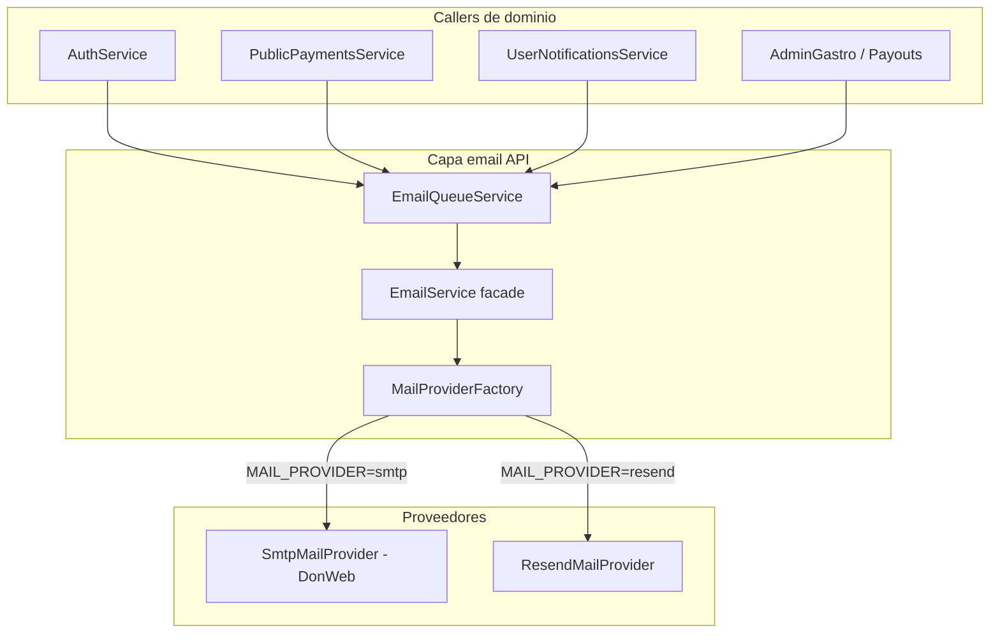

# Emails — Arquitectura (Slices 1–10)

**Proyecto:** Yo Te Invito  
**Dominio objetivo:** `yoteinvito.club` (correo profesional DonWeb)  
**Auditoría:** 2026-06-01 (Slice 1)  
**Implementación MailProvider + SMTP:** 2026-06-01 (Slice 2)  
**Templates + layout base:** 2026-06-01 (Slice 3)  
**Tanda 1 auth + productora:** 2026-06-01 (Slice 4)  
**Transferencias + recordatorios portal:** 2026-06-01 (Slice 5)  
**Reviews, disputas y moderación:** 2026-06-01 (Slice 6)  
**Referidos V2 (propuestas, comisiones, pagos):** 2026-06-01 (Slice 7)  
**Alertas inteligentes / contenido seguido:** 2026-06-01 (Slice 8)  
**Admin / operaciones internas:** 2026-06-01 (Slice 9)  
**Cierre técnico + cleanup legacy:** 2026-06-01 (Slice 10) — ver [`EMAILS_CLOSING_AUDIT.md`](./EMAILS_CLOSING_AUDIT.md)

Documentos relacionados:

- **Cierre del bloque:** [`EMAILS_CLOSING_AUDIT.md`](./EMAILS_CLOSING_AUDIT.md)
- Matriz inicial de envíos: [`EMAIL_MATRIX.md`](./EMAIL_MATRIX.md)
- Notificaciones portal (cron, preferencias): [`../guides/USER_PORTAL_NOTIFICATIONS.md`](../guides/USER_PORTAL_NOTIFICATIONS.md)
- Resend (estado actual en dev): [`../guides/CONFIG_GOOGLE_RESEND.md`](../guides/CONFIG_GOOGLE_RESEND.md)
- Runbook VPS / DNS correo: [`../deploy/DONWEB_PRODUCTION_RUNBOOK.md`](../deploy/DONWEB_PRODUCTION_RUNBOOK.md)

---

## 1. Resumen ejecutivo

| Aspecto | Estado (post Slice 2) |
|---------|------------------------|
| Selección proveedor | `MAIL_PROVIDER=smtp` \| `resend` → `createMailProvider()` |
| Abstracción | **`MailProvider`** + `ResendMailProvider` + `SmtpMailProvider` (Nodemailer) |
| `EmailService` | Fachada; **no** instancia Resend directamente |
| Cola de envío | **BullMQ** (`emails`) → `EmailService.send()` → provider |
| Idempotencia email | Sin cambios: `NotificationDeliveryLog` solo en `deliver()` (Slice 4 pendiente) |
| Templates | **Slice 3–9:** registry + **38** IDs; checkout/pagos/facturación y resto `.md` pendientes |
| Resend | **Conservado** para rollback (`MAIL_PROVIDER=resend`) |
| Smoke | `smoke:email`, `smoke:email-template` (`SMOKE_EMAIL_TEMPLATE_ID`) |
| Envío por template | `EmailService.sendTemplate()` → `renderEmailTemplate()` → `send()` |
| SMTP DonWeb (local) | **Validado** — `smoke:email` OK con `messageId` (sin documentar `SMTP_PASSWORD`) |
| SMTP DonWeb (VPS prod) | Pendiente — mismo bloque env en servidor + `smoke:email` desde el VPS |

### Cuentas `@yoteinvito.club` (referencia)

| Buzón | Uso |
|-------|-----|
| `no_reply@yoteinvito.club` | `MAIL_FROM` / `SMTP_USER` transaccional |
| `soporte@yoteinvito.club` | `MAIL_REPLY_TO` |
| `operaciones@yoteinvito.club` | `MAIL_OPERATIONS_TO` (alertas internas; no remitente masivo) |

### Estructura de archivos (Slice 2)

```
apps/api/src/email/
  send-email-options.ts
  mail-config.ts
  mail-config.validation.ts
  email.service.ts          # fachada + sendTemplate
  email-queue.service.ts    # enqueue + enqueueTemplate
  operational-alerts-email.service.ts
  email-templates.ts
  providers/
    mail-provider.interface.ts
    resend-mail.provider.ts
    smtp-mail.provider.ts
    create-mail-provider.ts
apps/api/scripts/smoke-email.ts
apps/api/scripts/smoke-email-template.ts
apps/api/src/email/templates/
  email-template.types.ts
  email-template.registry.ts
  email-template.renderer.ts
  email-template.util.ts
  layouts/base-email-layout.ts
  templates/
    auth-welcome-buyer.template.ts
    auth-welcome-producer.template.ts
    auth-welcome-gastro.template.ts
    auth-welcome-hotel.template.ts
    auth-welcome-referrer.template.ts
    auth-verify-email.template.ts
    producer-event-approved.template.ts
    producer-event-rejected.template.ts
    admin-critical-alert.template.ts
    ticket-transfer-received.template.ts
    ticket-transfer-accepted.template.ts
    ticket-transfer-rejected.template.ts
    ticket-transfer-cancelled.template.ts
    event-reminder-24h.template.ts
    review-received.template.ts
    review-official-reply.template.ts
    review-dispute-created.template.ts
    review-dispute-accepted.template.ts
    review-dispute-rejected.template.ts
    review-moderation-hidden.template.ts
    review-moderation-restored.template.ts
apps/api/src/auth/auth-register-email.util.ts   # welcomeTemplateIdForProfile + variables
apps/api/src/modules/me/ticket-transfer-notification.util.ts
apps/api/src/modules/notifications/review-email-template.util.ts
```

---

## 1.1 Templates implementados (Slices 3–6)

| `EmailTemplateId` | Uso | Referencia editorial |
|-------------------|-----|----------------------|
| `AUTH_WELCOME_BUYER` | Bienvenida comprador (`USER`) | `docs/emails/Base y bienvenida/AUTH_WELCOME_BUYER.md` |
| `AUTH_WELCOME_PRODUCER` | Bienvenida productora | `docs/emails/Base y bienvenida/AUTH_WELCOME_PRODUCER.md` |
| `AUTH_WELCOME_GASTRO` | Bienvenida gastronómico | `docs/emails/Base y bienvenida/AUTH_WELCOME_GASTRO.md` |
| `AUTH_WELCOME_HOTEL` | Bienvenida hotel | `docs/emails/Base y bienvenida/AUTH_WELCOME_HOTEL.md` |
| `AUTH_WELCOME_REFERRER` | Bienvenida referido | `docs/emails/Base y bienvenida/AUTH_WELCOME_REFERRER.md` |
| `AUTH_VERIFY_EMAIL` | Verificación de email (registro) | `AuthService.register` → `enqueueTemplate` |
| `PRODUCER_EVENT_APPROVED` | Evento aprobado (productora) | `docs/emails/Productoras y eventos/PRODUCER_EVENT_APPROVED.md` |
| `PRODUCER_EVENT_REJECTED` | Evento rechazado (productora) | `docs/emails/Productoras y eventos/PRODUCER_EVENT_REJECTED.md` |
| `ADMIN_CRITICAL_ALERT` | Alerta operativa interna | Genérico; destino default `MAIL_OPERATIONS_TO` |
| `TICKET_TRANSFER_RECEIVED` | Oferta pendiente al receptor | `docs/emails/Transferencias y recordatorios/TICKET_TRANSFER_RECEIVED.md` |
| `TICKET_TRANSFER_ACCEPTED` | Aceptación → emisor | `…/TICKET_TRANSFER_ACCEPTED_SENDER.md` |
| `TICKET_TRANSFER_REJECTED` | Rechazo → emisor | `…/TICKET_TRANSFER_REJECTED.md` |
| `TICKET_TRANSFER_CANCELLED` | Cancelación → receptor | `…/TICKET_TRANSFER_CANCELLED.md` |
| `EVENT_REMINDER_24H` | Recordatorio ticket ~24h | `…/EVENT_REMINDER_24H.md` |
| `REVIEW_RECEIVED` | Nueva reseña (portal gestionado) | `docs/emails/Reviews, disputas y moderación/REVIEW_RECEIVED.md` |
| `REVIEW_OFFICIAL_REPLY` | Respuesta oficial al autor | `…/REVIEW_OFFICIAL_REPLY.md` |
| `REVIEW_DISPUTE_CREATED` | Disputa registrada | `…/REVIEW_DISPUTE_CREATED.md` |
| `REVIEW_DISPUTE_ACCEPTED` | Disputa aceptada (admin) | `…/REVIEW_DISPUTE_ACCEPTED.md` |
| `REVIEW_DISPUTE_REJECTED` | Disputa rechazada (admin) | `…/REVIEW_DISPUTE_REJECTED.md` |
| `REVIEW_MODERATION_HIDDEN` | Reseña ocultada | `…/REVIEW_MODERATION_HIDDEN.md` |
| `REVIEW_MODERATION_RESTORED` | Reseña restaurada | `…/REVIEW_MODERATION_RESTORED.md` |
| `REFERRAL_PRODUCER_ASSOCIATED` | Referido asociado a productora | `docs/emails/Referidos/REFERRER_ASSOCIATED_TO_PRODUCER.md` |
| `REFERRAL_PROPOSAL_RECEIVED` | Propuesta comercial al referido | `…/REFERRAL_PROPOSAL_RECEIVED.md` |
| `REFERRAL_PROPOSAL_ACCEPTED` | Propuesta aceptada → productora | `…/REFERRAL_PROPOSAL_ACCEPTED.md` |
| `REFERRAL_PROPOSAL_REJECTED` | Propuesta rechazada → productora | `…/REFERRAL_PROPOSAL_REJECTED.md` |
| `REFERRAL_COMMISSION_GENERATED` | Comisión generada registrada | `…/REFERRAL_COMMISSION_CONFIRMED.md` (ID distinto al `.md`) |
| `REFERRAL_PAYMENT_REQUEST_CREATED` | Solicitud de pago → productora | `…/REFERRAL_PAYMENT_REQUEST_CREATED.md` |
| `REFERRAL_PAYMENT_MARKED_AS_PAID` | Pago marcado por productora | `…/REFERRAL_PAYMENT_MARKED_PAID.md` |
| `FAVORITE_EVENT_SOON` | Favorito próximo (cron) | Copy alineado con notificación in-app |
| `EXPECTED_EVENT_SOON` | Evento esperado próximo | idem |
| `FOLLOWED_PRODUCER_NEW_EVENT` | Productora seguida publica | idem |
| `FAVORITE_INTEREST_NEW_CONTENT` | Intereses ciudad/categoría | idem |
| `FOLLOWED_GASTRO_NEW_DISCOUNT` | Descuento gastro seguido | idem |
| `ADMIN_NEW_EVENT_PENDING` | Evento pendiente moderación | `…/ADMIN_NEW_EVENT_PENDING.md` |
| `ADMIN_OPERATIONAL_ERROR` | Error operativo categorizado | (genérico; sin `.md` dedicado) |
| `ADMIN_EMAIL_DELIVERY_FAILED` | Fallo de entrega | `…/ADMIN_CRITICAL_EMAIL_ERROR.md` |
| `ADMIN_SCANNER_CRITICAL_ERROR` | Scanner sistema | `…/ADMIN_SCANNER_ERROR.md` |
| `ADMIN_STORAGE_UPLOAD_FAILED` | Fallo GCS/upload | `…/ADMIN_STORAGE_ERROR.md` |

**Pendiente Slice 4b:** `AUTH_PASSWORD_RESET` (no hay flujo API de reset con email hoy; solo CLI `user:reset-password`).

**Pendiente slice posterior:** `REVIEW_PENDING_REMINDER` — cron `REVIEW_PENDING` sigue **solo in-app** (`sendEmail: false`); no se habilitó email en Slice 6.

**Referidos (Slice 7):** `ReferralEmailsService` → `enqueueTemplate` (no `deliver()`). Disclaimer legal compartido en `referral-email-layout.util.ts`. No se automatizan pagos ni transferencias; no se usa lenguaje de saldo/retiro. **`REFERRAL_AGREEMENT_ACTIVE`:** solo en docs; caller no implementado (evita duplicar con propuesta aceptada).

**Alertas inteligentes (Slice 8):** variables en `smart-alert-email-template.util.ts`. Cron favorito/esperado y gastro follow usan `emailTemplateId` cuando `sendEmail` es true. **`FOLLOWED_PRODUCER_NEW_EVENT`** y **`FAVORITE_INTEREST_NEW_CONTENT`** mantienen `sendEmail: false` (decisión producto); templates en registry para smoke y futura activación. Throttling `SMART_ALERTS_MAX_PER_USER_HOUR` sin cambios.

**Admin operaciones (Slice 9):** `OperationalAlertsEmailService` + templates `ADMIN_*` (excepto alerta genérica). Destino `MAIL_OPERATIONS_TO`. **Anti-loop:** `EmailQueueService` solo dispara `ADMIN_EMAIL_DELIVERY_FAILED` si `sourceTemplateId` no es `ADMIN_*`. Pagos/factura/webhooks: sin conectar.

**From / Reply-To:** todos usan `MAIL_FROM` (`no_reply@yoteinvito.club`) y `MAIL_REPLY_TO` vía `sendTemplate` — DonWeb exige coincidencia con `SMTP_USER`; no forzar `operaciones@` como remitente SMTP.

### Cómo agregar un template nuevo

1. Redacción en `docs/emails/<carpeta>/<TEMPLATE_ID>.md` (referencia).
2. Crear `apps/api/src/email/templates/templates/<kebab-name>.template.ts` con función `renderX(variables)`.
3. Registrar en `email-template.registry.ts`.
4. Añadir ID a `EMAIL_TEMPLATE_IDS` en `email-template.types.ts`.
5. Probar: `SMOKE_EMAIL_TEMPLATE_ID=<ID> SMOKE_EMAIL_TO=... pnpm --filter api run smoke:email-template`.
6. Integrar caller de dominio con `emailService.sendTemplate({ templateId, to, variables })` (slice posterior).

### Import masivo de `.md` (pendiente)

Los ~70 archivos en `docs/emails/` **no** se importan automáticamente. Condicionales tipo `{{#if}}` de borradores quedan para etapa posterior o se resuelven en TypeScript por template. Slices futuros: migrar por tanda (checkout, transferencias, reviews, etc.).

### Renderer

- `renderEmailTemplate({ templateId, variables })` → `{ subject, previewText, html, text }`.
- Variables con `getString()` + fallback seguro.
- HTML dinámico escapado con `escapeHtml()`.
- Layout común: `renderBaseEmailLayout()` — estilos inline, fondo oscuro, CTA verde `#22c55e`, preview oculto, sin Tailwind ni JS.

### Envío

```typescript
await emailService.sendTemplate({
  templateId: 'AUTH_WELCOME_BUYER',
  to: user.email,
  variables: { userName, portalUrl, supportEmail },
});
```

`send()` y `EmailQueueService` sin cambios; los callers legacy siguen usando `email-templates.ts` hasta migrarlos.

### Callers reales (Slices 3b–9)

| Template | Entrada | Canal |
|----------|---------|-------|
| `AUTH_VERIFY_EMAIL` | `auth.service.ts` → `emailQueue.enqueueTemplate` (mismo `verifyUrl` / token que antes) | Cola BullMQ |
| `AUTH_WELCOME_*` | `auth.service.ts` → `welcomeTemplateIdForProfile()` + `buildWelcomeTemplateVariables()` | Cola; 1 verify + 1 welcome por registro (sin duplicar) |
| `PRODUCER_EVENT_APPROVED` | `producer-event-status-notifications.service.ts` → `deliver({ emailTemplateId, … })` | Email; in-app/push sin cambios |
| `PRODUCER_EVENT_REJECTED` | idem (`REJECTED`) | Email con `rejectionReason`, `eventEditUrl`; fire-and-forget |
| `ADMIN_CRITICAL_ALERT` | `OperationalAlertsEmailService.enqueueCriticalAlert()` | Cola; destino `MAIL_OPERATIONS_TO` por defecto |
| `TICKET_TRANSFER_RECEIVED` | `TicketTransferOfferService.create` → `TRANSFER_OFFER_PENDING` + template | `deliver()`; mismo `referenceKey` `transfer:{offerId}` |
| `TICKET_TRANSFER_ACCEPTED` | `accept` → notifica emisor (`TICKET_TRANSFER_ACCEPTED`) | `deliver()`; `referenceKey` `transfer:{id}:accepted` |
| `TICKET_TRANSFER_REJECTED` | `reject` → notifica emisor | idem `:rejected` |
| `TICKET_TRANSFER_CANCELLED` | `cancel` → notifica receptor si `buyerUserId` | idem `:cancelled` |
| `EVENT_REMINDER_24H` | `NotificationsSchedulerService.processTicketReminders` | `deliver()`; `referenceKey` `ticket:{ticketId}` |
| `REVIEW_*` | `ReviewNotificationsService` → `deliver()` | Mismos `kind` / `referenceKey`; variables desde `review-email-template.util.ts` |
| `REFERRAL_*` | `ReferralEmailsService` (desde proposals, referrals, payment-requests, public-payments) | Cola; destinatarios vía membresías activas (`referral-email.util.ts`) |
| `FAVORITE_EVENT_SOON` / `EXPECTED_EVENT_SOON` | `NotificationsSchedulerService` cron | `deliver()` + template si email habilitado |
| `FOLLOWED_PRODUCER_NEW_EVENT` / `FAVORITE_INTEREST_NEW_CONTENT` | `SmartAlertsPreparedService` → publicación evento | `deliver()`; email deshabilitado |
| `FOLLOWED_GASTRO_NEW_DISCOUNT` | `GastroFollowDiscountAlertsService` | `deliver()` + template |
| `ADMIN_NEW_EVENT_PENDING` | `ProducerEventsCrudService` (status → `PENDING`) | Cola → operaciones |
| `ADMIN_STORAGE_UPLOAD_FAILED` | `UploadsService` (fallo GCS) | Cola → operaciones |
| `ADMIN_EMAIL_DELIVERY_FAILED` | `EmailQueueService.dispatchSend` | Solo templates no `ADMIN_*` |
| `ADMIN_CRITICAL_ALERT` | `OperationalAlertsEmailService.enqueueCriticalAlert` | Genérico reutilizable |

**Preferencias transferencias:** email → `emailNotificationsEnabled`; push → `notifyTransferOffers`.

**Preferencias reviews:** gestión (`REVIEW_RECEIVED`, disputas) → `emailNotificationsEnabled` + `notifyManagedReviews`; autor (`REVIEW_OFFICIAL_REPLY`, moderación) → `emailNotificationsEnabled` + `notifyReviewEngagement`. Push según `shouldSendPushForKind`.

**Migración Prisma:** no requerida en Slice 6 (reviews) ni Slice 7 (referidos sin `NotificationKind`).

**Preferencias referidos:** emails operativos del portal; no hay toggle dedicado en este slice.

**Aún en legacy (`email-templates.ts` / inline):** checkout (`renderOrderConfirmationEmail`), payouts, gastro QR operativo al local (no confundir con alerta follow).

**Idempotencia:** no se modificó cuándo se encola/envía ni el `NotificationDeliveryLog`; solo el HTML del email en los flujos migrados.

---

## 2. Estado actual del backend

### 2.1 Módulo de email

| Archivo | Rol |
|---------|-----|
| `email.module.ts` | Módulo global Nest |
| `email.service.ts` | Fachada → `MailProvider.send()`; retorna `boolean` (compat callers) |
| `email-queue.service.ts` | Cola BullMQ `emails`; worker → `email.send()` |
| `providers/resend-mail.provider.ts` | SDK Resend |
| `providers/smtp-mail.provider.ts` | Nodemailer → DonWeb SMTP |
| `providers/create-mail-provider.ts` | Factory según `MAIL_PROVIDER` |
| `mail-config.ts` | `resolveMailFrom`, `resolveMailReplyTo`, `resolveMailOperationsTo` |
| `email-templates.ts` | Funciones `render*` |

Importado en `app.module.ts`, `admin.module.ts`, `public.module.ts`.

### 2.2 Integración con proveedores

- **Resend:** solo en `ResendMailProvider` (`RESEND_API_KEY`).
- **SMTP:** solo en `SmtpMailProvider` (`SMTP_HOST`, `SMTP_USER`, `SMTP_PASSWORD`, `SMTP_PORT`, `SMTP_SECURE`).
- **From / Reply-To:** `MAIL_FROM` (fallback `EMAIL_FROM`) y `MAIL_REPLY_TO`; default from `Yo Te Invito <no_reply@yoteinvito.club>`.

#### DonWeb SMTP — configuración de referencia (validada en local)

Valores usados en validación local exitosa (`smoke:email`). **No versionar** `SMTP_PASSWORD` en git ni en esta doc.

| Variable | Valor de referencia |
|----------|---------------------|
| `MAIL_PROVIDER` | `smtp` |
| `SMTP_HOST` | `c2821613.ferozo.com` (host SMTP panel Ferozo/DonWeb) |
| `SMTP_PORT` | `465` |
| `SMTP_SECURE` | `true` |
| `SMTP_USER` | `no_reply@yoteinvito.club` |
| `MAIL_FROM` | `Yo Te Invito <no_reply@yoteinvito.club>` |
| `MAIL_REPLY_TO` | `soporte@yoteinvito.club` |
| `MAIL_OPERATIONS_TO` | `operaciones@yoteinvito.club` |
| `SMTP_PASSWORD` | Solo en `.env` local o env del VPS |

**Nota:** buzón transaccional con guion bajo (`no_reply@`). `operaciones@` es destino interno; no usarlo como remitente masivo.

### 2.3 Cola y jobs

- **Nombre cola:** `emails` (`email-queue.service.ts`)
- **Condición:** `REDIS_URL` definido
- **Sin Redis:** `enqueue()` llama `email.send().catch(() => {})` (errores silenciados)
- **Reintentos BullMQ:** no configurados (defaults; sin `attempts` / backoff explícito)
- **Observabilidad del job:** no hay tabla de delivery para emails fuera de notificaciones

### 2.4 `NotificationDeliveryLog` e idempotencia

Modelo Prisma: `NotificationDeliveryLog` — clave única `(userId, kind, referenceKey, channel)`.

Usado **solo** en `UserNotificationsService.deliver()` para canales `IN_APP`, `EMAIL`, `PUSH`.

**Importante:** el log de email se crea **antes** de que el worker BullMQ confirme entrega real. Si el job falla después, no se reintenta a nivel de negocio (idempotencia bloquea reenvío).

### 2.5 `UserNotificationsService.deliver`

Punto unificado de notificaciones multi-canal:

- Email: HTML mínimo inline + enlace `APP_URL`
- Encola vía `EmailQueueService`
- Preferencias `sendEmail` las define cada caller (scheduler, reviews, transferencias, etc.)

### 2.6 Otros envíos de email (sin `NotificationDeliveryLog`)

| Origen | Mecanismo | Template | Idempotencia |
|--------|-----------|----------|--------------|
| `auth.service.ts` (registro) | `emailQueue.enqueueTemplate` | `AUTH_VERIFY_EMAIL`, `AUTH_WELCOME_*` | No |
| `public-payments.service.ts` (pago OK) | `emailQueue` (sin await en un path) | `renderOrderConfirmationEmail` | No |
| `payouts.service.ts` | `emailQueue` | payout admin + confirmación productor | No |
| `admin-gastro.service.ts` (activar QR) | `EmailService.send` **síncrono** | inline | `GastroDiscount.emailSentAt` |
| `public-gastro-discounts.service.ts` (claim) | `EmailService.send` **síncrono** | inline en servicio | `GastroDiscountClaim.emailSentAt` |

### 2.7 Schedulers y servicios de notificación

| Servicio | Email |
|----------|-------|
| `NotificationsSchedulerService` | Cron recordatorios / favoritos / esperados / reviews → `deliver()` |
| `ReviewNotificationsService` | Reviews/disputas; filtra email con `shouldSendEmailForManagedReviews` / `shouldSendEmailForReviewEngagement` |
| `ProducerEventStatusNotificationsService` | Aprobación/rechazo evento; `shouldSendEmailForProducerEventStatus` |
| `ticket-transfer-offer.service.ts` | Oferta transferencia; `emailNotificationsEnabled` |
| `gastro-follow-discount-alerts.service.ts` | Nuevo descuento seguido |
| `smart-alerts-prepared.service.ts` | Email desactivado (`sendEmail: false`) |
| `event-publication-alerts.service.ts` | Alertas publicación (revisar kinds en código) |

### 2.8 Variables de entorno

Ver `apps/api/.env.example`. Principales:

| Variable | Uso |
|----------|-----|
| `MAIL_PROVIDER` | `smtp` \| `resend` (default `resend`) |
| `MAIL_FROM` / `EMAIL_FROM` | Remitente |
| `MAIL_REPLY_TO` | Reply-To |
| `MAIL_OPERATIONS_TO` / `ADMIN_EMAIL` | Alertas operativas (`payouts`) |
| `SMTP_*` | DonWeb cuando `MAIL_PROVIDER=smtp` |
| `RESEND_API_KEY` | Rollback Resend |
| `SMOKE_EMAIL_TO` | Destinatario único para `smoke:email` |
| `REDIS_URL` | Cola BullMQ |

### 2.9 Dependencias

- `resend` — `ResendMailProvider`
- `nodemailer` — `SmtpMailProvider`

---

## 3. Auditoría frontend (alcance slice)

| Área | Ubicación | Relación con email |
|------|-----------|-------------------|
| Preferencias globales email | `/me/preferences?tab=settings` | `emailNotificationsEnabled`, recordatorio 24h, eventos esperados |
| Preferencias push granulares | `/me/notifications` → `MePushAlertPreferences` | Tipos de alerta (reviews, productoras, etc.); **no** expone `notifyProducerEventStatus` ni toggles email por tipo |
| Bandeja in-app | `/me/notifications` | Solo lectura/gestión in-app + push |
| API preferencias | `GET/PATCH /me/preferences` | `UserPortalPreferences` en shared |

**Brecha UX:** backend soporta `notifyProducerEventStatus`, `notifyManagedReviews`, `notifyReviewEngagement` para email/push; la UI de email solo tiene interruptor global (`CONTEXT_PENDIENTES` ya lo marca pendiente).

---

## 4. Clasificación: crítico vs operativo vs opcional

Capa que **debe** decidirlo: **servicio de dominio que dispara el envío** (no `EmailService`), con reglas documentadas en [`EMAIL_MATRIX.md`](./EMAIL_MATRIX.md).

| Clase | Definición | Respeta opt-out usuario | Ejemplos actuales / planificados |
|-------|------------|-------------------------|----------------------------------|
| **Crítico** | Necesario para operación, seguridad o obligación transaccional | **No** (solo si el usuario no tiene email) | Verificación de cuenta, confirmación de compra pagada, reset password (futuro), ticket/QR post-compra (futuro checklist V2) |
| **Operativo** | Interno o B2B; no es marketing al usuario final | N/A (destinatario fijo) | Solicitud retiro → `ADMIN_EMAIL` / `MAIL_OPERATIONS_TO`; QR descuento → `contactEmail` del local; alertas admin (futuro) |
| **Opcional** | Engagement / recordatorios; mejora UX | **Sí** — `emailNotificationsEnabled` + flags por kind | Recordatorio 24h, favoritos, transferencias, reviews, estado evento productor, etc. vía `deliver()` |

**Bienvenida post-registro:** hoy se envía siempre (no crítica legal; podría reclasificarse como opcional o diferirse a Slice de templates).

---

## 5. Riesgos identificados

| Riesgo | Impacto | Mitigación propuesta (Slice 2+) |
|--------|---------|----------------------------------|
| Acoplamiento directo a Resend | Migración costosa | `MailProvider` + factory por `MAIL_PROVIDER` |
| `NotificationDeliveryLog` antes de entrega real | Emails perdidos sin reintento | Registrar log tras éxito del provider, o estado `PENDING`/`SENT`/`FAILED` |
| Errores tragados (`catch` vacío, `.catch(() => {})`) | Fallos invisibles | Logger estructurado + métricas; no silenciar en prod |
| Sin reintentos BullMQ explícitos | Picos SMTP/Resend | `attempts: 5`, backoff exponencial en worker |
| Dos rutas (cola vs `send` directo) | Comportamiento distinto bajo carga | Unificar todo en `EmailQueueService` |
| Orden confirmación sin idempotencia | Duplicados si webhook replay | `referenceKey` por `orderId` o tabla `EmailDeliveryLog` |
| Dominio default `yoteinvito.com` vs prod `.club` | SPF/DKIM mismatch | `EMAIL_FROM` / `MAIL_FROM` = `no-reply@yoteinvito.club` |
| DonWeb SMTP + Resend en paralelo | Confusión DNS | Un solo proveedor activo por entorno vía `MAIL_PROVIDER` |
| Secretos en docs | Seguridad | Solo placeholders en repo (esta doc cumple) |

---

## 6. Arquitectura implementada (Slice 2)

### 6.1 Diagrama lógico



### 6.2 Interfaces (`send-email-options.ts`, `mail-provider.interface.ts`)

- `SendEmailOptions`: `to`, `subject`, `html`, `text?`, `from?`, `replyTo?`
- `SendEmailResult`: `{ ok: true, providerMessageId? }` \| `{ ok: false, errorCode, retryable }`
- `EmailService.send()` → `boolean` (igual que antes para callers)

### 6.3 Smoke controlado

```bash
# Requiere SMOKE_EMAIL_TO + credenciales del provider activo (sin commitear passwords)
pnpm --filter api run smoke:email
```

No usa API HTTP, pagos ni BD. Un solo destinatario por ejecución.

### 6.4 Logs y reintentos (pendiente Slice 4)

| Capa | Responsabilidad |
|------|-----------------|
| BullMQ worker | Reintentos transporte (`retryable: true`) |
| `NotificationDeliveryLog` | Idempotencia negocio notificaciones usuario |
| Futuro `EmailOutboundLog` (opcional Slice 3) | Transaccionales auth/checkout/payout con `referenceKey`, estado, error |

Hasta tener `EmailOutboundLog`, no ampliar `NotificationDeliveryLog` a órdenes de compra (dominio distinto).

### 6.6 Templates (Slice 3+)

- Mantener `email-templates.ts` como funciones puras.
- Evolución: layout base Yo Te Invito (header/footer, `MAIL_FROM`, link soporte).
- Notificaciones: migrar HTML inline de `deliver()` a `renderNotificationEmail(kind, vars)`.

---

## 7. Variables de entorno (sin secretos en repo)

| Variable | Requerida | Descripción |
|----------|-----------|-------------|
| `MAIL_PROVIDER` | Sí (prod) | `smtp` o `resend` |
| `SMTP_HOST` | Si smtp | DonWeb/Ferozo: `c2821613.ferozo.com` (validado local) |
| `SMTP_PORT` | Si smtp | `465` con `SMTP_SECURE=true` (validado local) |
| `SMTP_SECURE` | Si smtp | `true` (465) / `false` (587 STARTTLS) |
| `SMTP_USER` | Si smtp | `no_reply@yoteinvito.club` |
| `SMTP_PASSWORD` | Si smtp | **Secret** — nunca en git ni docs |
| `MAIL_FROM` | Sí | `Yo Te Invito <no_reply@yoteinvito.club>` |
| `MAIL_REPLY_TO` | Recomendada | `soporte@yoteinvito.club` |
| `MAIL_OPERATIONS_TO` | Recomendada | `operaciones@yoteinvito.club` (sustituye/ampliía `ADMIN_EMAIL`) |
| `EMAIL_FROM` | Compat | Alias de `MAIL_FROM` durante transición |
| `ADMIN_EMAIL` | Compat | Fallback operaciones si falta `MAIL_OPERATIONS_TO` |
| `RESEND_API_KEY` | Si resend | API key Resend |
| `APP_URL` | Sí | Base URL enlaces |
| `REDIS_URL` | Recomendada | Cola emails |

**Deprecación gradual:** documentar que `EMAIL_FROM` → `MAIL_FROM`; mantener lectura dual en Slice 2.

---

## 8. Cuentas de correo recomendadas (`yoteinvito.club`)

| Buzón | Uso | Remitente / destino |
|-------|-----|---------------------|
| `no_reply@yoteinvito.club` | Transaccional automático (`SMTP_USER` + `MAIL_FROM`) | Validado SMTP local |
| `soporte@yoteinvito.club` | Respuestas humanas, footer, VAPID contact | `MAIL_REPLY_TO` |
| `operaciones@yoteinvito.club` | Alertas internas (payouts, moderación futura) | `MAIL_OPERATIONS_TO` |
| `facturacion@yoteinvito.club` | Futuro — facturas AFIP / adjuntos | Slice facturación (no este bloque) |

**DNS:** MX/SPF/DKIM/DMARC ya preservados en DonWeb (`DONWEB_PRODUCTION_RUNBOOK`). Validar que el **mismo dominio** emite SMTP que declara SPF.

---

## 9. Qué no hacer en Slice 1

- No cambiar flujos de pago Getnet ni facturación.
- No eliminar Resend del `package.json`.
- No commitear credenciales SMTP.
- No mover lógica de negocio a controllers.
- No duplicar schemas Zod fuera de `packages/shared`.

---

## 10. Próximos slices sugeridos

| Slice | Entregable |
|-------|------------|
| **Emails 2 — SMTP DonWeb** | [x] `MailProvider`, providers, smoke, `.env.example`, validación local `smoke:email` |
| **Emails 3 — Templates + layout** | [x] Layout, registry, renderer, 3 pilotos, `sendTemplate`, `smoke:email-template` |
| **Emails 3b — Migración callers piloto** | [x] Auth comprador, evento aprobado productor, `OperationalAlertsEmailService` |
| **Emails 4 — Tanda 1 templates** | [x] Bienvenidas por perfil, `AUTH_VERIFY_EMAIL`, `PRODUCER_EVENT_REJECTED` |
| **Emails 4b — Password reset** | `AUTH_PASSWORD_RESET` cuando exista flujo API seguro |
| **Emails 5 — Portal usuario** | [x] Transferencias (4 templates) + `EVENT_REMINDER_24H`; kinds `TICKET_TRANSFER_*` en Prisma |
| **Emails 6 — Reviews/disputas** | [x] 7 templates + `ReviewNotificationsService` |
| **Emails 7 — Import tandas `.md`** | Checkout, tickets emitidos, facturación, favoritos/expected inline |
| **Emails 6 — Delivery log transaccional** | `EmailOutboundLog`, idempotencia checkout/auth, métricas |
| **Emails 5 — UX preferencias** | Toggles email por tipo (`notifyProducerEventStatus`, reviews, etc.) |
| **Facturación** | `facturacion@`, adjuntos PDF (checklist V2 §3) |

---

## 11. Validación

| Comando | Resultado | Notas |
|---------|-----------|-------|
| `pnpm build` | **PASS** (Slice 6) | `api`, `web`, `scanner`, `shared` |
| `pnpm --filter api run smoke:email-template` | Manual | `SMOKE_EMAIL_TO` + cualquier `EMAIL_TEMPLATE_IDS` (21 IDs) |
| Migración `20260607120000_transfer_status_notification_kinds` | Deploy | Añade `TICKET_TRANSFER_ACCEPTED|REJECTED|CANCELLED` a `NotificationKind` |
| `pnpm --filter api run smoke:email` | **PASS local** | `MAIL_PROVIDER=smtp`, host `c2821613.ferozo.com:465`, `messageId` recibido; `SMTP_PASSWORD` solo en env local |
| `pnpm --filter api run smoke:email` (VPS) | Pendiente | Repetir en servidor prod con mismas vars (secretos en `/etc/...`, no en repo) |
| `pnpm --filter api run smoke:notifications` | Manual | Sin cambios; API + credenciales smoke usuario |

---

## 12. Archivos relevantes (índice rápido)

```
apps/api/src/email/
apps/api/src/modules/notifications/
apps/api/src/auth/auth.service.ts
apps/api/src/modules/public-payments/public-payments.service.ts
apps/api/src/modules/payouts/payouts.service.ts
apps/api/src/modules/admin/admin-gastro.service.ts
apps/api/src/public/public-gastro-discounts.service.ts
apps/api/src/modules/me/user-portal-preferences.util.ts
apps/api/prisma/schema.prisma  # UserNotification, NotificationDeliveryLog
apps/web/app/(portal)/me/preferences/page.tsx
apps/web/app/(portal)/me/notifications/page.tsx
apps/web/components/me/MePushAlertPreferences.tsx
```
