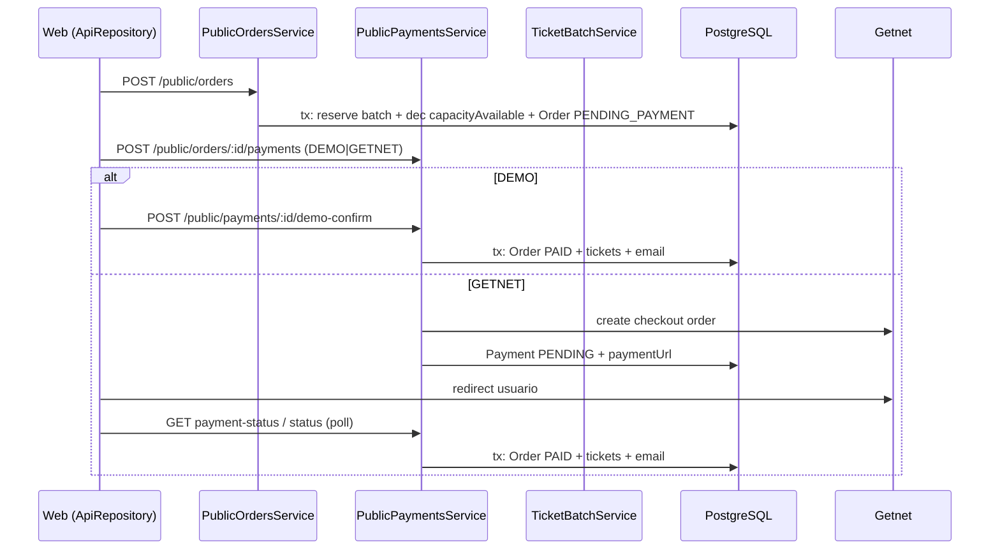

# Getnet Payments Audit — Yo Te Invito

Auditoría técnica del flujo actual de checkout/pagos **antes** de integrar Getnet en producción.  
**Alcance:** solo documentación. Sin cambios de schema, endpoints ni comportamiento funcional.

**Fecha:** 2026-06-01  
**Reglas de producto respetadas:** provider `DEMO` se mantiene; facturación automática fuera de alcance; comisión/arancel Getnet por método de pago queda como decisión pendiente.

> **Actualización Slice A (2026-06-01):** Fulfill unificado en `OrderFulfillmentService.fulfillPaidOrder` — [ORDER_FULFILLMENT_SERVICE.md](./ORDER_FULFILLMENT_SERVICE.md).
>
> **Actualización Slice B (2026-06-01):** Webhook — [GETNET_WEBHOOK.md](./GETNET_WEBHOOK.md).
>
> **Actualización Slice F (2026-06-01):** Activación y smoke — [GETNET_ACTIVATION_CHECKLIST.md](./GETNET_ACTIVATION_CHECKLIST.md), [GETNET_PRODUCTION_SMOKE.md](./GETNET_PRODUCTION_SMOKE.md), `pnpm --filter api run smoke:getnet`. Pendientes go-live: **firma webhook oficial**, **service fee**, **facturación**.

---

## 1. Estado actual del checkout

Hay **tres entradas** al flujo de compra de tickets, que convergen en la misma orden pública (`POST /public/orders`) y luego en pagos (`POST /public/orders/:orderId/payments`).

| Entrada | Auth | Reserva de stock | Siguiente paso de pago |
|---------|------|------------------|------------------------|
| **Checkout por evento** `/checkout/[eventId]` | Opcional (guest o logueado) | Al crear orden | Panel demo + Getnet en la misma página |
| **Carrito invitado** `/checkout` (localStorage `CartContext`) | No | Al crear una orden por evento | Redirige a `/checkout/success?orderIds=…` (solo demo allí) |
| **Carrito cuenta** `/me/cart` + `POST /me/cart/checkout` | JWT / dev auth | Al crear orden(es) por evento | URLs devueltas por API (ver nota de ruta) → UI usa `/checkout/{eventId}?orderId=` |

### Secuencia común (orden creada → tickets)

### Stock: dos capas

1. **`TicketType.capacityAvailable`** — se decrementa al **crear la orden** (`PublicOrdersService.create`).
2. **`TicketBatch.reservedQuantity`** — se incrementa al crear la orden (`TicketBatchService.reserveForPurchase`); al pagar pasa a **`soldCount`** (`confirmReservedAsSold`); al expirar se libera (`releaseReservation` + incremento de `capacityAvailable`).

La orden expira a los **15 minutos** (`ORDER_EXPIRY_MINUTES` en `public-orders.service.ts`). Un cron (`OrderExpirationService`, cada 3 min) y la lógica lazy en `createPayment` pueden marcar `EXPIRED` y liberar stock.

### Provider DEMO (obligatorio mantener)

- Regla de proyecto: **no eliminar** `DEMO` ni `demo-confirm` (ver `docs/context/AI_ENTRYPOINT.md`, `docs/guides/DEMO_REMOVAL.md`).
- En producción técnica actual el runbook indica seguir con demo hasta slice de pagos reales (`docs/deploy/DONWEB_PRODUCTION_RUNBOOK.md`).

### Getnet (parcialmente cableado)

- Backend: OAuth + creación de orden remota + persistencia de `Payment` con `externalReference` y `paymentUrl`.
- Confirmación: **polling** vía `GET /public/payments/:paymentId/status` o `GET /public/orders/:orderId/payment-status` — **no hay webhook** implementado.
- Doc existente: `docs/modules/getnet-payment-integration.md`.

### Facturación

**Fuera de alcance.** No existe flujo de factura electrónica ligado a `Order`/`Payment` en este recorrido. Los emails de checkout son confirmación de compra, no comprobantes fiscales.

---

## 2. Flujo actual de pago demo

### 2.1 Crear pago DEMO

`PublicPaymentsService.createPayment` → `createDemoPayment`:

- Crea `Payment` con `provider: DEMO`, `status: CREATED`, `amount` en centavos.
- Actualiza `paymentUrl` a `/demo/payments/{id}` (ruta simbólica; el front no la usa como página).

### 2.2 Confirmar pago demo

**Endpoint:** `POST /public/payments/:paymentId/demo-confirm?tenantId=…`  
**Controller:** `PublicPaymentsDemoController`  
**Servicio:** `PublicPaymentsService.confirmDemoPayment`

Pasos dentro de **una transacción Prisma**:

1. Idempotencia parcial: si `payment.status === 'APPROVED'`, devuelve la orden mapeada **sin reemitir**.
2. Valida orden `PENDING_PAYMENT` y no expirada.
3. `order.updateMany` condicional → `PAID` + `paidAt`.
4. `EventCapacityGuardService.assertEventCapacityAvailable` (capacidad global del evento).
5. `payment` → `APPROVED`.
6. Por cada `OrderItem`: `ticketBatches.confirmReservedAsSold` + crear N `Ticket` con `qrPayload` único (`yti:v1:…`).
7. `ReferralCommissionService.processOrderPaidInTransaction` (si hay atribución).
8. Encola email `renderOrderConfirmationEmail` vía `EmailQueueService`.

Fuera de la transacción: `referralEmails.notifyCommissionGenerated` si hubo comisión nueva.

### 2.3 Frontend demo

| Ubicación | Comportamiento |
|-----------|----------------|
| `ApiRepository.orders.confirmDemoPayment` | `POST …/payments` (DEMO) + `POST …/demo-confirm` en secuencia |
| `/checkout/[eventId]` | Botón “Pagar (demo)” → `confirmDemoPayment(orderId, tenantId)` |
| `/checkout/success` | “Pagar (demo)” / “Pagar todo (demo)” por cada `orderId` |

### 2.4 Smokes / pruebas

- `apps/api/scripts/smoke-user-portal.ts` — carrito API + `demo-confirm` → tickets.
- `apps/api/scripts/smoke-referrals-v2.ts` — orden con `referralCode` + `demo-confirm` → comisión.
- `docs/legacy/guides/slices-smoke/SLICE_07_SMOKE_TESTS.md` — idempotencia de `demo-confirm`.
- `pnpm --filter api run test:getnet-auth` — solo OAuth Getnet (no emite tickets).

---

## 3. Modelos Prisma involucrados

| Modelo | Rol en checkout |
|--------|-----------------|
| **Order** | Cabecera: comprador, `PENDING_PAYMENT` → `PAID`/`EXPIRED`, `expiresAt` (15 min), `buyerUserId`, `referralLinkId` |
| **OrderItem** | Línea: `ticketTypeId`, `ticketBatchId`, cantidad, precios |
| **Payment** | Intento de cobro por orden; `provider` (`DEMO` \| `GETNET` \| `MERCADOPAGO` en enum); `status`; `amount` (centavos); `externalReference` (UUID Getnet); `paymentUrl`; `metadata` |
| **TicketType** | Precio/catálogo; `capacityAvailable` reservado al crear orden |
| **TicketBatch** | Tandas: `reservedQuantity` / `soldCount` / `effectiveQuantity` |
| **Ticket** | Emisión post-pago: `qrPayload` único, `ownerUserId`, `orderItemId`, `source: ORDER` |
| **UserCart** / **UserCartItem** | Carrito persistido (no reserva stock hasta checkout) |
| **ReferralAttribution** / **ReferralCommission** | Creados/actualizados al pasar orden a `PAID` |

Enums relevantes: `OrderStatus`, `PaymentProvider`, `PaymentStatus`, `TicketBatchStatus`, `TicketStatus`.

**Relaciones clave:** `Order` 1—N `OrderItem`, 1—N `Payment`, 1—N `Ticket`. Cada `Ticket` apunta a un `OrderItem` y opcionalmente `TicketBatch`.

---

## 4. Endpoints involucrados

### Públicos (sin auth)

| Método | Path | Uso |
|--------|------|-----|
| `POST` | `/public/orders?tenantId=` | Crear orden + reservar stock |
| `GET` | `/public/orders/:orderId?tenantId=` | Detalle / reanudar checkout |
| `GET` | `/public/events/:eventId/ticket-types` | Catálogo en checkout |
| `POST` | `/public/orders/:orderId/payments?tenantId=` | Crear pago (`provider`: `DEMO` \| `GETNET`) |
| `POST` | `/public/payments/:paymentId/demo-confirm?tenantId=` | **Confirmación demo + emisión tickets** |
| `GET` | `/public/payments/:paymentId/status?tenantId=` | Poll estado Getnet + fulfill si aprobado |
| `GET` | `/public/orders/:orderId/payment-status?tenantId=` | Igual, último pago de la orden |
| `GET` | `/public/referral/:code` | Atribución → URL checkout con `?ref=` |

### Autenticados (`JwtOrDevAuthGuard`)

| Método | Path | Uso |
|--------|------|-----|
| `GET` | `/me/cart` | Carrito persistido |
| `POST` | `/me/cart/items` | Agregar/actualizar ítem |
| `PATCH` | `/me/cart/items/:itemId` | Cantidad |
| `DELETE` | `/me/cart/items/:itemId` | Quitar |
| `POST` | `/me/cart/checkout` | Convierte carrito en una o más órdenes (`PublicOrdersService.create`) |
| `GET` | `/me/cart/pending-orders` | Órdenes `PENDING_PAYMENT` del usuario |

### Internos

| Método | Path | Uso |
|--------|------|-----|
| `POST` | `/internal/jobs/expire-orders` | Expirar órdenes pendientes (también cron cada 3 min) |

**No existe** endpoint de webhook Getnet en el código actual.

### Rutas web (no son API)

| Ruta | Rol |
|------|-----|
| `/checkout` | Invitado, carrito localStorage |
| `/checkout/[eventId]` | Checkout principal por evento |
| `/checkout/success` | Post-carrito o retorno Getnet (poll + demo) |
| `/me/cart` | Carrito autenticado |

**Inconsistencia documentada:** `MeCartCheckoutResponse.checkoutUrls` devuelve `/checkout/orders/{id}` pero el front real usa `/checkout/{eventId}?orderId={id}` (`user-cart.service.ts` vs `me/cart/page.tsx`, `PendingOrdersList`).

---

## 5. Servicios involucrados

| Servicio | Responsabilidad |
|----------|-----------------|
| **`PublicOrdersService`** | Crear orden; reserva batch + `capacityAvailable`; atribución referral; `buyerUserId` |
| **`PublicPaymentsService`** | Crear pago DEMO/Getnet; `confirmDemoPayment`; `refreshPaymentStatus`; `completeOrderFromGetnet` |
| **`GetnetCheckoutService`** | OAuth, `POST /api/v2/orders`, `GET` estado remoto |
| **`GetnetAuthService`** | Token client_credentials |
| **`TicketBatchService`** | `reserveForPurchase`, `confirmReservedAsSold`, `releaseReservation`, reconciliación de tandas |
| **`EventCapacityGuardService`** | Tope de aforo del evento al pagar (`FOR UPDATE` en `Event`) |
| **`UserCartService`** | CRUD carrito; delega creación de orden a `PublicOrdersService` |
| **`OrderExpirationService`** | Expiración masiva + liberación de reservas |
| **`ReferralCommissionService`** | Comisión V2 al `PAID` (idempotente por orden/atribución) |
| **`ReferralEmailsService`** | Notificación post-comisión (fuera de tx principal) |
| **`EmailQueueService`** | Cola Redis para envío async |

**Controllers (solo HTTP + Zod):** `PublicOrdersController`, `PublicOrderPaymentsController`, `PublicPaymentsDemoController`, `PublicPaymentsRefreshController`, `MeCartController`.

**Schemas compartidos:** `packages/shared/src/schemas/payments.ts`, órdenes en `packages/shared` (p. ej. `createOrderDtoSchema`).

---

## 6. Flujo actual de emisión de tickets

Los tickets **solo** se crean cuando la orden pasa a **`PAID`**, nunca al crear la orden.

| Punto | Método | Condición |
|-------|--------|-----------|
| **Demo** | `confirmDemoPayment` → `OrderFulfillmentService.fulfillPaidOrder` (`DEMO_CONFIRM`) | Transacción única con lock en orden |
| **Getnet** | `refreshPaymentStatus` → `fulfillPaidOrder` (`GETNET_POLL`) | Cuando estado remoto → `APPROVED` |

~~Lógica duplicada~~ **Unificada en Slice A** (`order-fulfillment.service.ts`). Semántica compartida:

- Resolver `ownerUserId`: `order.buyerUserId` o usuario activo por email insensible a mayúsculas.
- Bucle por `orderItems` × `quantity`: `confirmReservedAsSold` + `ticket.create` con QR único.
- Comisión referral + email de confirmación.

**No aplica a:** cortesías (`CourtesiesService` / `consumeFromActiveBatch`) — flujo separado, mismo modelo `Ticket`.

---

## 7. Emails/notificaciones actuales relacionados

| Evento | Mecanismo | Template |
|--------|-----------|----------|
| Orden pagada (demo o Getnet fulfill) | `EmailQueueService.enqueue` dentro de la transacción de pago | **`renderOrderConfirmationEmail`** (`apps/api/src/email/email-templates.ts`) — marcado legacy, activo |
| Comisión referral generada | `ReferralEmailsService.notifyCommissionGenerated` | Templates del módulo referrals (fuera de tx de pago) |

El comentario en `email-templates.ts` indica migración futura al registry de emails en “bloque pagos reales”; hoy es el único email de checkout.

**No hay** email específico de “pago pendiente Getnet” ni reenvío de QR por correo más allá del link a `/me/tickets`.

---

## 8. Riesgos detectados

### 8.1 Idempotencia y doble emisión de tickets

| Escenario | Mitigación actual | Riesgo residual |
|-----------|-------------------|-----------------|
| Re-`demo-confirm` mismo pago | Retorno temprano si `payment.status === APPROVED` | Bajo |
| Dos pagos DEMO distintos misma orden | Segundo falla si orden ya no `PENDING_PAYMENT` | Medio: primer pago gana; segundo pago huérfano en DB |
| Poll Getnet concurrente | `order.updateMany` con `status: PENDING_PAYMENT` — solo uno gana | Bajo para tickets |
| `demo-confirm` + poll Getnet simultáneo | Misma condición `updateMany` en orden | Bajo |
| `completeOrderFromGetnet` sin chequear tickets existentes | Solo mira estado de orden al inicio (lectura previa a tx) | Bajo si `updateMany` falla; **medio** si alguien reintroduce fulfill sin `updateMany` |
| Orden expirada pagada en Getnet después | Expiración libera stock; pago tardío podría intentar fulfill sobre orden `EXPIRED` | **Alto** operativo — requiere política de reconciliación manual o extensión de ventana |

### 8.2 Transacciones Prisma

| Ubicación | ¿Transacción? | Nota |
|-----------|---------------|------|
| `PublicOrdersService.create` | Sí | Correcto para reserva |
| `confirmDemoPayment` | Sí | Email encolado **dentro** de la tx (efecto secundario; rollback no deshace cola) |
| `createGetnetPayment` | **No** — llamada HTTP Getnet luego `payment.create` | Orden remota huérfana si falla insert local |
| `refreshPaymentStatus` | Actualiza `payment` **fuera** de tx; luego `completeOrderFromGetnet` en tx | Ventana entre update de payment y fulfill |
| `expireOrdersJob` | Sí (batch) | Compite con pago por `updateMany` condicional |

### 8.3 Stock e inventario

- Doble decremento conceptual: `capacityAvailable` (tipo) + `reservedQuantity` (batch). Expiración restaura ambos; fulfill mueve reserva a vendido **sin** tocar `capacityAvailable` de nuevo (correcto).
- Si `confirmReservedAsSold` falla (`BATCH_RESERVE_MISMATCH`), la transacción entera revierte — bien.
- Carrito API no reserva hasta checkout: precios en `UserCartItem.unitPrice` pueden quedar desactualizados respecto al batch activo.

### 8.4 Getnet específico

- Sin webhook: dependencia de polling desde `/checkout/success` o cliente.
- Sin reconciliación batch nocturna.
- `getOrderPaymentStatus` toma el pago **más reciente** (`orderBy: createdAt desc`) — múltiples intentos Getnet pueden confundir estado.
- Monto enviado a Getnet = suma de ítems de orden **sin** cargo de servicio/comisión (ver §11.1).

### 8.5 UX / rutas

- ~~`checkoutUrls` con path inexistente `/checkout/orders/…`~~ **Corregido (Slice D)** — `/checkout/{eventId}?tenantId&orderId`.
- ~~Checkout invitado sin retorno Getnet dedicado~~ **Mitigado (Slice D)** — `/checkout/return` + refresh controlado.

---

## 9. Puntos de integración para Getnet

### 9.1 Dónde insertar Getnet (estado actual vs objetivo)

| Fase | Ubicación | Estado |
|------|-----------|--------|
| Crear intención de pago | `PublicPaymentsService.createGetnetPayment` + `GetnetCheckoutService.createOrder` | **Implementado** |
| Redirección UI | `CheckoutPaymentPanel` → `repos.orders.createPayment(..., 'GETNET')` | **Implementado** |
| Confirmación / fulfill | `refreshPaymentStatus` → `OrderFulfillmentService.fulfillPaidOrder` | **Implementado (poll)** |
| Webhook asíncrono | `POST /public/payments/getnet/webhook` → `fulfillPaidOrder` (`GETNET_WEBHOOK`) | **Implementado (Slice B)** |
| Reconciliación | Job periódico: órdenes `PENDING_PAYMENT` con `Payment` Getnet `PENDING`/`APPROVED` vs API | **Pendiente** |
| Monto total a enviar | Antes de `getnetCheckout.createOrder` — hoy usa ítems de orden tal cual | **Pendiente** (cargo servicio §11.1) |

### 9.2 Dónde insertar reconciliación por webhook

Recomendación arquitectónica (sin implementar en esta tanda):

1. **Webhook handler** (controller delgado) → validación firma/secret Getnet → idempotency key (`externalReference` o event id).
2. **Servicio único** `fulfillPaidOrder` — **hecho en Slice A** (`OrderFulfillmentService`).
3. Persistir eventos de webhook (tabla futura o `Payment.metadata`) para auditoría — **requeriría migración** en slice posterior.
4. El poll en `GET …/status` queda como **fallback**, no como única fuente de verdad.

### 9.3 Qué no tocar en integración Getnet

- **`confirmDemoPayment`** y provider **`DEMO`**.
- Flujo de **expiración** de órdenes (debe seguir liberando stock).
- **Facturación** (explícitamente excluida).

---

## 10. Recomendación de slices siguientes

Orden sugerido para el bloque Pagos Getnet (post-auditoría):

1. ~~**Slice A — Fulfill unificado + idempotencia fuerte**~~ **Completado** — ver [ORDER_FULFILLMENT_SERVICE.md](./ORDER_FULFILLMENT_SERVICE.md).

2. ~~**Slice B — Webhook Getnet**~~ **Completado** — [GETNET_WEBHOOK.md](./GETNET_WEBHOOK.md).

3. ~~**Slice C — Reconciliación y operaciones**~~ **Completado** — [GETNET_RECONCILIATION.md](./GETNET_RECONCILIATION.md).

4. ~~**Slice D — UX retorno y URLs**~~ **Completado** — [GETNET_CHECKOUT_RETURN_FLOW.md](./GETNET_CHECKOUT_RETURN_FLOW.md).

5. ~~**Slice E — Admin operativo de pagos**~~ **Completado** — [GETNET_ADMIN_PAYMENTS.md](./GETNET_ADMIN_PAYMENTS.md).

6. ~~**Slice F — Smoke productivo + activación**~~ **Completado** — [GETNET_ACTIVATION_CHECKLIST.md](./GETNET_ACTIVATION_CHECKLIST.md), [GETNET_PRODUCTION_SMOKE.md](./GETNET_PRODUCTION_SMOKE.md), `smoke:getnet`.

7. ~~**Slice G — Cierre documental + release**~~ **Completado** — [GETNET_CLOSING_AUDIT.md](./GETNET_CLOSING_AUDIT.md).

8. **Slice H — Hardening create payment** — transacción local + idempotency key al crear pago Getnet.

9. **Slice I — Emails V2 checkout** — migrar `renderOrderConfirmationEmail` al registry.

10. **Slice J — Cargo de servicio / comisión** — solo tras decisión §11.1 y confirmación Getnet.

**Explícitamente fuera de estos slices:** facturación electrónica automática.

---

## 11. Decisiones pendientes

### 11.1 Comisión/arancel Getnet trasladado al comprador

**Por ahora no se implementa** cálculo por método de pago (débito vs crédito vs cuotas).

**Decisión temporal (producto):**

- La plataforma avanzará primero con **Getnet funcional** al precio de lista de los ítems de la orden.
- **No** ofrecer al usuario la elección “débito sin cargo / crédito con cargo” hasta confirmar con Getnet si la API permite **restringir medios de pago por operación** (checkout link).
- El futuro **cargo de servicio** (platform fee) deberá calcularse **antes** de enviar el total a Getnet (`createGetnetPayment` / ítems o línea adicional documentada), y reflejarse en `Order.totalAmount` o línea explícita acordada con negocio — **sin** cambiar el schema en esta tanda de auditoría.

**Impacto técnico actual:** `amountCents` y los ítems enviados a Getnet usan `order.totalAmount` y precios de `OrderItem` sin recargo.

### 11.2 Otras decisiones abiertas

| Tema | Pregunta |
|------|----------|
| Webhook vs solo poll | ¿Getnet entrega firma y payload estándar para producción? |
| Pago tras expiración | ¿Reembolso automático, re-apertura de orden, o soporte manual? |
| Múltiples `Payment` por orden | ¿Reutilizar pago pendiente o cancelar anteriores al crear uno nuevo? |
| MERCADOPAGO en enum | Sin implementación; eliminar o implementar en roadmap separado |

---

## Referencias rápidas de código

| Artefacto | Ruta |
|-----------|------|
| Fulfill unificado | `apps/api/src/modules/public-payments/order-fulfillment.service.ts` — `fulfillPaidOrder` |
| Orquestación demo/Getnet | `public-payments.service.ts` — `confirmDemoPayment`, `refreshPaymentStatus` |
| Crear orden | `apps/api/src/public/public-orders.service.ts` |
| Demo controller | `apps/api/src/modules/public-payments/public-payments-demo.controller.ts` |
| Email legacy activo | `apps/api/src/email/email-templates.ts` — `renderOrderConfirmationEmail` |
| Front checkout | `apps/web/app/(public)/checkout/[eventId]/page.tsx`, `ApiRepository.orders.*` |
| Integración Getnet doc | `docs/modules/getnet-payment-integration.md` |

---

## Criterios de aceptación (Prompt 1)

| Criterio | Cumple |
|----------|--------|
| Existe `docs/payments/GETNET_PAYMENTS_AUDIT.md` | Sí |
| Permite entender dónde integrar Getnet | §9 |
| Identifica riesgos de idempotencia | §8.1 |
| Identifica dónde se emiten tickets | §6 |
| Confirma que DEMO debe seguir existiendo | §1, §2, §9.3 |
| Deja fuera facturación | §1, §9.3, §10 |
| Deja pendiente comisiones/cargos por método de pago | §11.1 |
