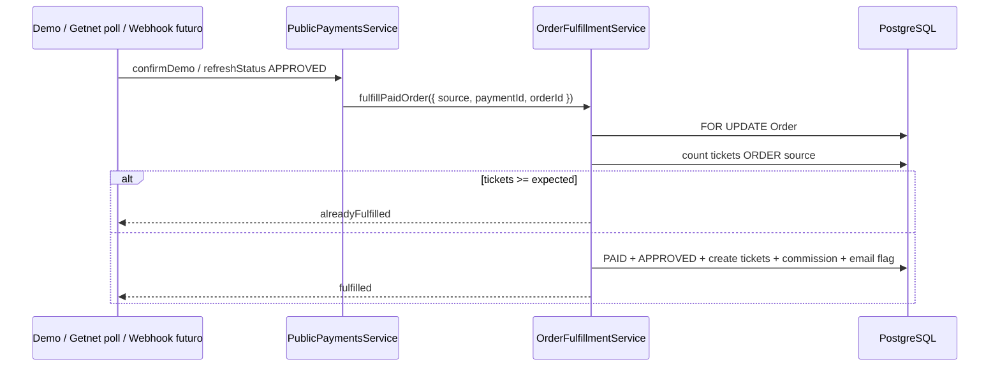

# Order Fulfillment Service — Yo Te Invito

## 1. Objetivo

Centralizar la transición **pago aprobado → orden `PAID` → tickets emitidos → email de confirmación → comisión referral (si aplica)** en un único servicio idempotente, reutilizable por DEMO, Getnet (polling actual) y futuros webhooks/reconciliación.

**Slice:** Getnet A (2026-06-01).

---

## 2. Problema detectado

La lógica de emisión de tickets / transición a `PAID` estaba **duplicada** entre:

- `PublicPaymentsService.confirmDemoPayment`
- `PublicPaymentsService.completeOrderFromGetnet` (invocado desde polling Getnet)

Riesgos: doble emisión bajo concurrencia, emails duplicados, divergencia de reglas entre proveedores.

---

## 3. Nuevo flujo unificado



---

## 4. Entradas soportadas

| `source` | Caller actual | Notas |
|----------|---------------|--------|
| `DEMO_CONFIRM` | `POST /public/payments/:id/demo-confirm` | `rejectIfExpired: true` |
| `GETNET_POLL` | `GET /public/payments/:id/status` / `payment-status` | `rejectIfExpired: false` (no lanza si orden expirada) |
| `GETNET_WEBHOOK` | `POST /public/payments/getnet/webhook` | `rejectIfExpired: false`; ver [GETNET_WEBHOOK.md](./GETNET_WEBHOOK.md) |
| `MANUAL_RECONCILIATION` | *Pendiente* | Operaciones / job batch |

---

## 5. Reglas de idempotencia

1. **Guard principal:** `COUNT(Ticket WHERE orderId AND source = 'ORDER') >= SUM(OrderItem.quantity)`.
2. **Lock:** `SELECT … FROM "Order" … FOR UPDATE` al inicio de la transacción.
3. **Orden ya cumplida:** outcome `alreadyFulfilled` — sincroniza `Payment` → `APPROVED` y `Order` → `PAID` si hiciera falta; **no** crea tickets.
4. **Emisión parcial por ítem:** solo crea `quantity - ticketsExistentesDelItem` por `orderItemId`; `confirmReservedAsSold` usa ese delta.
5. **Pago aprobado repetido (demo / poll / webhook):** segunda llamada → `alreadyFulfilled`.
6. **Email:** flag en `Payment.metadata.orderConfirmationEmailSent` — no reencola si ya enviado (salvo fulfill que acaba de crear tickets en la misma tx).

---

## 6. Qué hace el servicio

| Paso | Detalle |
|------|---------|
| Validar | `paymentId` pertenece a `orderId` y `tenantId` |
| Transición | `PENDING_PAYMENT` → `PAID` (condicional, no expirada) |
| Pago | `Payment` → `APPROVED` |
| Capacidad evento | `EventCapacityGuardService` sobre tickets **nuevos** |
| Stock batch | `TicketBatchService.confirmReservedAsSold` por delta |
| Tickets | `Ticket` con `source: ORDER`, QR único |
| Owner | `order.buyerUserId` o match email |
| Referidos | `ReferralCommissionService.processOrderPaidInTransaction` |
| Email | `renderOrderConfirmationEmail` + `EmailQueueService` (legacy, una vez por pago) |

**API pública:**

```ts
OrderFulfillmentService.fulfillPaidOrder(input: FulfillPaidOrderInput): Promise<FulfillPaidOrderResult>
```

**Outcomes:** `fulfilled` | `alreadyFulfilled` | `skipped` | (`error` vía excepciones HTTP en callers demo).

---

## 7. Qué NO hace el servicio

- No crea pagos Getnet ni llama OAuth/checkout remoto.
- No valida firma de webhook.
- No factura.
- No calcula comisiones/arancel Getnet por método de pago.
- No decide política de reembolsos ni órdenes expiradas con cobro tardío (solo `skipped` o excepción según `rejectIfExpired`).

---

## 8. Riesgos restantes

| Riesgo | Mitigación actual | Pendiente |
|--------|-------------------|-----------|
| Email encolado pero worker falla | Flag en metadata puede quedar `true` sin entrega | Job de reenvío / registry emails V2 |
| Orden `EXPIRED` + Getnet `APPROVED` | Poll: `skipped`, sin fulfill | Slice reconciliación manual |
| Múltiples `Payment` por orden | Fulfill atado a un `paymentId` | Política único pago activo |
| `createGetnetPayment` fuera de tx | Orden remota huérfana | Slice E hardening |
| Webhook / poll | Reconciliación Slice C → fulfill si política lo permite | Ver [GETNET_RECONCILIATION.md](./GETNET_RECONCILIATION.md) |

---

## 9. Smoke tests recomendados

### Unit (sin DB)

```bash
pnpm --filter api run test:order-fulfillment
```

### Demo (API + DB)

1. `POST /public/orders` → `POST …/payments` (DEMO) → `POST …/demo-confirm`
2. Verificar orden `PAID` y tickets = suma cantidades.
3. Repetir `demo-confirm` → misma cantidad de tickets.
4. Opcional: `pnpm --filter api run smoke:user-portal` (incluye demo-confirm).

### Getnet (si hay credenciales)

1. Crear pago Getnet → pagar en staging → `GET …/status` dos veces.
2. Verificar tickets no duplicados.

### Sin Getnet

Confiar en `test:order-fulfillment` + build API; integración Getnet en staging manual.

---

## Archivos

| Archivo | Rol |
|---------|-----|
| `apps/api/src/modules/public-payments/order-fulfillment.service.ts` | Servicio principal |
| `apps/api/src/modules/public-payments/order-fulfillment.types.ts` | Tipos input/result |
| `apps/api/src/modules/public-payments/order-fulfillment.util.ts` | Helpers testeables |
| `apps/api/src/modules/public-payments/order-response.mapper.ts` | `OrderResponse` compartido |
| `apps/api/src/modules/public-payments/public-payments.service.ts` | Orquestación DEMO / Getnet |
| `apps/api/scripts/test-order-fulfillment.util.ts` | Tests unitarios |

**Export:** `OrderFulfillmentService` desde `PublicPaymentsModule` para Slice B (webhook).
