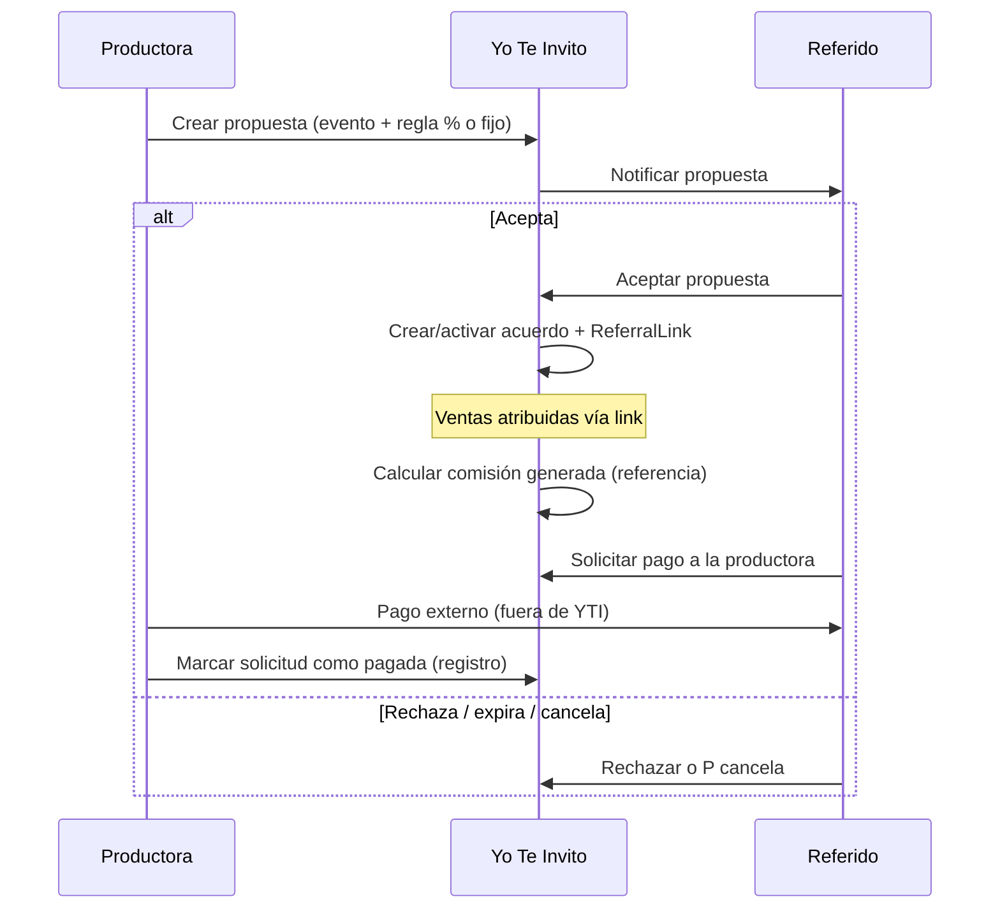

# Referidos V2 — Yo Te Invito

**Referidos V2 (slices 1–8):** modelo manual/comunicacional, propuestas comerciales, acuerdos, links, comisión generada al pagar, solicitudes de pago y métricas. **La plataforma no transfiere dinero** entre productora y referido.

---

## 1) Propósito

- Fijar que Referidos V2 es **manual y comunicacional**, no un producto financiero.
- Definir el flujo: **propuesta → aceptación/rechazo → acuerdo activo → link + atribución → cálculo de comisión generada → solicitud de pago externo**.
- Alinear copy UI y documentación con la regla: **Yo Te Invito no administra, retiene ni transfiere dinero entre productoras y referidos**.
- Servir de contrato para slices de implementación posteriores (API, Prisma, portales).

**Lectores:** producto, backend, frontend, IA de implementación. Leer antes de tocar comisiones, propuestas o liquidación referidos.

---

## 2) Alcance

### En alcance (Slice 1)

- Modelo de negocio y estados propuestos.
- Tipos de comisión: **porcentaje por entrada** o **monto fijo por entrada** (desde link del referido).
- Qué calcula la plataforma vs qué **no** hace.
- Copy exacto de disclaimer (4 superficies UI).
- Glosario UX obligatorio (términos permitidos / prohibidos).
- Mapeo con entidades y enums **ya existentes** en el repo.
- Propuesta de entidades/enums **nuevos** (sin migración en este slice).

### Fuera de alcance (Slice 1)

- Migraciones Prisma destructivas o cambios en `ReferralCommission` en producción.
- Checkout real, webhooks de pago, `Payment`, `Payout` de productora.
- Marketplace de reventa (eliminado; no reintroducir).
- Seeds demo, usuarios `@demo.local`, montos fijos demo (`5000` centavos por orden).
- Automatización de transferencias bancarias o wallets.
- Resolución de disputas comerciales por parte de la plataforma.

---

## 3) Auditoría breve — estado actual (repo)

### Datos y dominio (Prisma)

| Entidad | Rol hoy | Gap V2 |
|---------|---------|--------|
| `ReferrerProfile` | Perfil referidor, slug, membresías | OK base |
| `ProducerReferrerRelationship` | Asociación productora ↔ referidor (`RelationshipStatus`, `RelationshipOrigin`) | No modela **propuesta por evento** ni regla de comisión |
| `EventReferrerAssignment` | Asignación a evento + link opcional + cortesías | No guarda **términos de comisión aceptados** |
| `ReferralLink` | Código, checkout `?ref=`, `/r/[code]` | Se crea sin propuesta formal V2 |
| `ReferralAttribution` | Orden atribuida al link | OK para métricas y cálculo |
| `ReferralCommission` | Monto + estado legacy | Cálculo **demo** (`attributions * 5000`); estados no alineados a V2; mezcla “comisión” con “solicitud” |

**Enums existentes relevantes:**

- `RelationshipStatus`: `PENDING`, `ACTIVE`, `REJECTED`, `BLOCKED`
- `EventAssignmentStatus`: `ACTIVE`, `PAUSED`, `CANCELED`
- `ReferralCommissionStatus`: `PENDING`, `REQUESTED`, `PAID`, `REJECTED`

### API (`apps/api/src/modules/referrals/`)

- Propuestas: `POST/GET /producer/referrals/proposals`, `GET/POST /referrer/proposals` (accept/reject).
- Acuerdos + links al aceptar; atribución en `POST /public/orders` vía `referralCode`.
- Comisión V2: `ReferralCommissionService` en pago `PAID` (demo-confirm / futuro webhook); estados `CONFIRMED`, `MARKED_AS_PAID`, `CANCELLED`.
- Solicitudes de pago: `GET/POST /referrer/payment-requests/*`, `GET/POST /producer/referrals/payment-requests/*` (`mark-in-review`, `mark-paid`, `reject`).
- Métricas: `GET /producer/referrals/metrics`, `GET /producer/events/:eventId/referrals/metrics`, `GET /referrer/metrics`, `GET /referrer/agreements/:id/metrics`.
- Legacy (convivencia): `GET /me/commissions`, `POST /me/commissions/request`, `confirmCommissionPayout` en evento — deprecación opcional.

### UI

| Superficie | Estado |
|------------|--------|
| `/producer/referrals` | Propuestas, solicitudes de pago, métricas, disclaimers |
| `/producer/events/[eventId]/referrals` | Propuestas por evento, métricas; tab legacy comisiones convive |
| `/referrer` | Propuestas, links, comisiones, solicitudes de pago, métricas, disclaimers |
| Valoraciones B2B | `CommercialReviewPanel` — complementario al acuerdo de comisión |

### Liquidación V2 (definición cerrada)

**Liquidación manual y externa a la plataforma.** Yo Te Invito registra acuerdos, atribuciones, comisiones generadas y solicitudes de pago, pero **no administra ni garantiza pagos**. `mark-paid` es registro informativo de pago externo.

### Riesgos / pendientes post–Slice 8

1. Deprecar UI/API legacy de comisiones (`/me/commissions/request`, tab evento legacy).
2. Smoke E2E requiere productor + referido + asociación ACTIVE + evento APPROVED en BD local.
3. `smoke:cleanup` no revierte solicitudes ya `PAID` ni órdenes pagadas.

---

## 4) Principio rector — no es un producto financiero

Yo Te Invito:

| Hace | No hace |
|------|---------|
| Registra propuestas y acuerdos entre partes | Administrar pagos entre productora y referido |
| Mide ventas atribuidas al link del referido | Retener dinero de comisiones |
| Calcula **comisión generada** según regla pactada (referencia) | Transferir dinero a referidos |
| Facilita comunicación y solicitudes de pago (workflow) | Garantizar cobros ni resolver disputas comerciales |
| Muestra historial y estados de solicitudes | Actuar como pasarela, wallet o escrow |

**Liquidación V2:** **manual / externa** — productora y referido acuerdan medio y plazo fuera de la plataforma. La plataforma solo registra que el referido marcó “solicitud enviada” y que la productora puede marcar “pago externo registrado” (sin ejecutar el pago).

**Separación de dominios:**

- **Payout productora** (`Payout` / `/producer/payouts`): retiro de **ingresos de ticketing** hacia la productora — dominio distinto; no confundir con comisiones a referidos.
- **Checkout / `Payment`**: cobro de entradas al comprador — fuera del alcance de referidos V2.

---

## 5) Flujo de negocio V2



### Reglas de comisión (acuerdo)

Una propuesta aceptada fija **una** regla por evento + referidor:

| Tipo | Campo propuesto | Cálculo por entrada vendida y atribuida (orden PAID) |
|------|-----------------|------------------------------------------------------|
| Porcentaje | `commissionType = PERCENT_PER_TICKET` + `commissionPercent` (ej. 10 = 10%) | `sum(ticketLinePaidCents) * percent / 100` por línea atribuida, redondeo documentado en implementación |
| Monto fijo | `commissionType = FIXED_PER_TICKET` + `commissionFixedCents` | `ticketQuantityAttributed * commissionFixedCents` |

- Base de cálculo: entradas **vendidas y pagadas** (`Order` PAID + `ReferralAttribution` al link del acuerdo).
- Devoluciones/chargebacks futuros: slice aparte; por defecto **no suman** a comisión generada si la orden deja de ser PAID.
- La plataforma **muestra** el monto calculado como **“Comisión generada según acuerdo”**, no como saldo retirable.

---

## 6) Estados

### 6.1 Propuesta comercial (`ReferralCommercialProposal`)

Propuesta de la productora al referido para **un evento** (y opcionalmente condiciones de cortesía ya existentes en asignación).

| Estado | Significado |
|--------|-------------|
| `PENDING` | Enviada; espera respuesta del referido |
| `ACCEPTED` | Referido aceptó; dispara creación/activación de acuerdo |
| `REJECTED` | Referido rechazó |
| `CANCELLED` | Productora retiró la propuesta antes de respuesta |
| `EXPIRED` | Venció plazo (`expiresAt`) sin respuesta |

Transiciones: `PENDING` → `ACCEPTED` | `REJECTED` | `CANCELLED` | `EXPIRED`. Terminal: `ACCEPTED` (genera acuerdo), `REJECTED`, `CANCELLED`, `EXPIRED`.

### 6.2 Acuerdo comercial (`ReferralCommercialAgreement`)

Vigencia de la regla aceptada (evento + referidor + productora). Distinto de `ProducerReferrerRelationship` (vínculo general).

| Estado | Significado |
|--------|-------------|
| `ACTIVE` | Link activo; se acumula comisión generada |
| `PAUSED` | Sin nuevas atribuciones/comisión; link puede deshabilitarse en UI |
| `ENDED` | Evento finalizado o acuerdo cerrado por tiempo |
| `CANCELLED` | Terminado por acuerdo de partes o incumplimiento registrado |

**Mapeo con código actual (transición):**

- `EventReferrerAssignment.status` `ACTIVE` ≈ acuerdo `ACTIVE`; `PAUSED` ≈ `PAUSED`; `CANCELED` ≈ `CANCELLED`.
- Falta `ENDED` explícito y campos de comisión en asignación.

### 6.3 Comisión generada (`ReferralCommission` — evolución V2)

Registro **contable de referencia** por periodo o por venta atribuida (diseño en slice 2). No es dinero en custodia.

| Estado V2 | Significado |
|-----------|-------------|
| `PENDING` | Venta atribuida; monto calculado, aún no consolidado para solicitud |
| `CONFIRMED` | Consolidado y visible en dashboard como “comisión generada” |
| `CANCELLED` | Anulado (orden revertida, acuerdo cancelado, ajuste) |
| `MARKED_AS_PAID` | La productora registró pago externo (no implica que YTI pagó) |

**Mapeo legacy → V2 (migración suave, sin destructiva en Slice 1):**

| `ReferralCommissionStatus` actual | Propuesta V2 |
|-----------------------------------|--------------|
| `PENDING` | `PENDING` |
| `REQUESTED` | Separar: comisión `CONFIRMED` + `ReferralPaymentRequest` `REQUESTED` |
| `PAID` | `MARKED_AS_PAID` (renombrar label UI; enum nuevo en migración futura) |
| `REJECTED` | `CANCELLED` o solicitud `REJECTED` según contexto |

### 6.4 Solicitud de pago (`ReferralPaymentRequest`)

Workflow **comunicacional** — el referido pide a la productora que liquide fuera de la plataforma.

| Estado | Significado |
|--------|-------------|
| `REQUESTED` | Referido envió solicitud con monto referencial |
| `IN_REVIEW` | Productora la vio / está en gestión interna |
| `PAID` | Productora marcó “pago externo realizado” (declaración) |
| `REJECTED` | Productora rechazó la solicitud (motivo opcional) |
| `CANCELLED` | Referido canceló la solicitud |

**Nota:** `PAID` aquí significa **“registrado como pagado entre partes”**, no pago procesado por Yo Te Invito.

---

## 7) Modelos y enums propuestos (sin migrar en Slice 1)

### Nuevos (propuesta)

```prisma
enum ReferralCommissionType {
  PERCENT_PER_TICKET
  FIXED_PER_TICKET
}

enum ReferralCommercialProposalStatus {
  PENDING
  ACCEPTED
  REJECTED
  CANCELLED
  EXPIRED
}

enum ReferralCommercialAgreementStatus {
  ACTIVE
  PAUSED
  ENDED
  CANCELLED
}

enum ReferralCommissionRecordStatus {  // reemplazo gradual de ReferralCommissionStatus
  PENDING
  CONFIRMED
  CANCELLED
  MARKED_AS_PAID
}

enum ReferralPaymentRequestStatus {
  REQUESTED
  IN_REVIEW
  PAID
  REJECTED
  CANCELLED
}

model ReferralCommercialProposal {
  id                 String
  tenantId           String
  producerProfileId  String
  referrerProfileId  String
  eventId            String
  commissionType     ReferralCommissionType
  commissionPercent  Decimal?   // si PERCENT_PER_TICKET
  commissionFixedCents Int?     // si FIXED_PER_TICKET
  message            String?    // mensaje productora
  status             ReferralCommercialProposalStatus
  expiresAt          DateTime?
  respondedAt        DateTime?
  createdAt          DateTime
  updatedAt          DateTime
  // FKs a ProducerProfile, ReferrerProfile, Event
}

model ReferralCommercialAgreement {
  id                 String
  tenantId           String
  proposalId         String   @unique
  producerProfileId  String
  referrerProfileId  String
  eventId            String
  referralLinkId     String   @unique
  commissionType     ReferralCommissionType
  commissionPercent  Decimal?
  commissionFixedCents Int?
  status             ReferralCommercialAgreementStatus
  acceptedAt         DateTime
  endedAt            DateTime?
  // snapshot de términos desde propuesta aceptada
}
```

`ReferralCommission` existente: evolucionar a incluir `agreementId`, `generatedCents`, `status` V2, quitar semántica de “REQUESTED” de la misma fila.

`ReferralPaymentRequest` (nuevo): `agreementId`, `referrerProfileId`, `producerProfileId`, `amountCents`, `status`, `requestedAt`, `resolvedAt`, `producerNote`, `referrerNote`.

### Reutilizar sin renombrar (corto plazo)

- `ProducerReferrerRelationship` — precondición: relación `ACTIVE` (o flujo que lo active) antes de enviar propuesta.
- `ReferralLink`, `ReferralAttribution` — sin cambio de contrato público de checkout.
- `CommercialRelationshipReview` — reputación B2B; ortogonal al acuerdo de comisión.

---

## 8) Qué calcula la plataforma

Por acuerdo activo y ventas atribuidas (órdenes PAID):

1. **Cantidad de entradas atribuidas** (tickets en ítems de órdenes con atribución al link).
2. **Bruto atribuido** (suma pagada en esas órdenes) — métrica informativa.
3. **Comisión generada** según `%` o monto fijo por entrada.
4. **Agregados** por evento / productora / referidor / rango de fechas.

Opcional (slice posterior): desglose por orden, export CSV para conciliación **externa**.

### Qué NO calcula ni muestra

- Saldo disponible, retirable o garantizado.
- Impuestos, retenciones ni comisiones de pasarela de pago del referido.
- Pagos automáticos ni fechas de acreditación bancaria.

---

## 9) Glosario UX obligatorio

### Prohibido (UI y docs de referidos)

- Retirar dinero  
- Saldo disponible  
- Payout automático  
- Cobro garantizado  
- Yo Te Invito te paga  
- Wallet / billetera / transferencia automática (en contexto referido)

### Usar

- Comisión generada  
- Monto generado según acuerdo  
- Solicitar pago a la productora  
- Solicitud de pago  
- Acuerdo comercial  
- Pago externo entre partes  
- Registro de pago (cuando la productora confirma fuera de la plataforma)

### Etiquetas de estado (español UI)

| Enum | Label UI |
|------|----------|
| Propuesta `PENDING` | Pendiente de respuesta |
| Propuesta `ACCEPTED` | Aceptada |
| Propuesta `REJECTED` | Rechazada |
| Propuesta `CANCELLED` | Cancelada |
| Propuesta `EXPIRED` | Vencida |
| Acuerdo `ACTIVE` | Activo |
| Acuerdo `PAUSED` | Pausado |
| Acuerdo `ENDED` | Finalizado |
| Acuerdo `CANCELLED` | Cancelado |
| Comisión `PENDING` | Pendiente de consolidar |
| Comisión `CONFIRMED` | Comisión generada |
| Comisión `CANCELLED` | Anulada |
| Comisión `MARKED_AS_PAID` | Pago externo registrado |
| Solicitud `REQUESTED` | Solicitud enviada |
| Solicitud `IN_REVIEW` | En revisión por la productora |
| Solicitud `PAID` | Pago externo registrado |
| Solicitud `REJECTED` | Rechazada |
| Solicitud `CANCELLED` | Cancelada |

---

## 10) Copy exacto — disclaimer

Texto legal/producto a mostrar **siempre visible** (no colapsado por defecto) en las cuatro superficies. Misma sustancia; se permite acortar solo la primera línea en mobile si el bloque completo queda a un toque (“Ver condiciones”).

### 10.1 Formulario de propuesta del productor

**Título:** Condiciones del acuerdo comercial  

**Cuerpo:**

> Yo Te Invito no administra pagos entre tu productora y los referidos. No retiene dinero, no transfiere fondos y no garantiza cobros. Esta plataforma solo registra la propuesta, mide ventas atribuidas al link del referido y calcula montos de comisión según la regla que indiques, como referencia para que ustedes acuerden y ejecuten el pago por fuera. Cualquier pago es un acuerdo directo entre tu productora y el referido. Yo Te Invito no resuelve disputas comerciales entre las partes.

**Checkbox obligatorio (label):**

> Entiendo que Yo Te Invito no procesa ni garantiza el pago de comisiones a referidos.

### 10.2 Bandeja de propuestas del referido

**Título:** Antes de aceptar  

**Cuerpo:**

> La comisión que ves en esta propuesta es un monto estimado según la regla indicada por la productora. No es dinero disponible en Yo Te Invito. Si aceptás, promocionás el evento con tu link; las ventas atribuidas se miden aquí. El cobro lo gestionás vos con la productora por canales externos (transferencia, efectivo u otro acuerdo). Yo Te Invito no retiene ni transfiere dinero y no garantiza que la productora te pague.

**Acciones:** Aceptar acuerdo comercial / Rechazar propuesta (no usar “Cobrar” ni “Retirar”).

### 10.3 Dashboard de comisiones (referido y productor)

**Título:** Comisión generada — solo referencia  

**Cuerpo:**

> Los montos de esta sección son comisión generada según el acuerdo comercial vigente y las ventas atribuidas a tu link. No constituyen saldo disponible ni dinero custodiado por Yo Te Invito. La liquidación es un pago externo entre vos y la productora. La plataforma no administra pagos, no garantiza cobros y no resuelve disputas comerciales.

**Hint bajo totales:**

> Monto generado según acuerdo · No es saldo retirable

### 10.4 Solicitud de pago

**Título:** Solicitud de pago a la productora  

**Cuerpo:**

> Al enviar esta solicitud, le indicás a la productora que deseas que liquide la comisión generada según el acuerdo. Yo Te Invito no envía dinero ni ejecuta transferencias. La productora puede marcar la solicitud como pagada cuando haya realizado el pago por fuera de la plataforma; ese registro es informativo y no reemplaza tu comprobante ni medios legales de cobro.

**Checkbox obligatorio (label):**

> Entiendo que esta solicitud no garantiza el pago y que Yo Te Invito no transfiere fondos.

**Botón primario:** Enviar solicitud de pago (no “Solicitar retiro” ni “Cobrar ahora”).

---

## 11) API y pantallas (roadmap post–Slice 1)

### Slice 2 — Backend propuestas (implementado)

| Método | Ruta | Rol |
|--------|------|-----|
| POST | `/producer/referrals/proposals` | Productor — crear propuesta |
| GET | `/producer/referrals/proposals` | Productor — listar enviadas |
| GET | `/producer/referrals/proposals/:id` | Productor — detalle |
| POST | `/producer/referrals/proposals/:id/cancel` | Productor — cancelar `PENDING` |
| GET | `/referrer/proposals` | Referido — bandeja recibidas |
| GET | `/referrer/proposals/:id` | Referido — detalle |
| POST | `/referrer/proposals/:id/accept` | Referido — aceptar → acuerdo + link + asignación |
| POST | `/referrer/proposals/:id/reject` | Referido — rechazar (sin link) |

Body crear: `referrerProfileId`, `eventId`, `commissionType` (`PERCENTAGE` \| `FIXED_PER_TICKET`), `commissionValue`, opcional `message`, `terms`, `startAt`, `endAt`.

Tests util: `pnpm --filter api run test:referral-proposals`.

### Slice 3 — Cálculo comisión por venta atribuida (implementado)

- **Hook:** `ReferralCommissionService.processOrderPaidInTransaction` desde `PublicPaymentsService` al pasar orden a `PAID` (demo-confirm y fulfill Getnet).
- **Idempotencia:** `referralAttributionId` y `orderId` únicos en `ReferralCommission`.
- **Montos:** `OrderItem.subtotal` en unidades mayores (ARS); comisión en **centavos** (`amountCents`). `FIXED_PER_TICKET`: `commissionValue` en centavos por entrada. `PERCENTAGE`: `round(attributedSubtotalCents * value / 100)`.
- **Estado V2:** `CONFIRMED` al pagar; `CANCELLED` si no hay entradas válidas o orden no PAID; revocación de ticket re-sincroniza vía `AdminTicketsService`.
- **Sin acuerdo activo:** no se crea fila V2 (links legacy sin propuesta siguen igual).
- Tests: `pnpm --filter api run test:referral-commission`.

| Slice | Entregable |
|-------|------------|
| 2 | Prisma + endpoints propuesta ✓ |
| 3 | Cálculo comisión generada idempotente ✓ |
| 4 | Portal productor — propuestas y flujo V2 ✓ |
| 5 | Portal referido — propuestas, links, comisiones ✓ |
| 6 | `ReferralPaymentRequest` + UI; productor `mark-in-review` / `mark-paid` / `reject` ✓ |
| 7 | Métricas V2 + disclaimers en portales ✓ |
| 8 | QA: `smoke:referrals`, tests util, checklist y docs ✓ |

### Slice 6 — Solicitudes de pago (implementado)

| Método | Ruta | Rol |
|--------|------|-----|
| GET | `/referrer/payment-requests/eligible-commissions` | Referido |
| GET/POST | `/referrer/payment-requests` | Referido — listar / crear |
| GET | `/referrer/payment-requests/:id` | Referido |
| POST | `/referrer/payment-requests/:id/cancel` | Referido |
| GET | `/producer/referrals/payment-requests` | Productor |
| GET | `/producer/referrals/payment-requests/:id` | Productor |
| POST | `/producer/referrals/payment-requests/:id/mark-in-review` | Productor |
| POST | `/producer/referrals/payment-requests/:id/mark-paid` | Productor — registra pago externo; comisiones → `MARKED_AS_PAID` |
| POST | `/producer/referrals/payment-requests/:id/reject` | Productor |

Tests util: `pnpm --filter api run test:referral-payment-requests`.

### Slice 7 — Métricas (implementado)

| Método | Ruta |
|--------|------|
| GET | `/producer/referrals/metrics` |
| GET | `/producer/events/:eventId/referrals/metrics` |
| GET | `/referrer/metrics` |
| GET | `/referrer/agreements/:id/metrics` |

### Slice 8 — QA

| Comando | Uso |
|---------|-----|
| `pnpm --filter api run smoke:referrals` | E2E API con `SMOKE_PRODUCER_EMAIL` + `SMOKE_REFERRER_EMAIL` |
| `pnpm --filter api run test:referral-proposals` | Validación propuestas / vencimiento |
| `pnpm --filter api run test:referral-commission` | Cálculo % y fijo; idempotencia |
| `pnpm --filter api run test:referral-payment-requests` | Elegibilidad, overlap, autorización productor |

Ver [SMOKE_TESTS_GUIDE.md](../guides/SMOKE_TESTS_GUIDE.md).

---

## 12) Criterios de aceptación — Slice 1 (documentación)

- [x] Queda documentado que V2 es manual/comunicacional, no financiero.
- [x] Comisiones: porcentaje o monto fijo por entrada vendida desde el link.
- [x] Monto al referido: “comisión generada”, no “saldo”.
- [x] Pago acordado y ejecutado fuera de la plataforma.
- [x] Definido qué calcula la plataforma y qué no hace.
- [x] Sin cambios a checkout/pagos reales en este slice.
- [x] Sin marketplace de reventa ni seeds demo.

**Implementación slices 2–8:** completada en repo (ver §11).

---

## 13) Smoke / QA

**Automatizado:** `pnpm --filter api run smoke:referrals` (requiere API :3001, credenciales productor + referido, asociación ACTIVE, evento APPROVED).

**Manual (regresión UI):**

1. Productor envía propuesta % → referido acepta → link activo en checkout `?ref=`.
2. Orden pagada (demo) → comisión `CONFIRMED` en portal referido.
3. Referido crea solicitud de pago → productor `mark-paid` → comisión `MARKED_AS_PAID` (sin texto de saldo/retiro).
4. Revisar disclaimers en `/producer/referrals` y `/referrer`.

---

## 14) Referencias

- `apps/api/prisma/schema.prisma` — modelos referidos actuales  
- `apps/api/src/modules/referrals/referrals.service.ts` — asignación, comisiones legacy  
- `apps/web/lib/producer/referral-display.ts` — aviso comisiones pendientes  
- `docs/reviews/REVIEWS_V2.md` — valoraciones B2B (complementario)  
- `docs/modules/producer-payouts.md` — payouts productora (dominio distinto)  
- `docs/dev/Yo_Te_Invito_Checklist_V2_Produccion.md` — checklist producción  

---

*Última actualización: Slice 8 QA y cierre — 2026-05-22.*
